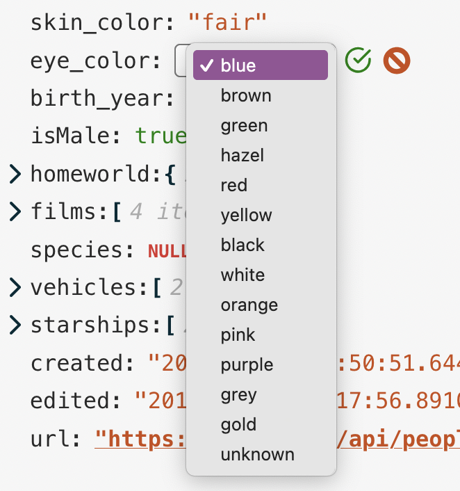
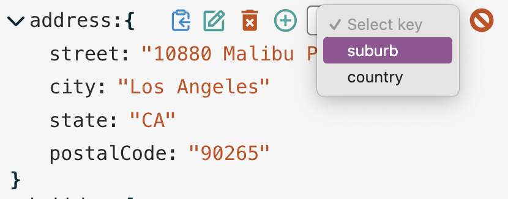
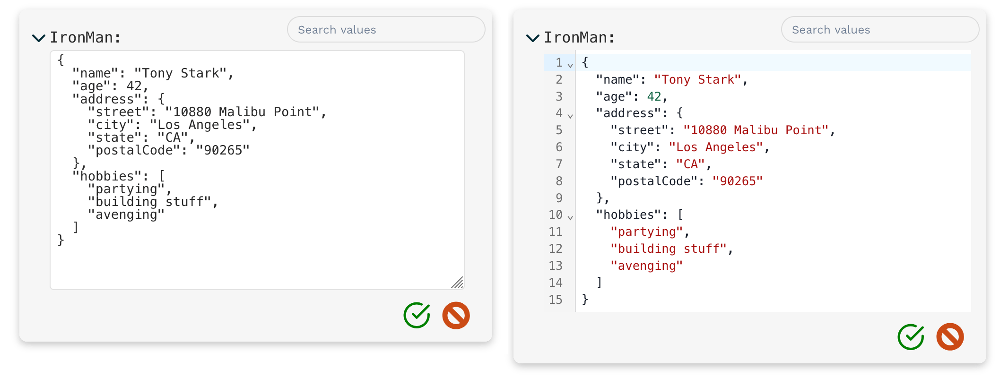
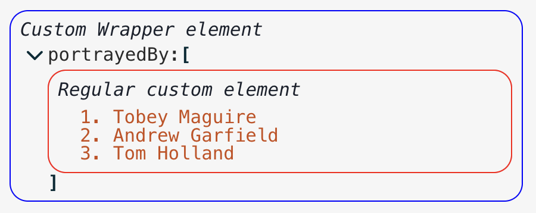

# json-edit-react

<!-- NPM INTRO -->


A highly-configurable [React](https://github.com/facebook/react) component for editing or viewing JSON/object data


## [Explore the Demo](https://carlosnz.github.io/json-edit-react/) <!-- omit in toc -->


### Features include:

 - ✅ **Easy inline editing** of individual values or whole blocks of JSON text 
 - 🔒 **Granular control** – restrict edits, deletions, or additions per element
 - 📏 **[JSON Schema](https://json-schema.org/) validation** (using 3rd-party validation library)
 - 🎨 **Customisable UI** — built-in or custom [themes](#themes--styles), CSS overrides or targeted classes
 - 📦 **Self-contained** — plain HTML/CSS, so no dependence on external UI libraries
 - 🔍 **Search & filter** — find data by key, value or custom function
 - 🚧 **[Custom components](#custom-nodes)** — replace specific nodes with specialised components (e.g. date picker, links, images)
 - 🌏 **[Localisation](#localisation)** — easily translate UI labels and messages
 - 🔄 **[Drag-n-drop](#drag-n-drop)** re-ordering within objects/arrays
 - 🎹 **[Keyboard customisation](#keyboard-customisation)** — define your own key bindings
 - 🎮 **[External control](#external-control-1)** via callbacks and triggers

💡 Try the **[Live Demo](https://carlosnz.github.io/json-edit-react/)** to see these features in action!


<!-- NPM INTRO -->

> [!IMPORTANT]
> Breaking changes:
> - **Version 1.19.0** has a change to the `theme` input. Built-in themes must now be imported separately and passed in, rather than just naming the theme as a string. This is better for tree-shaking, so unused themes won't be bundled with your build. See [Themes & Styles](#themes--styles).
> - **Version 1.14.0** has a change which recommends you provide a `setData` prop and not use `onUpdate` for updating your data externally. See [Managing state](#managing-state).

## Contents  <!-- omit in toc -->
- [Installation](#installation)
- [Implementation](#implementation)
- [Usage](#usage)
- [Props Reference](#props-reference)
  - [Data Management](#data-management)
  - [Restricting Editing](#restricting-editing)
  - [Look and Feel / UI](#look-and-feel--ui)
  - [Search and Filtering](#search-and-filtering)
  - [Custom components \& overrides (incl. Localisation)](#custom-components--overrides-incl-localisation)
  - [External control](#external-control)
  - [Miscellaneous](#miscellaneous)
- [Managing State](#managing-state)
- [Update Functions](#update-functions)
  - [OnChange Function](#onchange-function)
  - [OnError Function](#onerror-function)
  - [Copy Function](#copy-function)
  - [JSON Schema Validation](#json-schema-validation)
- [Advanced Editing Control](#advanced-editing-control)
  - [`restrictEdit`, `restrictDelete` \& `restrictAdd`](#restrictedit-restrictdelete--restrictadd)
  - [`collapse`](#collapse)
  - [Data Type Restrictions](#data-type-restrictions)
  - [New Key Restrictions \& Default Values](#new-key-restrictions--default-values)
  - [Drag-n-drop](#drag-n-drop)
- [Full object editing](#full-object-editing)
- [Search/Filtering](#searchfiltering)
- [Themes \& Styles](#themes--styles)
  - [CSS classes](#css-classes)
  - [Fragments](#fragments)
  - [Icons](#icons)
- [Localisation](#localisation)
- [Custom Nodes](#custom-nodes)
  - [Active hyperlinks](#active-hyperlinks)
  - [Custom Collection nodes](#custom-collection-nodes)
- [Custom Text](#custom-text)
- [Custom Buttons](#custom-buttons)
- [Keyboard customisation](#keyboard-customisation)
- [External control](#external-control-1)
  - [Event callbacks](#event-callbacks)
  - [Event triggers](#event-triggers)
- [Undo functionality](#undo-functionality)
- [Exported helpers](#exported-helpers)
  - [Functions \& Components](#functions--components)
  - [Types](#types)
- [Issues, bugs, suggestions?](#issues-bugs-suggestions)
- [Roadmap](#roadmap)
- [Inspiration](#inspiration)
- [Changelog](#changelog)

<!-- NPM USAGE -->

## Installation

```sh
# Depending on your package manager:

npm i json-edit-react
# OR
yarn add json-edit-react
```

## Implementation

```jsx
import { JsonEditor } from 'json-edit-react'

// In your React component:
return (
  <JsonEditor
    data={ jsonData }
    setData={ setJsonData } // optional
    { ...otherProps } />
);
```

## Usage

**(for end user)**

It's pretty self explanatory (click the "edit" icon to edit, etc.), but there are a few not-so-obvious ways of interacting with the editor:

- **Double-click** a value (or a key) to edit it
- When editing a string, use `Cmd/Ctrl/Shift-Enter` to add a new line (`Enter` submits the value)
- It's the opposite when editing a full object/array node (which you do by **clicking "edit"** on an object or array value) — `Enter` for new line, and `Cmd/Ctrl/Shift-Enter` for submit
- `Escape` to **cancel** editing
- When clicking the "**clipboard**" icon, holding down `Cmd/Ctrl` will copy the *path* to the selected node rather than its value
- When opening/closing a node, hold down "Alt/Option" to open/close *all* child nodes at once
- For Number inputs, **arrow-up** and **down** keys will increment/decrement the value
- For Boolean inputs, **space bar** will toggle the value
- Easily navigate to the next or previous node for editing using the `Tab`/`Shift-Tab` keys.
- **Drag and drop** items to change the structure or modify display order
- When editing is not permitted, double-clicking a string value will expand the text to the full value if it is truncated due to length (there is also a clickable "..." for long strings)
- **JSON text input** can accept "looser" input, if an additional JSON parsing method is provided (e.g. [JSON5](https://json5.org/)). See `jsonParse` prop.

[Have a play with the Demo app](https://carlosnz.github.io/json-edit-react/) to get a feel for it!

<!-- NPM USAGE -->

## Props Reference

The only *required* property is `data` (although you will need to provide a `setData` method to update your data).

This is a reference list of *all* possible props, divided into related sections. Most of them provide a link to a section below in which the concepts are explored in more detail.

<details open>
<summary>

### Data Management

</summary>

| Prop              | Type                    | Default | Description                                                                                                                         |
| ----------------- | ----------------------- | ------- | ----------------------------------------------------------------------------------------------------------------------------------- |
| `data`            | `object\|array`         | none    | The data to be displayed / edited                                                                                                   |
| `setData`         | `object\|array => void` | none    | Method to update your `data` object. See [Managing state](#managing-state) below for additional notes.                              |
| `onUpdate`        | `UpdateFunction`        | none    | A function to run whenever a value is **updated** (edit, delete *or* add) in the editor. See [Update functions](#update-functions). |
| `onEdit`          | `UpdateFunction`        | none    | A function to run whenever a value is **edited**.                                                                                   |
| `onDelete`        | `UpdateFunction`        | none    | A function to run whenever a value is **deleted**.                                                                                  |
| `onAdd`           | `UpdateFunction`        | none    | A function to run whenever a new property is **added**.                                                                             |
| `onChange`        | `OnChangeFunction`      | none    | A function to modify/constrain user input as they type — see [OnChange functions](#onchange-function).                              |
| `onError`         | `OnErrorFunction`       | none    | A function to run whenever the component reports an error — see [OnErrorFunction](#onerror-function).                               |
| `enableClipboard` | `boolean\|CopyFunction` | `true`  | Enable or disable the "Copy to clipboard" button in the UI. — see [Copy Function](#copy-function)                                   |

</details>
<details>
<summary>

### Restricting Editing

</summary>

| Prop                    | Type                                      | Default | Description                                                                                                                                                             |
| ----------------------- | ----------------------------------------- | ------- | ----------------------------------------------------------------------------------------------------------------------------------------------------------------------- |
| `restrictEdit`          | `boolean\|FilterFunction`                 | `false` | If `true`, no editing at all is permitted. A callback function can be provided — see [Advanced Editing Control](#advanced-editing-control)                              |
| `restrictDelete`        | `boolean\|FilterFunction`                 | `false` | As with `restrictEdit` but for deletion                                                                                                                                 |
| `restrictAdd`           | `boolean\|FilterFunction`                 | `false` | As with `restrictEdit` but for adding new properties                                                                                                                    |
| `restrictTypeSelection` | `boolean\|DataType[]\|TypeFilterFunction` | `false` | For restricting the data types the user can select, including [Custom Node](#custom-nodes) types, and **Enums** — see [Data Type Restrictions](#data-type-restrictions) |
| `newKeyOptions`         | `string[] \| NewKeyOptionsFunction`       | none    | New keys can be restricted to certain values — see [New Key Restrictions & Default Values](#new-key-restrictions--default-values)                                       |
| `defaultValue`          | `any\|DefaultValueFilterFunction`         | `null`  | Value that new properties are initialised with — see [New Key Restrictions & Default Values](#new-key-restrictions--default-values)                                     |
| `restrictDrag`          | `boolean\|FilterFunction`                 | `true`  | Set to `false` to enable drag and drop functionality — see [Drag-n-drop](#drag-n-drop)                                                                                  |
| `viewOnly`              | `boolean`                                 |         | A shorthand if you just want the component to be a viewer, with no editing at all. Overrides any of the above edit restrictions.                                        |

</details>

<details>
<summary>

### Look and Feel / UI
</summary>

| Prop                    | Type                                      | Default              | Description                                                                                                                                                                                                                                                                                                                                                                                               |
| ----------------------- | ----------------------------------------- | -------------------- | --------------------------------------------------------------------------------------------------------------------------------------------------------------------------------------------------------------------------------------------------------------------------------------------------------------------------------------------------------------------------------------------------------- |
| `theme`                 | `ThemeInput`                              | `defaultTheme`       | Either one of the built-in themes (imported separately), or an object specifying some or all theme properties — see [Themes](#themes--styles).                                                                                                                                                                                                                                                            |
| `icons`                 | `{[iconName]: JSX.Element, ... }`         | `{ }`                | Replace the built-in icons by specifying them here — see [Themes](#themes--styles).                                                                                                                                                                                                                                                                                                                       |  |
| `indent`                | `number`                                  | `3`                  | Specify the amount of indentation for each level of nesting in the displayed data.                                                                                                                                                                                                                                                                                                                        |
| `collapse`              | `boolean\|number\|FilterFunction`         | `false`              | Defines which nodes of the JSON tree will be displayed "opened" in the UI on load — see [Collapse](#collapse).                                                                                                                                                                                                                                                                                            |
| `collapseAnimationTime` | `number`                                  | `300`                | Time (in milliseconds) for the transition animation when collapsing collection nodes.                                                                                                                                                                                                                                                                                                                     |
| `collapseClickZones`    | `Array<"left" \| "header" \| "property">` | `["left", "header"]` | Aside from the <span style="font-size: 140%">`⌄`</span> icon, you can specify other regions of the UI to be clickable for collapsing/opening a collection.                                                                                                                                                                                                                                                |
| `rootName`              | `string`                                  | `"data"`             | A name to display in the editor as the root of the data object.                                                                                                                                                                                                                                                                                                                                           |
| `showArrayIndices`      | `boolean`                                 | `true`               | Whether or not to display the index (as a property key) for array elements.                                                                                                                                                                                                                                                                                                                               |
| `showStringQuotes`      | `boolean`                                 | `true`               | Whether or not to display string values in "quotes".                                                                                                                                                                                                                                                                                                                                                      |
| `showCollectionCount`   | `boolean\|"when-closed"`                  | `true`               | Whether or not to display the number of items in each collection (object or array).                                                                                                                                                                                                                                                                                                                       |
| `stringTruncate`        | `number`                                  | `250`                | String values longer than this many characters will be displayed truncated (with `...`). The full string will always be visible when editing.                                                                                                                                                                                                                                                             |
| `keySort`               | `boolean\|CompareFunction`                | `false`              | If `true`, object keys will be ordered (using default JS `.sort()`). A [compare function](https://developer.mozilla.org/en-US/docs/Web/JavaScript/Reference/Global_Objects/Array/sort) can also be provided to define sorting behaviour, except the input type should be a tuple of the key and the value of a node i.e. `(a: [string \| number, ValueData], b: [string \| number, ValueData]) => number` |
| `minWidth`              | `number\|string` (CSS value)              | `250`                | Minimum width for the editor container.                                                                                                                                                                                                                                                                                                                                                                   |
| `maxWidth`              | `number\|string` (CSS value)              | `600`                | Maximum width for the editor container.                                                                                                                                                                                                                                                                                                                                                                   |
| `rootFontSize`          | `number\|string` (CSS value)              | `16px`               | The "base" font size from which all other sizings are derived (in `em`s). By changing this you will scale the entire component.                                                                                                                                                                                                                                                                           |
| `insertAtTop`           | `boolean\| "object \| "array"`            | `false`              | If `true`, inserts new values at the *top* rather than bottom. Can set the behaviour just for arrays or objects by setting to `"object"` or `"array"` respectively.                                                                                                                                                                                                                                       |  |
| `errorMessageTimeout`   | `number`                                  | `2500`               | Time (in milliseconds) to display the error message in the UI.                                                                                                                                                                                                                                                                                                                                            |  |
| `showErrorMessages`     | `boolean `                                | `true`               | Whether or not the component should display its own error messages (you'd probably only want to disable this if you provided your own [`onError` function](#onerror-function))                                                                                                                                                                                                                            |
</details>
<details>
<summary>

### Search and Filtering
</summary>

| Prop                 | Type                                          | Default     | Description                                                                                                      |
| -------------------- | --------------------------------------------- | ----------- | ---------------------------------------------------------------------------------------------------------------- |
| `searchText`         | `string`                                      | `undefined` | Data visibility will be filtered by matching against value, using the method defined below in `searchFilter`     |
| `searchFilter`       | `"key"\|"value"\|"all"\|SearchFilterFunction` | `undefined` | Define how `searchText` should be matched to filter the visible items — see [Search/Filtering](#searchfiltering) |
| `searchDebounceTime` | `number`                                      | `350`       | Debounce time when `searchText` changes                                                                          |

</details>
<details>
<summary>

### Custom components & overrides (incl. Localisation)
</summary>

| Prop                    | Type                                                | Default                                   | Description                                                                                                                                                                                                                                                                                    |
| ----------------------- | --------------------------------------------------- | ----------------------------------------- | ---------------------------------------------------------------------------------------------------------------------------------------------------------------------------------------------------------------------------------------------------------------------------------------------- |
| `customNodeDefinitions` | `CustomNodeDefinition[]`                            |                                           | You can provide custom React components to override specific nodes in the data tree, according to a condition function — see [Custom nodes](#custom-nodes). (A simple custom component to turn url strings into active links is provided in the main package — see [here](#active-hyperlinks)) |
| `customButtons`         | `CustomButtonDefinition[]`                          | `[]`                                      | You can add your own buttons to the Edit Buttons panel if you'd like to be able to perform a custom operation on the data — see [Custom Buttons](#custom-buttons)                                                                                                                              |
| `translations`          | `LocalisedStrings` object                           | `{ }`                                     | UI strings (such as error messages) can be translated by passing an object containing localised string values (there are only a few) — see [Localisation](#localisation)                                                                                                                       |
| `customText`            | `CustomTextDefinitions`                             |                                           | In addition to [localising the component](#localisation) text strings, you can also *dynamically* alter them, depending on the data — see [Custom Text](#custom-text)                                                                                                                          |
| `TextEditor`            | `ReactComponent`<br>&nbsp;&nbsp;`<TextEditorProps>` |                                           | Pass a component to offer a custom text/code editor when editing full JSON object as text. [See details](#full-object-editing)                                                                                                                                                                 |
| `jsonParse`             | `(input: string) => JsonData`                       | `JSON.parse`                              | Provide an alternative JSON parser (e.g. [JSON5](https://json5.org/)), to allow "looser" text input when editing JSON blocks.                                                                                                                                                                  |
| `jsonStringify`         | `(data: JsonData) => string`                        | `(data) => JSON.stringify(data, null, 2)` | Similarly, you can override the presentation of the text when editing JSON. You can supply different formatting parameters to the native `JSON.stringify()`, or provide a third-party option, like the aforementioned JSON5.                                                                   |
| `keyboardControls`      | `KeyboardControls`                                  | As explained [above](#usage)              | Override some or all of the keyboard controls — see [Keyboard customisation](#keyboard-customisation)                                                                                                                                                                                          |

</details>
<details>
<summary>

### External control
</summary>

More detail [below](#external-control-1)

| Prop               | Type                  | Default | Description                                                                                            |
| ------------------ | --------------------- | ------- | ------------------------------------------------------------------------------------------------------ |
| `onEditEvent`      | `OnEditEventFunction` | none    | Callback to execute whenever the user starts or stops editing a node                                   |
| `onCollapse`       | `OnCollapseFunction`  | none    | Callback to execute whenever the user collapses or opens a node                                        |
| `externalTriggers` | `ExternalTriggers`    | none    | Specify a node to collapse/open, or to start/stop editing. See [External control](#external-control-1) |  |

</details>

<details>
<summary>

### Miscellaneous
</summary>

| Prop        | Type     | Default | Description                                                                                                                       |
| ----------- | -------- | ------- | --------------------------------------------------------------------------------------------------------------------------------- |
| `id`        | `string` | none    | Name for the HTML `id` attribute on the main component container.                                                                 |
| `className` | `string` | none    | Name of a CSS class to apply to the overall component. In most cases, specifying `theme` properties will be more straightforward. |
</details>

----

## Managing State

It is recommended that you manage the `data` state yourself outside this component — just pass in a `setData` method, which is called internally to update your `data`. However, this is not compulsory — if you don't provide a `setData` method, the data will be managed internally, which is fine if you're not really doing anything with the data. The alternative is to use the [Update functions](#update-functions) to update your `data` externally, but this is not recommended except in special circumstances as you can run into issues keeping your data in sync with the internal state (which is what is displayed), as well as unnecessary re-renders.

> [!TIP]
> Update functions should ideally be used only for implementing side effects (e.g. notifications), validation, or mutating the data before setting it with `setData`.

## Update Functions

A **callback** to be executed whenever a data update (edit, delete or add) occurs can be provided. You might wish to use this to update some external state, make an API call, modify the data before saving it, or [validate the data structure](#json-schema-validation) against a JSON schema.

If you want the same function for all updates, then just the `onUpdate` prop is sufficient. However, should you require something different for **editing**, **deletion** and **addition**, then you can provide separate Update functions via the `onEdit`, `onDelete` and `onAdd` props.

The function will receive the following object as a parameter:

```js
{
    newData,      // data state after update
    currentData,  // data state before update 
    newValue,     // the new value of the property being updated
    currentValue, // the current value of the property being updated
    name,         // name of the property being updated
    path          // full path to the property being updated,
                  //   as an array of property keys
                  //   (e.g. [ "user", "friends", 1, "name" ])
                  //   (equivalent to "user.friends[1].name")
}
```
The function can return nothing (in which case the data is updated normally), or a value to represent success/failure, error value, or modified data. The return value can be one of the following, and handled accordingly:
- `true` / `void` / `undefined`: data continues update as normal
- `false`: considers the update to be an error, so data is not updated (reverts to previous value), and a generic error message is displayed in the UI
- `string`: also considered an error, so no data update, but the UI error message will be your provided string
- `[ "value", <value> ]`: tells the component to use the returned `<value>` instead of the input data. You might use this to automatically modify user input -- for example, sorting an array, or inserting a timestamp field into an object.
- `[ "error", <value> ]`: same as `string`, but in the longer tuple format.

### OnChange Function

Similar to the Update functions, the `onChange` function is executed as the user input changes. You can use this to restrict or constrain user input -- e.g. limiting numbers to positive values, or preventing line breaks in strings. The function *must* return a value in order to update the user input field, so if no changes are to be made, just return it unmodified.

The input object is similar to the Update function input, but with no `newData` field (since this operation occurs before the data is updated).

<details>
<summary>

#### Examples
</summary>

- Restrict "age" inputs to positive values up to 100:  
  ```js
  // in <JsonEditor /> props
  onChange = ({ newValue, name }) => {
        if (name === "age" && newValue < 0) return 0;
        if (name === "age" && newValue > 100) return 100;
        return newValue
      }
  ```
- Only allow alphabetical or whitespace input for "name" field (including no line breaks):  
  ```js
  onChange = ({ newValue, name }) => {
      if (name === 'name' && typeof newValue === "string")
        return newValue.replace(/[^a-zA-Z\s]|\n|\r/gm, '');
      return newValue;
    }
  ```
</details>

### OnError Function

Normally, the component will display simple error messages whenever an error condition is detected (e.g. invalid JSON input, duplicate keys, or custom errors returned by the [`onUpdate` functions)](#update-functions)). However, you can provide your own `onError` callback in order to implement your own error UI, or run additional side effects. (In the former case, you'd probably want to disable the `showErrorMessages` prop, too.) The input is similar to the other callbacks:

```js
{
    currentData,  // data state before update 
    currentValue, // the current value of the property being updated
    errorValue,   // the erroneous value that failed to update the property
    name,         // name of the property being updated
    path,         // full path to the property being updated,
                  //   as an array of property keys
                  //   (e.g. [ "user", "friends", 1, "name" ] )
                  //   (equivalent to "user.friends[1].name"),
    error: {
      code,       // one of 'UPDATE_ERROR' | 'DELETE_ERROR' |
                  //   'ADD_ERROR' | 'INVALID_JSON' | 'KEY_EXISTS'
      message     // the (localised) error message that would be displayed
    }
}
```
> [!NOTE]
> An example of a custom Error UI can be seen in the [Demo](#https://carlosnz.github.io/json-edit-react/?data=customNodes) with the "Custom Nodes" data set -- when you enter invalid JSON input a "Toast" notification is displayed instead of the normal component error message.

### Copy Function

A similar callback can be run whenever an item is **copied** to the clipboard (if passed to the `enableClipboard` prop), but with a slightly different input object:

```js
{
    key          // name of the property being copied  
    path         // path to the property
    value        // the value copied to the clipboard
    type         // Either "path" or "value" depending on whether "Cmd/Ctrl" was pressed 
    stringValue  // A nicely stringified version of `value`  
                 // (i.e. what the clipboard actually receives)
    success      // true/false -- whether clipboard copy action actually succeeded
    errorMessage // Error detail if `success === false`
}
```

> [!TIP]
> Since there is very little user feedback when clicking "Copy", a good idea would be to present some kind of notification (see [Demo](https://carlosnz.github.io/json-edit-react/)). There are situations (such as an insecure environment) where the browser won't actually permit any clipboard actions. In this case, the `success` property will be `false`, so you can handle it appropriately.


### JSON Schema Validation

It's possible to do full [JSON Schema](https://json-schema.org/) validation by creating an [Update Function](#update-functions) that passes the data to a 3rd-party schema validation library (e.g. [Ajv](https://ajv.js.org/)). This will then reject any invalid input, and display an error in the UI (or via a custom [onError](#onerror-function) function). You can see an example of this in the [Demo](https://carlosnz.github.io/json-edit-react/?data=jsonSchemaValidation) with the "JSON Schema Validation" data set (and the "Custom Nodes" data set). 

An example `onUpdate` validation function (using Ajv) could be something like this:

```js
import { JsonEditor } from 'json-edit-react'
import Ajv from 'ajv'
import schema from './my-json-schema.json'

// Put these outside React components:
const ajv = new Ajv()
const validate = ajv.compile(schema)

// Etc....

// In the React component:
return 
  <JsonEditor
    data={ jsonData }
    onUpdate={ ({ newData }) => {
      const valid = validate(newData)
      if (!valid) {
        console.log('Errors', validate.errors)
        const errorMessage = validate.errors
          ?.map((error) => `${error.instancePath}${error.instancePath ? ': '
            : ''}${error.message}`)
          .join('\n')
        // Send detailed error message to an external UI element,
        // such as a "Toast" notification
         displayError({
          title: 'Not compliant with JSON Schema',
          description: errorMessage,
          status: 'error',
        })
        // This string returned to and displayed in json-edit-react UI
        return 'JSON Schema error'
      }
    }}
  { ...otherProps } />
``` 


## Advanced Editing Control

As well as configuring which nodes of can be **edited**, **deleted**, or **added** to, you can also specify:

- the data types (if any) available to each node (including *enums*),
- a restricted set of available keys that can be added to a node,
- default values for specific nodes and data types,
- drag 'n' drop restrictions
- which nodes appear open or closed ("collapsed")

As outlined in the [props list](#restricting-editing) above, most of these props can take either:

- a `boolean` (in which case `true` means that edit mode is fully restricted, `false` means no restrictions)
- a `FilterFunction` callback, which allows edit controls to be defined dynamically

The callback for each type of restriction is slightly different, so let's look at each in turn:

### `restrictEdit`, `restrictDelete` & `restrictAdd`

> [!TIP]
> As a shorthand, if you want to restrict *all* editing completely, you can just pass the `viewOnly` prop, which will supersede any other defined editing restrictions

These each take a `boolean` value, or a `FilterFunction` callback, with the following input parameter object:

```js
{
    key,        // name of the property
    path,       // path to the property (as an array of property keys)
    level,      // depth of the property (with 0 being the root)
    index,      // index of the node within its collection (based on display order)
    value,      // value of the property
    size ,      // if a collection (object, array), the number of items
                //   (null for non-collections)
    parentData, // parent object containing the current node
    fullData    // the full (overall) data object
    collapsed   // whether or not the current node is in a
                // "collapsed" state (only for Collection nodes)
}
```

The callback must return a `boolean` value -- if `true` that node will **not** be editable.

> [!TIP]
> There is no specific restriction function for editing object **property names**, but the node must return `false` for *both* `restrictEdit` and `restrictDelete` (and `restrictAdd` for collections), since changing a property name is equivalent to deleting a property and adding a new one.

<details>
<summary>

**Edit restriction examples**
</summary>

- *A good case would be ensure your root node is not directly editable:*

```js
// in <JsonEditor /> props
restrictEdit = { ({ level }) => level === 0 }
```

- *Don't let the `id` field be edited:*

```js
restrictEdit = { ({ key }) => key === "id" }
// You'd probably want to include this in `restrictDelete` as well
```

- *Only individual properties can be deleted, not objects or arrays:*

```js
restrictDelete = { ({ size }) => size !== null }
```

- *The only collections that can have new items added are the "address" object and the "users" array:*
```js
restrictAdd = { ({ key }) => key !== "address" && key !== "users" }
// "Adding" is irrelevant for non-collection nodes
```
</details>

### `collapse`

The `collapse` prop can take a `boolean` value, in which case the data is initialised with *all* nodes either closed (`true`) or open (`false`). However a `number` value is probably more useful here — this specifies a nesting depth after which nodes will be closed. A `FilterFunction` with the same signature as the edit restrictions can also be provided for more fine-grained control of the initial display state.

### Data Type Restrictions

The `restrictDataType` prop can take either a `boolean` (`true` means data type can **not** be changed at all) or a (slightly different) `FilterFunction` as above, or an **array** of available data types. The core types are:

- `"string"`
- `"number"`
- `"boolean"`
- `"null"`
- `"object"`
- `"array"`

The data type array can also specify [Custom Node](#custom-nodes) types (as defined in the custom node's `name` prop), as well as Enum options (see [Enums](#enums) below).

Similarly, the `FilterFunction` for data types, while it takes the same input shape, can return either a simple `boolean` *or* an `array` of available types.

> [!NOTE]
> If `restrictTypeSelection` returns less than two available types for a given node, the "Type Selector" drop-down won't appear for that node.

<details>
<summary>

**Type restriction example**
</summary>

This `restrictTypeSelection` function defines the following restrictions:
  - `string` values can only be changed to strings or objects (for nesting)
  - `null` is not allowed anywhere
  - `boolean` values must remain boolean
  - data nested below the "user" field can be any simple property (i.e. not objects or arrays), and doesn't have to follow the above rules (except no "null")

```js
restrictTypeSelection = { ({ path, value }) => {
  if (path.includes('user')) return ['string', 'number', 'boolean']
  if (typeof value === 'boolean') return false
  if (typeof value === 'string') return ['string', 'object']
  return ['string', 'number', 'boolean', 'array', 'object'] // no "null"
} }
```
</details>

#### Enums

By defining an **Enum** type, you can restrict the available values to a pre-defined list:



To define an Enum, just add an object with the following structure to your "Types" array (either directly in the prop, or returned from the callback):

```js
{
  enum: "My Enum Type" // name that will appear in the Types selector drop-down
  values: [  // the list of allowed values
    "Option A",
    "Option B",
    "Option C"
  ]
  matchPriority: 1 // (Optional) used to recognize existing string values
                   //   as the particular type (see below)
}
```

What is `matchPriority`? Well, when the data object is initialised, we have no way to know whether a given string value is "just a string" or is supposed to be one of the values of an Enum type (and we don't want to assume that if it's listed somewhere in an Enum `values` list that it definitely *should* be restricted to that type). So, if `matchPriority` is not defined, then that Enum type will *never* be initially assigned to a potentially matching Enum value when editing. If `matchPriority` is defined, then the highest priority Enum that has the value in its `values` list will be assigned (so if multiple Enums have overlapping `values`, the one with the highest priority will be applied.).

If the type of a given node is going to be *restricted* to a particular Enum type (i.e. the `restrictEditType` prop returns *only* one value), then a `matchPriority` is essential, otherwise it wouldn't be possible to switch a `string` to that type.

You can see examples of this in the [Star Wars data set](https://carlosnz.github.io/json-edit-react/?data=starWars) of the Demo — the `eye_color`, `skin_color`, `hair_color` and `films` values are all restricted to a single, matching Enum type.

> [!NOTE]
> When editing, once an Enum type is selected from the Types selector, that node will continue to be displayed as that type for subsequent edits in the same session -- the `matchPriority` is purely for automatic recognition of a given value as a specific type when *first* editing it.

<details>
<summary>

**Enum definition examples**
</summary>

- *All nodes can be any of the standard data types plus a couple of custom Enum types:*

```js
restrictTypeSelection = [
  'string',
  'number',
  'boolean',
  'null',
  'object',
  'array',
  {
    enum: 'Weekday',
    values: ['Monday', 'Tuesday', 'Wednesday',
      'Thursday', 'Friday', 'Saturday', 'Sunday'],
    matchPriority: 1,
  },
  {
    enum: 'Colour',
    values: ['Red', 'Orange', 'Yellow', 'Green', 'Blue', 'Indigo', 'Violet'],
    matchPriority: 1,
  },
]
```

> **💡 TIP**
> 
> For convenience, the core set of data types is exported from the package as `standardDataTypes`, so the previous example could simply have been: `restrictTypeSelection = [...standardDataTypes, ...enumDefinitionsAsAbove]`

- *Types cannot be changed on any node, and there is an Enum for "Eye colour" if the key matches:*

```js
restrictTypeSelection = ({ key }) => {
  if (key === 'eye_color')
    return [
      // Only one type returned, so can't be changed to another type
      {
        enum: 'Eye colour',
        values: ['blue', 'brown', 'green', 'hazel'],
        matchPriority: 1,
      },
    ]

  return true // No other node types can be changed either
}
```
</details>


### New Key Restrictions & Default Values

You can restrict the available properties a given collection node can have (when adding new properties) by setting the `newKeyOptions` prop. The value can be either a **list of keys**, or a callback (with same input shape as the other `FilterFunctions`) returning the key list.

This will cause the UI to present a Drop-down selector when adding a new key rather than the usual text input:



The initial value for newly-added keys can also be defined with the `defaultValue` prop -- this can be *any* value, or a callback returning any value. The input signature for the `defaultValue` callback is almost the same as the `FilterFunctions`, but it can take a second argument, which is the name of the new key.

You can see an example of this in the [JSON Schema validation data](https://carlosnz.github.io/json-edit-react/?data=jsonSchemaValidation) of the Demo app when you add new keys to either the `address` collection or the root node.

<details>
<summary>

#### Key restriction and Default value example:
</summary>

- *For an "address" node, only appropriate properties are available, with defaults for each:*

```js
newKeyOptions = ({ key }) => {
      if (key === 'address') return ['street', 'city', 'state', 'postalCode', 'country']
    },
defaultValue = (_, newKey) => { // Ignoring normal first parameter in this case
  switch (newKey) {
    case 'street':
      return 'Enter street name'
    case 'city':
      return getCurrentCity() // function defined elsewhere
    case 'state':
      return getCurrentState()
    case 'postalCode':
      return '123456'
    case 'country':
      return 'United States'
  }
}
```
> [!NOTE]
> The `newKeyOptions` and `defaultValue` functions needn't return anything -- if they don't, they'll just use:
> - `newKeyOptions`: normal text input for new key
> - `defaultValue`: an internal default (the `DEFAULT_STRING` value defined in [Localisation](#localisation))
</details>


### Drag-n-drop

The `restrictDrag` property controls which items (if any) can be dragged into new positions. By default, this is *off*, so you must set `restrictDrag = false` to enable this functionality. Like the Edit restrictions above, this property can also take a Filter function for fine-grained control. There are a couple of additional considerations, though:

- JavaScript does *not* guarantee object property order, so enabling this feature may yield unpredictable results. See [here](https://dev.to/frehner/the-order-of-js-object-keys-458d) for an explanation of how key ordering is handled.
> [!WARNING]
> It is strongly advised that you only enable drag-and-drop functionality if:
> 1. you're sure object keys will always be simple strings (i.e. not digits or non-standard characters)
> 2. you're saving the data in a serialisation format that preserves key order. For example, storing in a Postgres database using the `jsonb` (binary JSON) type, key order is meaningless, so the next time the object is loaded, the keys will be listed alphabetically.

- The `restrictDrag` filter applies to the *source* element (i.e. the node being dragged), not the destination.
- To be draggable, the node must *also* be delete-able (via the `restrictDelete` prop), as dragging a node to a new destination is essentially just deleting it and adding it back elsewhere.
- Similarly, the destination collection must be editable in order to drop it in there. This ensures that if you've gone to the trouble of configuring restrictive editing constraints using Filter functions, you can be confident that they can't be circumvented via drag-n-drop.

## Full object editing

The user can edit the entire JSON object (or a sub-node) as raw text (provided you haven't restricted it using a [`restrictEdit` function](#filter-functions)). By default, we just display a native HTML [textarea](https://developer.mozilla.org/en-US/docs/Web/HTML/Element/textarea) element for plain-text editing. However, you can offer a more sophisticated text/code editor by passing the component into the `TextEditor` prop. Your component must provide the following props for json-edit-react to use:

- `value: string` — the current text
- `onChange: (value: string) => void`  — should be called on every keystroke to update `value`
- `onKeyDown: (e: React.KeyboardEvent) => void` — should be called on every keystroke to detect "Accept"/"Cancel" keys

You can see an example in the [demo](https://carlosnz.github.io/json-edit-react/) where I have implemented [**CodeMirror**](https://codemirror.net/) when the "Custom Text Editor" option is checked. It changes the native editor (on the left) into the one shown on the right:

  

See the codebase for the exact implementation details:

- [Simple component that wraps CodeMirror](https://github.com/CarlosNZ/json-edit-react/blob/main/demo/src/CodeEditor.tsx)
- [Prop passed to json-edit-react](https://github.com/CarlosNZ/json-edit-react/blob/d6e3c39d1fe876fa8ed267301ebecf128132b602/demo/src/App.tsx#L450-L465)

> [!TIP]
> True `JSON` text is rather fussy about formatting (quoted keys, no trailing commas, etc.), which can be annoying to deal with when typing by hand. I recommend accepting "looser" `JSON` text input by passing in an alternative parser, such as [JSON5](https://json5.org/) (which is what is used in the [Demo](https://carlosnz.github.io/json-edit-react/)). Set this via [the `jsonParse` prop](#custom-components--overrides-incl-localisation).

## Search/Filtering

The displayed data can be filtered based on search input from a user. The user input should be captured independently (we don't provide a UI here) and passed in with the `searchText` prop. This input is debounced internally (time can be set with the `searchDebounceTime` prop), so no need for that as well. The values that the `searchText` are tested against is specified with the `searchFilter` prop. By default (no `searchFilter` defined), it will match against the data *values* (with case-insensitive partial matching — i.e. input "Ilb", will match value "Bilbo").

You can specify what should be matched by setting `searchFilter` to either `"key"` (match property names), `"value"` (the default described above), or `"all"` (match both properties and values). This should be enough for the majority of use cases, but you can specify your own `SearchFilterFunction`. The search function is the same signature as the above [FilterFunctions](#filter-functions) but takes one additional argument for the `searchText`, i.e.

```ts
( { key, path, level, value, ...etc }:FilterFunctionInput, searchText:string ) => boolean
```

There are two helper functions (`matchNode()` and `matchNodeKey()`) exported with the package that might make creating a search function easier (these are the functions used internally for the `"key"` and `"value"` matches described above). You can see what they do [here](https://github.com/CarlosNZ/json-edit-react/blob/574f2c1ba3e724c93ce8ab9cdba2fe8ebbbbf806/src/filterHelpers.ts#L64-L95).

An example custom search function can be seen in the [Demo](#https://carlosnz.github.io/json-edit-react/?data=jsonPlaceholder) with the "Client list" data set -- the search function matches by "name" and "username", and makes the entire "Client" object visible when one matches, so it can be used to find a particular person and edit their specific details:

```js 
({ path, fullData }, searchText) => {
  // Matches *any* node that shares a path (i.e. a descendent) with a matching name/username
    if (path?.length >= 2) {
      const index = path?.[0]
      return (
        matchNode({ value: fullData[index].name }, searchText) ||
        matchNode({ value: fullData[index].username }, searchText)
      )
    } else return false
  }
```

## Themes & Styles

There is a small selection of built-in themes (as seen in the [Demo app](https://carlosnz.github.io/json-edit-react/)). In order to use one of these, just import it from the package and pass it as the theme prop:

```js
import { JsonEditor, githubDarkTheme } from 'json-edit-react'
// ...other imports

const MyApp = () => {
  const [ data, setData ] = useState({ one: 1, two: 2 })

  return <JsonEditor
    data={data}
    setData={setData}
    theme={githubDarkTheme}
    // other props...
    />
}
```

The following themes are available in the package (although realistically, these exist more to showcase the capabilities — I'm open to better built-in themes, so feel free to [create an issue](https://github.com/CarlosNZ/json-edit-react/issues) with suggestions):
- `githubDarkTheme`
- `githubLightTheme`
- `monoDarkTheme`
- `monoLightTheme`
- `candyWrapperTheme`
- `psychedelicTheme`

However, you can pass in your own theme object, or part thereof. The theme structure is as follows (this is the "default" theme definition):

```js
{
  displayName: 'Default',
  fragments: { edit: 'rgb(42, 161, 152)' },
  styles: {
    container: {
      backgroundColor: '#f6f6f6',
      fontFamily: 'monospace',
    },
    collection: {},
    collectionInner: {},
    collectionElement: {},
    dropZone: {},
    property: '#292929',
    bracket: { color: 'rgb(0, 43, 54)', fontWeight: 'bold' },
    itemCount: { color: 'rgba(0, 0, 0, 0.3)', fontStyle: 'italic' },
    string: 'rgb(203, 75, 22)',
    number: 'rgb(38, 139, 210)',
    boolean: 'green',
    null: { color: 'rgb(220, 50, 47)', fontVariant: 'small-caps', fontWeight: 'bold' },
    input: ['#292929', { fontSize: '90%' }],
    inputHighlight: '#b3d8ff',
    error: { fontSize: '0.8em', color: 'red', fontWeight: 'bold' },
    iconCollection: 'rgb(0, 43, 54)',
    iconEdit: 'edit',
    iconDelete: 'rgb(203, 75, 22)',
    iconAdd: 'edit',
    iconCopy: 'rgb(38, 139, 210)',
    iconOk: 'green',
    iconCancel: 'rgb(203, 75, 22)',
  },
}

```

The `styles` property is the main one to focus on. Each key (`property`, `bracket`, `itemCount`) refers to a part of the UI. The value for each key is *either*:
- a `string`, in which case it is interpreted as the colour (or background colour in the case of `container` and `inputHighlight`)
- a full CSS style object for fine-grained definition. You only need to provide properties you wish to override — all unspecified ones will fallback to either the default theme, or another theme that you specify as the "base".
- a "Style Function", which is a function that takes the same input as [Filter Functions](#filter-functions), but returns a CSS style object (or `null`). This allows you to *dynamically* change styling of various elements based on content or structure. (An example is in the [Demo](https://carlosnz.github.io/json-edit-react/?data=customNodes) "Custom Nodes" data set, where the character names are styled larger than other string values)
- an array containing any combination of the above, in which case they are merged together. For example, you could provide a Theme Function with styling for a very specific condition, but then provide "fallback" styles whenever the function returns `null`. (In the array, the *later* items have higher precedence)

For a simple example, if you want to use the "githubDark" theme, but just change a couple of small things, you'd specify something like this:

```js
// in <JsonEditor /> props
theme={[
        githubDarkTheme,
        {
            iconEdit: 'grey',
            boolean: { color: 'red', fontStyle: 'italic', fontWeight: 'bold', fontSize: '80%' },
        },
      ]}
```

Which would change the "Edit" icon and boolean values from this:  
  
into this:  


Or you could create your own theme from scratch and overwrite the whole theme object.

So, to summarise, the `theme` prop can take *either*:

- an imported theme, e.g `"candyWrapperTheme"`
- a theme object:
  - can be structured as above with `fragments`, `styles`, `displayName` etc., or just the `styles` part (at the root level)
- a theme name *and* an override object in an array, i.e. `[ "<themeName>, {...overrides } ]`

You can play round with live editing of the themes in the [Demo app](https://carlosnz.github.io/json-edit-react/) by selecting "Edit this theme!" from the "Demo data" selector (though you won't be able to create functions in JSON).

### CSS classes

Another way to style the component is to target the CSS classes directly. Every element in the component has a unique class name, so you should be able to locate them in your browser inspector and override them accordingly. All class names begin with the prefix `jer-`, e.g. `jer-collection-header-row`, `jer-value-string`.

### Fragments

The `fragments` property above is just a convenience to allow repeated style "fragments" to be defined once and referred to using an alias. For example, if you wanted all your icons to be blue and slightly larger and spaced out, you might define a fragment like so:
```js
fragments: { iconAdjust: { color: "blue", fontSize: "110%", marginRight: "0.6em" }}
```

Then in the theme object, just use:
```js
{
    ...,
    iconEdit: "iconAdjust",
    iconDelete: "iconAdjust",
    iconAdd: "iconAdjust",
    iconCopy: "iconAdjust",
}
```

Then, when you want to tweak it later, you only need to update it in one place!

Fragments can also be mixed with additional properties, and even other fragments, like so:
```js
iconEdit: [ "iconAdjust", "anotherFragment", { marginLeft: "1em" } ]
```

> [!NOTE]
> ### About sizing and scaling
> Internally, all sizing and spacing is done in `em`s, never `px` (aside from the [`rootFontSize`](#look-and-feel--ui), which sets the "base" size). This makes scaling a lot easier — just change the `rootFontSize` prop (or set `fontSize` on the main container via targeting the class, or tweaking the [theme](#themes--styles)), and watch the *whole* component scale accordingly.


### Icons

The default icons can be replaced, but you need to provide them as React/HTML elements. Just define any or all of them within the `icons` prop, keyed as:

```js
 icons={{
  add: <YourIcon /> 
  edit: <YourIcon /> 
  delete: <YourIcon />
  copy: <YourIcon />
  ok: <YourIcon />
  cancel: <YourIcon />
  chevron: <YourIcon />
}}
```

The Icon components will need to have their own styles defined, as the theme styles *won't* be added to the custom elements.

## Localisation

Localise your implementation (or just customise the default messages) by passing in a `translations` object to replace the default strings. The keys and default (English) values are:
```js
{
  ITEM_SINGLE: '{{count}} item',
  ITEMS_MULTIPLE: '{{count}} items',
  KEY_NEW: 'Enter new key',
  KEY_SELECT: 'Select key',
  NO_KEY_OPTIONS: 'No key options',
  ERROR_KEY_EXISTS: 'Key already exists',
  ERROR_INVALID_JSON: 'Invalid JSON',
  ERROR_UPDATE: 'Update unsuccessful',
  ERROR_DELETE: 'Delete unsuccessful',
  ERROR_ADD: 'Adding node unsuccessful',
  DEFAULT_STRING: 'New data!',
  DEFAULT_NEW_KEY: 'key',
  SHOW_LESS: '(Show less)',
}
```

Your `translations` object doesn't have to be exhaustive — only define the keys you want to modify.

## Custom Nodes

You can replace certain nodes in the data tree with your own custom components. An example might be for an image display, or a custom date editor, or just to add some visual bling. See the "Custom Nodes" data set in the [interactive demo](https://carlosnz.github.io/json-edit-react/?data=customNodes) to see it in action. (There is also a custom Date picker that appears when editing ISO strings in the other data sets.)

Custom nodes are provided in the `customNodeDefinitions` prop, as an array of objects of following structure:

```js
{
  condition,            // a FilterFunction, as above
  element,              // React Component
  customNodeProps,      // object (optional)
  hideKey,              // boolean (optional)
  defaultValue,         // JSON value for a new instance of your component
  showOnEdit            // boolean, default false
  showOnView            // boolean, default true
  showEditTools         // boolean, default true
  name                  // string (appears in Types selector)
  showInTypesSelector   // boolean (optional), default false
  passOriginalNode      // boolean (optional), default false -- if `true`, makes the original
                        // node available for rendering within Custom Node
  
  // Only affects Collection nodes:
  showCollectionWrapper // boolean (optional), default true
  wrapperElement        // React component (optional) to wrap *outside* the normal collection wrapper
  wrapperProps          // object (optional) -- props for the above wrapper component
}
```

The `condition` is just a [Filter function](#filter-functions), with the same input parameters (`key`, `path`, `value`, etc.), and `element` is a React component. Every node in the data structure will be run through each condition function, and any that match will be replaced by your custom component. Note that if a node matches more than one custom definition conditions (from multiple components), the *first* one will be used, so place them in the array in priority order.

The component will receive *all* the same props as a standard node component plus some additional ones — see [BaseNodeProps](https://github.com/CarlosNZ/json-edit-react/blob/b085f6391dabf574809f1040b11401c13344923d/src/types.ts#L219-L265) (common to all nodes) and [CustomNodeProps](https://github.com/CarlosNZ/json-edit-react/blob/b085f6391dabf574809f1040b11401c13344923d/src/types.ts#L275-L287) type definitions. Specifically, if you want to update the data structure from your custom node, you'll need to call the `setValue` method on your node's data value. And if you enable `passOriginalNode` above, you'll also have access to `originalNode` and `originalNodeKey` in order to render the standard content (i.e. what would have been rendered if it wasn't intercepted by this Custom Node) -- this can be helpful if you want your Custom Node to just be the default content with a little extra decoration. (*Note:* you may need a little custom CSS to render these original node components identically to the default display.)

You can pass additional props specific to your component, if required, through the `customNodeProps` object. A thorough example of a custom **Date Picker** is used in the demo (along with a couple of other more basic presentational ones), which you can inspect to see how to utilise the standard props and a couple of custom props. View the source code [here](https://github.com/CarlosNZ/json-edit-react/blob/main/demo/src/customComponents/DateTimePicker.tsx).

By default, your component will be presented to the right of the property key it belongs to, like any other value. However, you can hide the key itself by setting `hideKey: true`, and the custom component will take the whole row. (See the "Presented by" box in the "Custom Nodes" data set for an example.)

Also, by default, your component will be treated as a "display" element, i.e. it will appear in the JSON viewer, but when editing, it will revert to the standard editing interface. This can be changed, however, with the `showOnEdit`, `showOnView` and `showEditTools` props. For example, a Date picker might only be required when *editing* and left as-is for display. The `showEditTools` prop refers to the editing icons (copy, add, edit, delete) that appear to the right of each value on hover. If you choose to disable these but you still want to your component to have an "edit" mode, you'll have to provide your own UI mechanism to toggle editing.

You can allow users to create new instances of your special nodes by selecting them as a "Type" in the types selector when editing/adding values. Set `showInTypesSelector: true` to enable this. However, if this is enabled you need to also provide a `name` (which is what the user will see in the selector) and a `defaultValue` which is the data that is inserted when the user selects this "type". (The `defaultValue` must return `true` if passed through the `condition` function in order for it to be immediately displayed using your custom component.)

### Active hyperlinks

A simple custom component and definition to turn url strings into clickable links is provided with the main package for you to use out of the box. Just import and use like so:

```js
import { JsonEditor, LinkCustomNodeDefinition } from 'json-edit-react'

// ...Other stuff
return (
  <JsonEditor
    {...otherProps}
    customNodeDefinitions={[LinkCustomNodeDefinition, ...otherCustomDefinitions]}
  />
  )
```

### Custom Collection nodes

In most cases it will be preferable (and simpler) to create custom nodes to match *value* nodes (i.e. not `array` or `object` *collection* nodes), which is what all the [Demo](https://carlosnz.github.io/json-edit-react/?data=customNodes) examples show. However, if you *do* wish to target a whole collection node, there are a couple of other things to know:
- The normal descendants of this node can still be displayed using the [React `children`](https://react.dev/learn/passing-props-to-a-component#passing-jsx-as-children) property, it just becomes your component's responsibility to handle it.
- You can specify two different components in the definition:
  - the regular `element` prop, which will be displayed *inside* the collection brackets (i.e. it appears as the *contents* of the collection)
  - an optional `wrapperElement`, which is displayed *outside* the collection (props can be supplied as described above with `wrapperProps`). Again, the inner contents (including your custom `element`) can be displayed using React `children`. In this example, the **blue** border shows the `wrapperElement` and the **red** border shows the inner `element`:  
   
- There is one additional prop, `showCollectionWrapper` (default `true`), which, when set to `false`, hides the surrounding collection elements (namely the hide/show chevron and the brackets). In this case, you would have to provide your own hide/show mechanism in your component should you want it.


## Custom Text

It's possible to change the various text strings displayed by the component. You can [localise it](#localisation), but you can also specify functions to override the displayed text based on certain conditions. For example, say we want the property count text (e.g. `6 items` by default) to give a summary of a certain type of node, which can look nice when collapsed. For example (taken from the [Demo](https://carlosnz.github.io/json-edit-react/?data=customNodes)):


The `customText` property takes an object, with any of the [localisable keys](#localisation) as keys, with a function that returns a string (or `null`, which causes it to fallback to the localised or default string). The input to these functions is the same as for [Filter functions](#filter-functions), so in this example, it would be defined like so:

```js

// The function definition
const itemCountReplacement = ({ key, value, size }) => {
    // This returns "Steve Rogers (Marvel)" for the node summary
    if (value instanceof Object && 'name' in value)
      return `${value.name} (${(value)?.publisher ?? ''})`
    // This returns "X names" for the alias lists
    if (key === 'aliases' && Array.isArray(value))
      return `${size} ${size === 1 ? 'name' : 'names'}`
    // Everything else as normal
    return null
  }

// And in component props...
...otherProps,
customText = {
  ITEM_SINGLE: itemCountReplacement,
  ITEMS_MULTIPLE: itemCountReplacement,
}
```

## Custom Buttons

In addition to the "Copy", "Edit" and "Delete" buttons that appear by each value, you can add your own buttons if you need to allow some custom operations on the data. Provide an array of button definitions in the `customButtons` prop, with the following structure:

```ts
customButtons = [
  {
    Element: React.FC<{ nodeData: NodeData }>,
    onClick?: (nodeData: NodeData, e: React.MouseEvent) => void
  }
]
```
Where `NodeData` is the same data structure received by the previous [Update Functions](#update-functions).

> [!NOTE]
> The `onClick` is optional -- don't provide it if you have your own `onClick` handler within your button component.

## Keyboard customisation

The default keyboard controls are [outlined above](#usage), but it's possible to customise/override these. Just pass in a `keyboardControls` prop with the actions you wish to override defined. The default config object is:
```ts
{
  confirm: 'Enter',  // default for all Value nodes, and key entry
  cancel: 'Escape',
  objectConfirm: { key: 'Enter', modifier: ['Meta', 'Shift', 'Control'] },
  objectLineBreak: 'Enter',
  stringConfirm: 'Enter',
  stringLineBreak: { key: 'Enter', modifier: 'Shift' },
  numberConfirm: 'Enter',
  numberUp: 'ArrowUp',
  numberDown: 'ArrowDown',
  tabForward: 'Tab',
  tabBack: { key: 'Tab', modifier: 'Shift' },
  booleanConfirm: 'Enter',
  booleanToggle: ' ', // Space bar
  clipboardModifier: ['Meta', 'Control'],
  collapseModifier: 'Alt',
}
```

If (for example), you just wish to change the general "confirmation" action to "Cmd-Enter" (on Mac), or "Ctrl-Enter", you'd just pass in:
```ts
  keyboardControls = {
    confirm: {
      key: "Enter",
      modifier: [ "Meta", "Control" ]
    }
  }
```

**Considerations**:

- Key names come from [this list](https://developer.mozilla.org/en-US/docs/Web/API/UI_Events/Keyboard_event_key_values)
- Accepted modifiers are "Meta", "Control", "Alt", "Shift"
- On Mac, "Meta" refers to the "Cmd" key, and "Alt" refers to "Option"
- If multiple modifiers are specified (in an array), *any* of them will be accepted (multi-modifier commands not currently supported)
- You only need to specify values for `stringConfirm`, `numberConfirm`, and `booleanConfirm` if they should *differ* from your `confirm` value. 
- You won't be able to override system or browser behaviours: for example, on Mac "Ctrl-click" will perform a right-click, so using it as a click modifier won't work (hence we also accept "Meta"/"Cmd" as the default `clipboardModifier`).

## External control

You can interact with the component externally, with event callbacks and triggers to set/get the collapse or editing state of any node.

### Event callbacks

Pass in a function to the props `onEditEvent` and `onCollapse` if you want your app to be able to respond to these events.

The `onEditEvent` callback is executed whenever the user starts or stops editing a node, and has the following signature:

```ts
type OnEditEventFunction = 
  (path: CollectionKey[] | null, isKey: boolean) => void
```

The `path` will be an array representing the path components when starting to edit, and `null` when ending the edit. The `isKey` indicates whether the edit is for the property `key` rather than `value`.

The `onCollapse` callback is executed when user opens or collapses a node, and has the following signature:

```ts
type OnCollapseFunction = (
  {
    path: CollectionKey[],
    collapsed: boolean, // closing = true, opening = false
    includeChildren: boolean // if was clicked with Modifier key to
                             // open/close all descendants as well
  }
) => void
```

### Event triggers

You can *trigger* collapse and editing actions by changing the the `externalTriggers` prop.

The shape of the `externalTriggers` object is:

```ts
interface ExternalTriggers  {
  collapse?: CollapseState | CollapseState[]
  edit?: EditState
}

// CollapseState same as `onCollapseFunction` (above) input
interface CollapseState {
  path: CollectionKey[]
  collapsed: boolean
  includeChildren: boolean
}

interface EditState {
  path?: CollectionKey[]
  action?: 'accept' | 'cancel'
}
```

For the `edit` trigger, the `path` is only required when *starting* to edit, and
the `action` is only required when *stopping* the edit, to determine whether the
component should cancel or submit the current changes.

> [!CAUTION]
> Ensure that your `externalTriggers` object is stable (i.e. doesn't create new instances on each render) so as to not cause unwanted triggering -- you may need to wrap it in `useMemo`.
> You should also be careful that your event callbacks and triggers don't cause an infinite loop!


## Undo functionality

Even though Undo/Redo functionality is probably desirable in most cases, this is not built in to the component, for two main reasons:
1. It would involve too much additional UI and I didn't want this component becoming opinionated about the look and feel beyond the essentials (which are mostly customisable/style-able anyway)
2. It is quite straightforward to implement using existing libraries. I've used **[use-undo](https://github.com/homerchen19/use-undo)** in the [Demo](https://carlosnz.github.io/json-edit-react/), which is working well.

## Exported helpers

A few helper functions, components and types that might be useful in your own implementations (from creating Filter or Update functions, or Custom components) are exported from the package:

### Functions & Components

- `LinkCustomComponent`: the component used to render [hyperlinks](#active-hyperlinks)
- `LinkCustomNodeDefinition`: custom node definition for [hyperlinks](#active-hyperlinks)
- `StringDisplay`: main component used to display a string value, re-used in the above "Link" Custom Component
- `StringEdit`: component used when editing a string value, can be useful for custom components
- `IconAdd`, `IconEdit`, `IconDelete`, `IconCopy`, `IconOk`, `IconCancel`, `IconChevron`: all the built-in [icon](#icons) components
- `matchNode`, `matchNodeKey`: helpers for defining custom [Search](#searchfiltering) functions
- `extract`: function to extract a deeply nested object value from a string path. See [here](https://github.com/CarlosNZ/object-property-extractor)
- `assign`: function to set a deep object value from a string path. See [here](https://github.com/CarlosNZ/object-property-assigner)
- `isCollection`: simple utility that returns `true` if input is a "Collection" (i.e. an Object or Array)
- `toPathString`: transforms a path array to a string representation, e.g.  `["data", 0, "property1", "name"] => "data.0.property1.name"`
- `defaultTheme`, `githubDarkTheme`, `monoDarkTheme`, `monoLightTheme`, `candyWrapperTheme`, `psychedelicTheme`: all built-in themes
- `standardDataTypes`: array containing all standard data types: `[ 'string','number', 'boolean', 'null', 'object', 'array' ]`

### Types

- `Theme`: a full [Theme](#themes--styles) object
- `ThemeInput`: input type for the `theme` prop
- `JsonEditorProps`: all input props for the Json Editor component
- `JsonData`: main `data` object -- any valid JSON structure
- [`UpdateFunction`](#update-functions), [`OnChangeFunction`](#onchange-function), [`OnErrorFunction`](#onerror-function) [`FilterFunction`](#filter-functions), [`CopyFunction`](#copy-function), [`SearchFilterFunction`](#searchfiltering), [`OnEditEventFunction`](#event-callbacks), [`OnCollapseFunction`](#event-callbacks), [`CompareFunction`](https://developer.mozilla.org/en-US/docs/Web/JavaScript/Reference/Global_Objects/Array/sort),[`TypeFilterFunction`](#filter-functions), [`NewKeyOptionsFunction`](#new-key-restrictions--default-values), [`DefaultValueFunction`](#new-key-restrictions--default-values)
- [`CustomNodeDefinition`](#custom-nodes), [`CustomTextDefinitions`](#custom-text), [`CustomTextFunction`](#custom-text), [`ExternalTriggers`](#event-triggers): input types of the respective props
- `TranslateFunction`: function that takes a [localisation](#localisation) key and returns a translated string
- `LocalisedString`: keys for the [`translations`](#localisation) object
- `IconReplacements`: input type for the `icons` prop
- `CollectionNodeProps`: all props passed internally to "collection" nodes (i.e. objects/arrays)
- `ValueNodeProps`: all props passed internally to "value" nodes (i.e. *not* objects/arrays)
- `CustomNodeProps`: all props passed internally to [Custom nodes](#custom-nodes); basically the same as `CollectionNodeProps` with an extra `customNodeProps` field for passing props unique to your component`
- `DataType`: `"string"` | `"number"` | `"boolean"` | `"null"` | `"object"` | `"array"`
- `EnumDefinition`: type of [Enum definition](#enums) objects
- `KeyboardControls`: structure for [keyboard customisation](#keyboard-customisation) prop
- `TextEditorProps`: props for custom [Text Editor](#full-object-editing)

## Issues, bugs, suggestions?

Please open an issue: https://github.com/CarlosNZ/json-edit-react/issues

## Roadmap

Things in the pipeline:

1. I'm working on a script that can take a JSON Schema and return the suite of [Filter Functions](#advanced-editing-control) required to fully constrain the component's editing UI to comply with this schema (we can already do [validation](#json-schema-validation), but this prevent most invalid data from ever being entered). I don't think it'll part of the main package, as I don't want to increase the bundle size for a companion script -- I may release it in its own package, or just publish the code here in the repo.
2. Alternative line wrapping for array data [#2](https://github.com/CarlosNZ/json-edit-react/issues/2)
3. Start thinking about V2

## Inspiration

This component is heavily inspired by [react-json-view](https://github.com/mac-s-g/react-json-view), a great package that I've used in my own projects. However, it seems to have been abandoned now, and requires a few critical fixes, so I decided to create my own from scratch and extend the functionality while I was at it.

## Changelog

- **1.25.1**: Small bug fix for incorrect resetting of cancelled edits (#184)[https://github.com/CarlosNZ/json-edit-react/issues/184]
- **1.25.0**:
  - Implement [External control](#external-control) via event callbacks and triggers ([#138](https://github.com/CarlosNZ/json-edit-react/issues/138), [#145](https://github.com/CarlosNZ/json-edit-react/issues/145))
  - Define [enum](#enums) types ([#109](https://github.com/CarlosNZ/json-edit-react/issues/109))
  - Define [`newKeyOptions`](#new-key-restrictions--default-values) to restrict adding new properties to a pre-defined list ([#95](https://github.com/CarlosNZ/json-edit-react/issues/95))
- **1.24.0**:
  - Option to access (and render) the original node (and its key) within a [Custom Node](#custom-nodes) ([#180](https://github.com/CarlosNZ/json-edit-react/issues/180))
  - Cancelling edit after changing type correctly reverts to previous value ([#122](https://github.com/CarlosNZ/json-edit-react/issues/122))
- **1.23.1**: Fix bug where you could collapse a node by clicking inside a "new key" input field [#175](https://github.com/CarlosNZ/json-edit-react/issues/175)
- **1.23.0**:
  - Add `viewOnly` prop as a shorthand for restricting all editing [#168](https://github.com/CarlosNZ/json-edit-react/issues/168)
  - Add a toggle on the "..." of long strings so they can be expanded to full length in the UI [#172](https://github.com/CarlosNZ/json-edit-react/issues/172)
- **1.22.5**: Fix for crash when trying to switch to object type if new data is rejected by `onUpdate` function [#169](https://github.com/CarlosNZ/json-edit-react/issues/169) (thanks @kyaw-t) [#170](https://github.com/CarlosNZ/json-edit-react/pulls/170)
- **1.22.2**: Make `collapseAnimationTime` use local value rather than global CSS variable [#163](https://github.com/CarlosNZ/json-edit-react/issues/163)
- **1.22.1**: Fix custom nodes not re-calculating condition when `data` changes
- **1.22.0**:
  - Option for [custom text/code editor](#full-object-editing) when editing full JSON object [#157](https://github.com/CarlosNZ/json-edit-react/issues/157)
  - Handle clipboard copy errors [#159](https://github.com/CarlosNZ/json-edit-react/pull/159) (thanks @dm-xai) [#160](https://github.com/CarlosNZ/json-edit-react/issues/160)
- **1.21.1**: Users can now navigate between nodes using "Tab"/"Shift-Tab" key
- **1.20.0**: Refactor out direct access of global `document` object, which allows component to work with server-side rendering
- **1.19.2**:
  - Boolean toggle key can be customised [#150](https://github.com/CarlosNZ/json-edit-react/issues/150)
  - Pass `nodeData` to [custom buttons](#custom-buttons) [#146](https://github.com/CarlosNZ/json-edit-react/issues/146)
- **1.19.0**: Built-in [themes](#themes--styles) must now be imported separately -- this improves tree-shaking to prevent unused themes being bundled with your build
- **1.18.0**:
  - Ability to [customise keyboard controls](#keyboard-customisation)
  - Option to insert new values at the top
- **1.17.0**: `defaultValue` function takes the new `key` as second parameter
- **1.16.0**: Extend the "click" zone for collapsing nodes to the header bar and left margin (not just the collapse icon)
- **1.15.12**:
  - [Custom buttons](#custom-buttons)
  - Misc small bug fixes
- **1.15.7**:
  - Small bug fix for `overflow: clip` setting based on animating
  state
  - Small tweak to outer bracket positioning
- **1.15.5**: Bug fix for collapse icon being clipped when indent is low #104
- **1.15.3**:
  - Allow [UpdateFunction](#update-functions) to return `true` to represent success
  - Refactor collapse animation to improve lag and accuracy
- **1.15.2**:
  - Collapse animation timing is configurable (#96)
  - Bug fix for non-responsive keyboard submit for boolean values (#97)
- **1.15.0**: Remove ([JSON5](https://json5.org/)) from the package, and provided props for passing in *any* alternative JSON parsing and stringifying methods.
- **1.14.0**:
  - Allow [UpdateFunction](#update-functions) to return a modified value, not just an error
  - Add `setData` prop to discourage reliance on internal data [state management](#managing-state)
  - Refactor state/event management to use less `useEffect` hooks
- **1.13.3**: Bug fix for when root data value is `null` [#90](https://github.com/CarlosNZ/json-edit-react/issues/90)
- **1.13.2**: Slightly better error handling when validating [JSON schema](#json-schema-validation)
- **1.13.0**:
  - [Drag-n-drop](#drag-n-drop) editing!
  - Remove unnecessary dependency
  - Refactor some duplicate code into common hook
- **1.12.0**:
  - Preserve editing mode when changing Data Type
  - [`onError` callback](#onerror-function) available for custom error handling
- **1.11.8**: Fix regression for empty data root name introduces in 1.11.7
- **1.11.7**: Handle \<empty-string\> object keys / prevent duplicate keys
- **1.11.3**: Bug fix for invalid state when changing type to Collection node
- **1.11.0**:
  - Improve CSS definitions to prevent properties from being overridden by the host environment's CSS
  - Add `rootFontSize` prop to set the "base" size for the component
- **1.10.2**:
  - Fixes for text wrapping and content overlaps when values and inputs contain very long strings (#57, #58)
  - Only allow one element to be edited at a time, and prevent collapsing when an inner element is being edited.
- **1.9.0**:
  - Increment number input using up/down arrow keys
  - Option to display string values without "quotes"
  - Add [`onChange` prop](#onchange-function) to allow validation/restriction of user input as they type
  - Don't update `data` if user hasn't actually changed a value (prevents Undo from being unnecessarily triggered)
  - Misc HTML warnings, React compatibility fixes
- **1.8.0**: Further improvements/fixes to collection custom nodes, including additional  `wrapperElement` [prop](#custom-collection-nodes)
  - Add optional `id` prop
- **1.7.2**:
  - Fix and improve Custom nodes in *collections*
  - Include `index` in Filter (and other) function input
- **1.7.0**: Implement [Search/filtering](#searchfiltering) of data visibility
- **1.6.1**: Revert data state on Update Function error
- **1.6.0**: Allow a function for `defaultValue` prop
- **1.5.0**:
  - Open/close all descendant nodes by holding "Alt"/"Option" while opening/closing a node
- **1.4.0**:
  - [Style functions](#themes--styles) for context-dependent styling
  - Handle "loose" ([JSON5](https://json5.org/)) JSON text input(e.g. non-quoted keys, trailing commas, etc.)
- **1.3.0**:
  - [Custom (dynamic) text](#custom-text)
  - Add [hyperlink](#custom-nodes) Custom component to bundle
  - Better indentation of collection nodes (property name lines up with non-collection nodes, not the collapse icon)
- **1.2.2**: Allow editing of Custom nodes
- **1.1.0**: Don't manage data state within component
- **1.0.0**:
  - [Custom nodes](#custom-nodes)
  - Allow editing of keys
  - Option to define restrictions on data type selection
  - Option to hide array/object item counts
  - Improve keyboard interaction
- **0.9.6**: Performance improvement by not processing child elements if not visible
- **0.9.4**:
  - Layout improvements
  - Better internal handling of functions in data
- **0.9.3**: Bundle as ES6 module
- **0.9.1**: Export more Types from the package
- **0.9.0**: Initial release