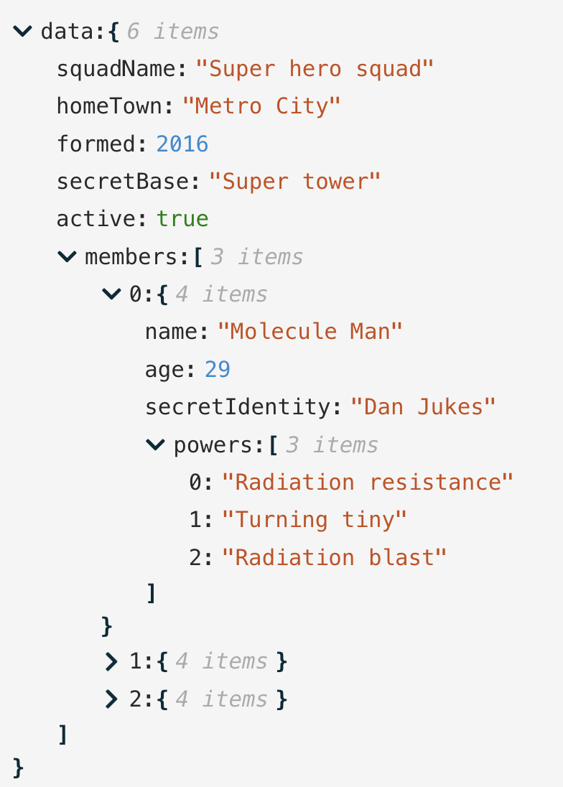
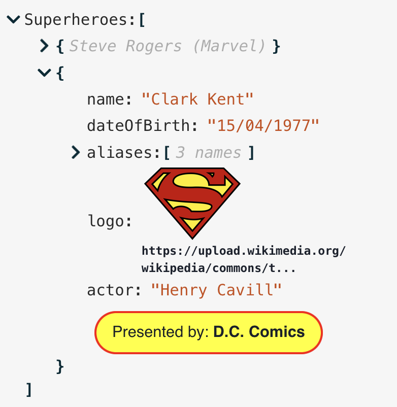

# json-edit-react


A [React](https://github.com/facebook/react) component for editing or viewing JSON/object data

Features include:

 - edit individual values, or whole objects as JSON text
 - fine-grained control over which elements can be edited, deleted, or added to
 - customisable UI, through simple, pre-defined [themes](#themes--styles), specific CSS overrides for UI components, or by targeting CSS classes
 - self-contained — rendered with plain HTML/CSS, so no dependance on external UI libraries
 - provide your own [custom component](#custom-nodes) to integrate specialised UI for certain data.

**[Explore the Demo](https://carlosnz.github.io/json-edit-react/)**



- [Installation](#installation)
- [Implementation](#implementation)
- [Usage](#usage)
- [Props overview](#props-overview)
- [Update functions](#update-functions)
  - [Copy function](#copy-function)
- [Filter functions](#filter-functions)
  - [Examples](#examples)
- [Themes \& Styles](#themes--styles)
  - [Fragments](#fragments)
  - [A note about sizing and scaling](#a-note-about-sizing-and-scaling)
  - [Icons](#icons)
- [Localisation](#localisation)
- [Custom Nodes](#custom-nodes)
  - [Active hyperlinks](#active-hyperlinks)
- [Custom Text](#custom-text)
- [Undo functionality](#undo-functionality)
- [Exported helpers](#exported-helpers)
  - [Functions \& Components](#functions--components)
  - [Types](#types)
- [Issues, bugs, suggestions?](#issues-bugs-suggestions)
- [Roadmap](#roadmap)
- [Inspiration](#inspiration)
- [Changelog](#changelog)


## Installation

`npm i json-edit-react`

or 

`yarn add json-edit-react`

## Implementation

```jsx
import { JsonEditor } from 'json-edit-react'

// In your React components:
return 
  <JsonEditor
    data={ jsonData }
    onUpdate={ ({newData} ) => {
      // Do something with the new data, e.g. update jsonData
  }}
  { ...otherProps } />
```

## Usage

**(for end user)**

It's pretty self explanatory (click the "edit" icon to edit, etc.), but there are a few not-so-obvious ways of interacting with the editor:

- Double-click a value (or a key) to edit it
- When editing a string, use `Cmd/Ctrl/Shift-Enter` to add a new line (`Enter` submits the value)
- It's the opposite when editing a full object/array node (which you do by clicking "edit" on an object or array value) — `Enter` for new line, and `Cmd/Ctrl/Shift-Enter` for submit
- `Escape` to cancel editing
- When clicking the "clipboard" icon, holding down `Cmd/Ctrl` will copy the *path* to the selected node rather than its value
- When opening/closing a node, hold down "Alt/Option" to open/close *all* child nodes at once

## Props overview

The only *required* value is `data`.

| prop                    | type                                         | default     | description                                                                                                                                                                                                                                                                                                          |
| ----------------------- | -------------------------------------------- | ----------- | -------------------------------------------------------------------------------------------------------------------------------------------------------------------------------------------------------------------------------------------------------------------------------------------------------------------- |
| `data`                  | `object\|array`                              |             | The data to be displayed / edited                                                                                                                                                                                                                                                                                    |
| `rootName`              | `string`                                     | `"data"`    | A name to display in the editor as the root of the data object.                                                                                                                                                                                                                                                      |
| `onUpdate`              | `UpdateFunction`                             |             | A function to run whenever a value is **updated** (edit, delete *or* add) in the editor. See [Update functions](#update-functions).                                                                                                                                                                                  |
| `onEdit`                | `UpdateFunction`                             |             | A function to run whenever a value is **edited**.                                                                                                                                                                                                                                                                    |
| `onDelete`              | `UpdateFunction`                             |             | A function to run whenever a value is **deleted**.                                                                                                                                                                                                                                                                   |
| `onAdd`                 | `UpdateFunction`                             |             | A function to run whenever a new property is **added**.                                                                                                                                                                                                                                                              |
| `enableClipboard`       | `boolean\|CopyFunction`                      | `true`      | Whether or not to enable the "Copy to clipboard" button in the UI. If a function is provided, `true` is assumed and this function will be run whenever an item is copied.                                                                                                                                            |
| `indent`                | `number`                                     | `3`         | Specify the amount of indentation for each level of nesting in the displayed data.                                                                                                                                                                                                                                   |
| `collapse`              | `boolean\|number\|FilterFunction`            | `false`     | Defines which nodes of the JSON tree will be displayed "opened" in the UI on load. If `boolean`, it'll be either all or none. A `number` specifies a nesting depth after which nodes will be closed. For more fine control a function can be provided — see [Filter functions](#filter-functions).                   |
| `restrictEdit`          | `boolean\|FilterFunction`                    | `false`     | If `false`, no editing is permitted. A function can be provided for more specificity — see [Filter functions](#filter-functions)                                                                                                                                                                                     |
| `restrictDelete`        | `boolean\|FilterFunction`                    | `false`     | As with `restrictEdit` but for deletion                                                                                                                                                                                                                                                                              |
| `restrictAdd`           | `boolean\|FilterFunction`                    | `false`     | As with `restrictEdit` but for adding new properties                                                                                                                                                                                                                                                                 |
| `restrictTypeSelection` | `boolean\|DataType[]\|TypeFilterFunction`    | `false`     | For restricting the data types the user can select. Can be a list of data types (e.g. `[ 'string', 'number', 'boolean', 'array', 'object', 'null' ]`) or a boolean. A function can be provided -- it should take the same input as the above `FilterFunction`s, but output should be `boolean \| DataType[]`.        |
| `keySort`               | `boolean\|CompareFunction`                   | `false`     | If `true`, object keys will be ordered (using default JS `.sort()`). A [compare function](https://developer.mozilla.org/en-US/docs/Web/JavaScript/Reference/Global_Objects/Array/sort) can also be provided to define sorting behaviour.                                                                             |
| `showArrayIndices`      | `boolean`                                    | `true`      | Whether or not to display the index (as a property key) for array elements.                                                                                                                                                                                                                                          |
| `showCollectionCount`   | `boolean\|"when-closed"`                     | `true`      | Whether or not to display the number of items in each collection (object or array).                                                                                                                                                                                                                                  |
| `defaultValue`          | `any\|DefaultValueFilterFunction`            | `null`      | When a new property is added, it is initialised with this value. A function can be provided with the same input as the `FilterFunction`s, but should output a value. This allows a different default value to be used depending on the data state (e.g. default for top level is an object, but a string elsewhere.) |
| `stringTruncate`        | `number`                                     | `250`       | String values longer than this many characters will be displayed truncated (with `...`). The full string will always be visible when editing.                                                                                                                                                                        |
| `translations`          | `LocalisedStrings` object                    | `{ }`       | UI strings (such as error messages) can be translated by passing an object containing localised string values (there are only a few). See [Localisation](#localisation)                                                                                                                                              |
| `theme`                 | `string\|ThemeObject\|[string, ThemeObject]` | `"default"` | Either the name of one of the built-in themes, or an object specifying some or all theme properties. See [Themes](#themes--styles).                                                                                                                                                                                  |
| `className`             | `string`                                     |             | Name of a CSS class to apply to the component. In most cases, specifying `theme` properties will be more straightforward.                                                                                                                                                                                            |
| `icons`                 | `{[iconName]: JSX.Element, ... }`            | `{ }`       | Replace the built-in icons by specifying them here. See [Themes](#themes--styles).                                                                                                                                                                                                                                   |  |
| `minWidth`              | `number\|string` (CSS value)                 | `250`       | Minimum width for the editor container.                                                                                                                                                                                                                                                                              |
| `maxWidth`              | `number\|string` (CSS value)                 | `600`       | Maximum width for the editor container.                                                                                                                                                                                                                                                                              |
| `customNodeDefinitions` | `CustomNodeDefinition[]`                     |             | You can provide customised components to override specific nodes in the data tree, according to a condition function. See see [Custom nodes](#custom-nodes) for more detail. (A simple custom component to turn url strings into active links is provided in the main package  -- see [here](#active-hyperlinks))    |
| `customText`            | `CustomTextDefinitions`                      |             | In addition to [localising the component](#localisation) text strings, you can also *dynamically* alter it, depending on the data. See [Custom Text](#custom-text) for more detail.                                                                                                                                  |

## Update functions

A callback to be executed whenever a data update (edit, delete or add) occurs can be provided. You might wish to use this to update your data state, or make an API call, for example. If you want the same function for all updates, then just the `onUpdate` prop is sufficient. However, should you require something different for editing, deletion and addition, then you can provide separate Update functions via the `onEdit`, `onDelete` and `onAdd` props.

The function will receive the following object as a parameter:

```js
{
    newData,      // data state after update
    currentData,  // data state before update 
    newValue,     // the new value of the property being updated
    currentValue, // the current value of the property being updated
    name,         // name of the property being updated
    path          // full path to the property being updated, as an array of property keys
                  // (e.g. [ "user", "friends", 1, "name" ] ) (equivalent to "user.friends[1].name")
}
```

The function needn't return anything, but if it returns `false`, it will be considered an error, in which case an error message will displayed in the UI and the internal data state won't actually be updated. If the return value is a `string`, this will be the error message displayed (i.e. you can define your own error messages for updates). On error, the displayed data will revert to its previous value.

### Copy function

A similar callback is executed whenever an item is copied to the clipboard (if passed to the `enableClipboard` prop), but with a different input parameter:

```js
    key         // name of the property being copied  
    path        // path to the property
    value       // the value copied to the clipboard
    type        // Either "path" or "value" depending on whether "Cmd/Ctrl" was pressed 
    stringValue // A nicely stringified version of `value`  
                // (i.e. what the clipboard actually receives)
```

Since there is very little user feedback when clicking "Copy", a good idea would be to present some kind of notification in this callback.

## Filter functions

You can control which nodes of the data structure can be edited, deleted, or added to, or have their data type changed, by passing Filter functions. These will be called on each property in the data and the attribute will be enforced depending on whether the function returns `true` or `false` (`true` means *cannot* be edited).

The function receives the following object:
```js
{
    key,   // name of the property
    path,  // path to the property (as an array of property keys)
    level, // depth of the property (with 0 being the root)
    value, // value of the property
    size ,  // if a collection (object, array), the number of items (null for non-collections)
    parentData, // parent object containing the current node
    collapsed // whether or not the current node is in a
              // "collapsed" state (only for Collection nodes)
}
```

A Filter function is available for the `collapse` prop as well, so you can have your data appear with deeply-nested collections opened up, while collapsing everything else, for example.

For restricting data types, the (Type) filter function is slightly more sophisticated. The input is the same, but the output can be either a `boolean` (which would restrict the available types for a given node to either *all* or *none*), or an array of data types to be restricted to. The available values are:
- `"string"`
- `"number"`
- `"boolean"`
- `"null"`
- `"object"`
- `"array"`

There is no specific restriction function for editing object key names, but they must return `true` for *both* `restrictEdit` and `restrictDelete` (and `restrictAdd` for collections), since changing a key name is equivalent to deleting a property and adding a new one.

Using all these restriction filters together can allow you to enforce a reasonably sophisticated data schema.

### Examples

- A good case would be ensure your root node is not directly editable:

```js
// in <JsonEditor /> props
restrictEdit = { ({ level }) => level === 0 }
```

- Don't let the `id` field be edited:

```js
restrictEdit = { ({ key }) => key === "id" }
// You'd probably want to include this in `restrictDelete` as well
```

- Only individual properties can be deleted, not objects or arrays:

```js
restrictDelete = { ({ size }) => size !== null }
```

- The only collections that can have new items added are the "address" object and the "users" array:
```js
restrictAdd = { ({ key }) => key !== "address" && key !== "users" }
// "Adding" is irrelevant for non-collection nodes
```

- Multiple type restrictions:
  - `string` values can only be changed to strings or objects (for nesting)
  - `null` is not allowed anywhere
  - `boolean` values must remain boolean
  - data nested below the "user" field can be any simple property (i.e. not objects or arrays), and doesn't have to follow the above rules (except no "null")
```js
restrictTypeSelection = { ({ path, value }) => {
  if (path.includes('user')) return ['string', 'number', 'boolean']
  if (typeof value === 'boolean') return false
  if (typeof value === 'string') return ['string', 'object']
  return ['string', 'number', 'boolean', 'array', 'object'] // no "null"
} }
```

## Themes & Styles

There is a small selection of built-in themes (as seen in the [Demo app](https://carlosnz.github.io/json-edit-react/)). In order to use one of these, just pass the name into the `theme` prop (although realistically, these exist more to showcase the capabilities  — I'm open to better built-in themes, so feel free to [create an issue](https://github.com/CarlosNZ/json-edit-react/issues) with suggestions). The available themes are:
- `default`
- `githubDark`
- `githubLight`
- `monoDark`
- `monoLight`
- `candyWrapper`
- `psychedelic`

However, you can pass in your own theme object, or part thereof. The theme structure is as follows (this is the "default" theme definition):

```js
{
  displayName: 'Default',
  fragments: { edit: 'rgb(42, 161, 152)' },
  styles: {
    container: {
      backgroundColor: '#f6f6f6',
      fontFamily: 'monospace',
    },
    collection: {},
    collectionInner: {},
    collectionElement: {},
    property: '#292929',
    bracket: { color: 'rgb(0, 43, 54)', fontWeight: 'bold' },
    itemCount: { color: 'rgba(0, 0, 0, 0.3)', fontStyle: 'italic' },
    string: 'rgb(203, 75, 22)',
    number: 'rgb(38, 139, 210)',
    boolean: 'green',
    null: { color: 'rgb(220, 50, 47)', fontVariant: 'small-caps', fontWeight: 'bold' },
    input: ['#292929', { fontSize: '90%' }],
    inputHighlight: '#b3d8ff',
    error: { fontSize: '0.8em', color: 'red', fontWeight: 'bold' },
    iconCollection: 'rgb(0, 43, 54)',
    iconEdit: 'edit',
    iconDelete: 'rgb(203, 75, 22)',
    iconAdd: 'edit',
    iconCopy: 'rgb(38, 139, 210)',
    iconOk: 'green',
    iconCancel: 'rgb(203, 75, 22)',
  },
}

```

The `styles` property is the main one to focus on. Each key (`property`, `bracket`, `itemCount`) refers to a part of the UI. The value for each key is *either*:
- a `string`, in which case it is interpreted as the colour (or background colour in the case of `container` and `inputHighlight`)
- a full CSS style object for fine-grained definition. You only need to provide properties you wish to override — all unspecified ones will fallback to either the default theme, or another theme that you specify as the "base".
- a "Style Function", which is a function that takes the same input as [Filter Functions](#filter-functions), but returns a CSS style object (or `null`). This allows you to *dynamically* change styling of various elements based on content or structure.
- an array containing any combination of the above, in which case they are merged together. For example, you could provide a Theme Function with styling for a very specific condition, but then provide "fallback" styles whenever the function returns `null`. (In the array, the *later* items have higher precedence)

For a simple example, if you want to use the "githubDark" theme, but just change a couple of small things, you'd specify something like this:

```js
// in <JsonEditor /> props
theme={[
        'githubDark',
        {
            iconEdit: 'grey',
            boolean: { color: 'red', fontStyle: 'italic', fontWeight: 'bold', fontSize: '80%' },
        },
      ]}
```

Which would change the "Edit" icon and boolean values from this:  
  
into this:  


Or you could create your own theme from scratch and overwrite the whole theme object.

So, to summarise, the `theme` prop can take *either*:

- a theme name e.g. `"candyWrapper"`
- a theme object:
  - can be structured as above with `fragments`, `styles`, `displayName` etc., or just the `styles` part (at the root level)
- a theme name *and* an override object in an array, i.e. `[ "<themeName>, {...overrides } ]`

You can play round with live editing of the themes in the [Demo app](https://carlosnz.github.io/json-edit-react/) by selecting "Edit this theme!" from the "Demo data" selector (though you won't be able to create functions in JSON).

#### CSS classes

Another way to style the component is to target the CSS classes directly. Every element in the component has a unique class name, so you should be able to locate them in your browser inspector and override them accordingly. All class names begin with the prefix `jer-`, e.g. `jer-collection-header-row`, `jer-value-string`

### Fragments

The `fragments` property above is just a convenience to allow repeated style "fragments" to be defined once and referred to using an alias. For example, if you wanted all your icons to be blue and slightly larger and spaced out, you might define a fragment like so:
```js
fragments: { iconAdjust: { color: "blue", fontSize: "110%", marginRight: "0.6em" }}
```

Then in the theme object, just use:
```js
{
    ...,
    iconEdit: "iconAdjust",
    iconDelete: "iconAdjust",
    iconAdd: "iconAdjust",
    iconCopy: "iconAdjust",
}
```

Then, when you want to tweak it later, you only need to update it in one place!

Fragments can also be mixed with additional properties, and even other fragments, like so:
```js
iconEdit: [ "iconAdjust", "anotherFragment", { marginLeft: "1em" } ]
```

### A note about sizing and scaling

Internally, all sizing and spacing is done in `em`s, never `px`. This makes scaling a lot easier — just change the font-size of the main container (either via the `className` prop or in the `container` prop of the theme) (or its parent), and watch the *whole* component scale accordingly.

### Icons

The default icons can be replaced, but you need to provide them as React/HTML elements. Just define any or all of them within the `icons` prop, keyed as follows:

```js
 icons={{
  add: <YourIcon /> 
  edit: <YourIcon /> 
  delete: <YourIcon />
  copy: <YourIcon />
  ok: <YourIcon />
  cancel: <YourIcon />
  chevron: <YourIcon />
}}
```

The Icon components will need to have their own styles defined, as the theme styles *won't* be added to the custom elements.

## Localisation

Localise your implementation by passing in a `translations` object to replace the default strings. The keys and default (English) values are as follows:
```js
{
  ITEM_SINGLE: '{{count}} item',
  ITEMS_MULTIPLE: '{{count}} items',
  KEY_NEW: 'Enter new key',
  ERROR_KEY_EXISTS: 'Key already exists',
  ERROR_INVALID_JSON: 'Invalid JSON',
  ERROR_UPDATE: 'Update unsuccessful',
  ERROR_DELETE: 'Delete unsuccessful',
  ERROR_ADD: 'Adding node unsuccessful',
  DEFAULT_STRING: 'New data!',
  DEFAULT_NEW_KEY: 'key',
}

```

## Custom Nodes

You can replace certain nodes in the data tree with your own custom components. An example might be for an image display, or a custom date editor, or just to add some visual bling. See the "Custom Nodes" data set in the [interactive demo](https://carlosnz.github.io/json-edit-react/) to see it in action. (There is also a custom Date picker that appears when editing ISO strings in the other data sets.)

Custom nodes are provided in the `customNodeDefinitions` prop, as an array of objects of following structure:

```js
{
  condition,            // a FilterFunction, as above
  element,              // React Component
  customNodeProps,      // object (optional)
  hideKey,              // boolean (optional)
  defaultValue,         // JSON value for a new instance of your component
  showOnEdit            // boolean, default false
  showOnView            // boolean, default true
  showEditTools         // boolean, default true
  name                  // string (appears in Types selector)
  showInTypesSelector,  // boolean (optional), default false
}
```

The `condition` is just a [Filter function](#filter-functions), with the same input parameters (`key`, `path`, `level`, `value`, `size`), and `element` is a React component. Every node in the data structure will be run through each condition function, and any that match will be replaced by your custom component. Note that if a node matches more than one custom definition conditions (from multiple components), the *first* one will be used, so place them in the array in priority order.

The component will receive *all* the same props as a standard node component (see codebase), but you can pass additional props to your component if required through the `customNodeProps` object. A thorough example of a custom Date picker is used in the demo (along with a couple of other more basic presentational ones), which you can inspect to see how to utilise the standard props and a couple of custom props. View the source code [here](https://github.com/CarlosNZ/json-edit-react/blob/main/demo/src/customComponents/DateTimePicker.tsx)

By default, your component will be presented to the right of the property key it belongs to, like any other value. However, you can hide the key itself by setting `hideKey: true`, and the custom component will take the whole row. (See the "Presented by" box in the "Custom Nodes" data set for an example.)

Also, by default, your component will be treated as a "display" element, i.e. it will appear in the JSON viewer, but when editing, it will revert to the standard editing interface. This can be changed, however, with the `showOnEdit`, `showOnView` and `showEditTools` props. For example, a Date picker might only be required when *editing* and left as-is for display. The `showEditTools` prop refers to the editing icons (copy, add, edit, delete) that appear to the right of each value on hover. If you choose to disable these but you still want to your component to have an "edit" mode, you'll have to provide your own UI mechanism to toggle editing.

You can allow users to create new instances of your special nodes by selecting them as a "Type" in the types selector when editing/adding values. Set `showInTypesSelector: true` to enable this. However, if this is enabled you need to also provide a `name` (which is what the user will see in the selector) and a `defaultValue` which is the data that is inserted when the user selects this "type". (The `defaultValue` must return `true` if passed through the `condition` function in order for it to be immediately displayed using your custom component.)

### Active hyperlinks

A simple custom component and definition to turn url strings into clickable links is provided with the main package for you to use out of the box. Just import and use like so:

```js
import { JsonEditor, LinkCustomNodeDefinition } from 'json-edit-react'

// ...Other stuff
return (
  <JsonEditor
    {...otherProps}
    customNodeDefinitions={[LinkCustomNodeDefinition, ...otherCustomDefinitions]}
  />
  )
```

## Custom Text

It's possible to change the various text strings displayed by the component. You can [localise it](#localisation), but you can also specify functions to override the displayed text based on certain conditions. For example, say we want the property count text (e.g. `6 items` by default) to give a summary of a certain type of node, which can look nice when collapsed. For example (taken from the [Demo](https://carlosnz.github.io/json-edit-react/)):



The `customText` property takes an object, with any of the [localisable keys](#localisation) as keys, with a function that returns a string (or `null`, which causes it to fallback to the localised or default string). The input to these functions is the same as for [Filter functions](#filter-functions), so in this example, it would be defined like so:

```js

// The function definition
const itemCountReplacement = ({ key, value, size }) => {
    // This returns "Steve Rogers (Marvel)" for the node summary
    if (value instanceof Object && 'name' in value)
      return `${value.name} (${(value)?.publisher ?? ''})`
    // This returns "X names" for the alias lists
    if (key === 'aliases' && Array.isArray(value))
      return `${size} ${size === 1 ? 'name' : 'names'}`
    // Everything else as normal
    return null
  }

// And in component props...
...otherProps,
customText = {
  ITEM_SINGLE: itemCountReplacement,
  ITEMS_MULTIPLE: itemCountReplacement,
}
```

 
## Undo functionality

Even though Undo/Redo functionality is probably desirable in most cases, this is not built in to the component, for two main reasons:
1. It would involve too much additional UI and I didn't want this component becoming opinionated about the look and feel beyond the essentials (which are mostly customisable/style-able anyway)
2. It is quite straightforward to implement using existing libraries. I've used **[use-undo](https://github.com/homerchen19/use-undo)** in the [Demo](https://carlosnz.github.io/json-edit-react/), which is working well.

## Exported helpers

A few helper functions, components and types that might be useful in your own implementations (from creating Filter or Update functions, or Custom components) are exported from the package:

### Functions & Components

- `themes`: an object containing all the built-in theme definitions
- `LinkCustomComponent`: the component used to render [hyperlinks](#active-hyperlinks)
- `LinkCustomNodeDefinition`: custom node definition for [hyperlinks](#active-hyperlinks)
- `IconAdd`, `IconEdit`, `IconDelete`, `IconCopy`, `IconOk`, `IconCancel`, `IconChevron`: all the built-in [icon](#icons) components
- `truncate`: function to truncate a string to a specified length. See [here](#link)
- `breakString`: function to turn a string into HTML, preserving line breaks and white space. See [here](#link)
- `extract`: function to extract a deeply nested object value from a string path. See [here](https://github.com/CarlosNZ/object-property-extractor)
- `assign`: function to set a deep object value from a string path. See [here](https://github.com/CarlosNZ/object-property-assigner)

### Types

- `ThemeName`: string literal list of built-in theme names
- `Theme`: a full [Theme](#themes--styles) object
- `ThemeInput`: input type for the `theme` prop
- `JsonEditorProps`: all input props for the Json Editor component
- [`UpdateFunction`](#update-functions), [`FilterFunction`](#filter-functions), [`CopyFunction`](#copy-function), [`CompareFunction`](https://developer.mozilla.org/en-US/docs/Web/JavaScript/Reference/Global_Objects/Array/sort), [`LocalisedString`](#localisation), [`CustomNodeDefinition`](#custom-nodes), [`CustomTextDefinitions`](#custom-text)
- `TranslateFunction`: function that takes a [localisation](#localisation) key and returns a translated string
- `IconReplacements`: input type for the `icons` prop
- `CollectionNodeProps`: all props passed internally to "collection" nodes (i.e. objects/arrays)
- `ValueNodeProps`: all props passed internally to "value" nodes (i.e. *not* objects/arrays)
- `CustomNodeProps`: all props passed internally to [Custom nodes](#custom-nodes); basically the same as `CollectionNodeProps` with an extra `customNodeProps` field for passing props unique to your component`

## Issues, bugs, suggestions?

Please open an issue: https://github.com/CarlosNZ/json-edit-react/issues

## Roadmap

The main features I'd like to introduce are:

1. **JSON Schema validation**. We can currently specify a reasonable degree of control over what can be edited using [Filter functions](#filter-functions) with the restriction props, but I'd like to go a step further and be able to pass in a [JSON Schema](https://json-schema.org/) and have the data be automatically validated against it, with the results reflected in the UI. This would allow control over data types and prevent missing properties, something that is not currently possible.
2. **Visibility filter function** — *hide* properties from the UI completely based on a Filter function. This should arguably be done outside the component though (filter the data upstream), so would be less of a priority (though it would be fairly simple to implement, so 🤷‍♂️)
3. **Search** — allow the user to narrow the list of visible keys with a simple search input. This would be useful for very large data objects, but is possibly getting a bit too much in terms of opinionated UI, so would need to ensure it can be styled easily. Perhaps it would be better if the "Search" input was handled outside this package, and we just accepted a "search" string prop?

## Inspiration

This component is heavily inspired by [react-json-view](https://github.com/mac-s-g/react-json-view), a great package that I've used in my own projects. However, it seems to have been abandoned now, and requires a few critical fixes, so I decided to create my own from scratch and extend the functionality while I was at it.

## Changelog

- **1.6.1**: Revert data state on Update Function error
- **1.6.0**: Allow a function for `defaultValue` prop
- **1.5.0**:
  - Open/close all descendant nodes by holding "Alt"/"Option" while opening/closing a node
- **1.4.0**:
  - [Style functions](#themes--styles) for context-dependent styling
  - Handle "loose" ([JSON5](https://json5.org/)) JSON text input(e.g. non-quoted keys, trailing commas, etc.)
- **1.3.0**:
  - [Custom (dynamic) text](#custom-text)
  - Add [hyperlink](#custom-nodes) Custom component to bundle
  - Better indentation of collection nodes (property name lines up with non-collection nodes, not the collapse icon)
- **1.2.2**: Allow editing of Custom nodes
- **1.1.0**: Don't manage data state within component
- **1.0.0**:
  - [Custom nodes](#custom-nodes)
  - Allow editing of keys
  - Option to define restrictions on data type selection
  - Option to hide array/object item counts
  - Improve keyboard interaction
- **0.9.6**: Performance improvement by not processing child elements if not visible
- **0.9.4**:
  - Layout improvements
  - Better internal handling of functions in data
- **0.9.3**: Bundle as ES6 module
- **0.9.1**: Export more Types from the package
- **0.9.0**: Initial release

