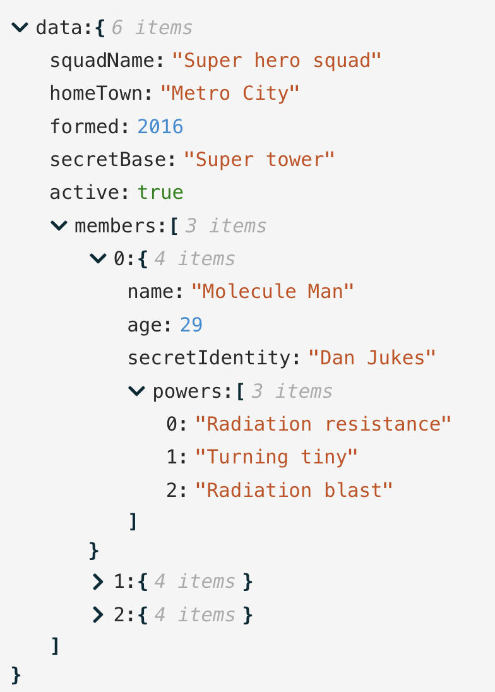
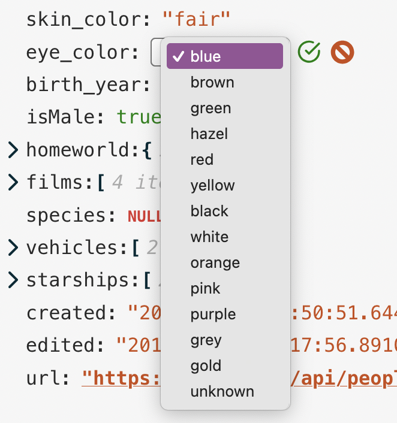
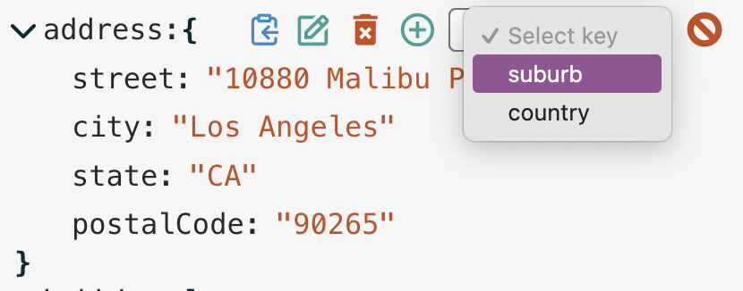
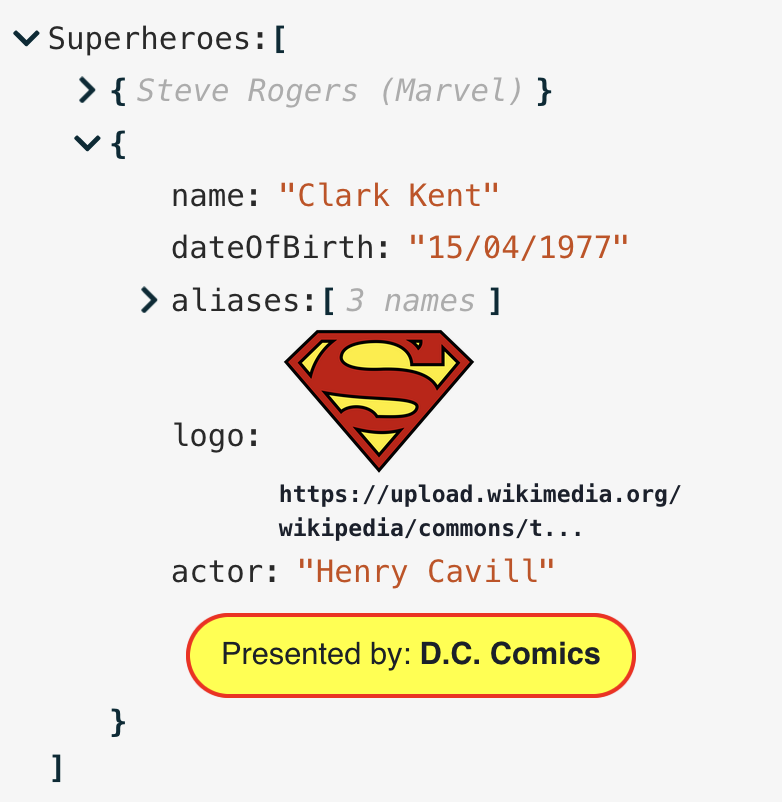
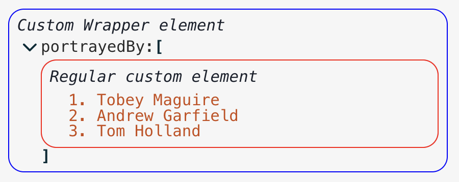
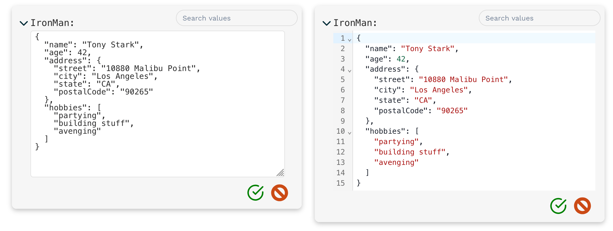

# json-edit-react

<!-- NPM INTRO -->


A highly-configurable [React](https://github.com/facebook/react) component for editing or viewing JSON/object data


## [Explore the Demo](https://carlosnz.github.io/json-edit-react/) <!-- omit in toc -->


[](https://deepwiki.com/CarlosNZ/json-edit-react)
[](https://github.com/CarlosNZ/json-edit-react/discussions)
[](https://github.com/sponsors/CarlosNZ)


### Features include:

 - ✅ **Easy inline editing** of individual values or whole blocks of JSON text 
 - 🔒 **Granular control** – restrict edits, deletions, or additions per element
 - 📏 **[JSON Schema](https://json-schema.org/) validation** (using 3rd-party validation library)
 - 🎨 **Customisable UI** — built-in or custom [themes](#themes--styles), CSS overrides or targeted classes
 - 📦 **Self-contained** — plain HTML/CSS, no external UI library dependencies, and *zero runtime dependencies*
 - 🔍 **Search & filter** — find data by key, value or custom function
 - 🚧 **[Custom components](#custom-nodes)** — replace keys and/or values with specialised components (e.g. date picker, links, images, `undefined`, `BigInt`, `Symbol`)
 - 🌏 **[Localisation](#localisation)** — easily translate UI labels and messages
 - 🔄 **[Drag-n-drop](#drag-n-drop)** re-ordering within objects/arrays
 - 🎹 **[Keyboard customisation](#keyboard-customisation)** — define your own key bindings
 - 🎮 **[External control](#external-control-1)** via callbacks and imperative methods

💡 Try the **[Live Demo](https://carlosnz.github.io/json-edit-react/)** to see these features in action!



## Optional Companion Packages  <!-- omit in toc -->

- **THEMES**: [@json-edit-react/themes](https://www.npmjs.com/package/@json-edit-react/themes) — curated, ready-made [themes] (#themes)
- **COMPONENTS**: [@json-edit-react/components](https://www.npmjs.com/package/@json-edit-react/components) - custom node components (links, date picker, etc.)
- **UTILITIES**: [@json-edit-react/themes](https://www.npmjs.com/package/@json-edit-react/themes) — a collection of helpers and tools for enhancing json-edit-react

> [!NOTE]
> This documentation is for V2 of **json-edit-react**, which is currently in beta. V1 docs are [here](https://github.com/CarlosNZ/json-edit-react).
> 
> If you're upgrading from V1, be sure to read the [migration guide](https://github.com/CarlosNZ/json-edit-react/blob/main/migration_guide.md).
> 
> 🎤️ Got feedback? [Open an issue](https://github.com/CarlosNZ/json-edit-react/issues), or [join the discussion](https://github.com/CarlosNZ/json-edit-react/discussions/198).

<!-- NPM INTRO -->

----

## Contents  <!-- omit in toc -->
- [Using the editor (for end users)](#using-the-editor-for-end-users)
- [Installation](#installation)
- [Implementation](#implementation)
- [Props Reference](#props-reference)
  - [Data Management](#data-management)
  - [Restricting Editing](#restricting-editing)
  - [Look and Feel / UI](#look-and-feel--ui)
  - [Search and Filtering](#search-and-filtering)
  - [Custom components \& overrides (incl. Localisation)](#custom-components--overrides-incl-localisation)
  - [External interaction](#external-interaction)
  - [Miscellaneous](#miscellaneous)
- [Managing state](#managing-state)
  - [Controlled component — `data` + `setData`](#controlled-component--data--setdata)
  - [Read-only display — `JsonViewer`](#read-only-display--jsonviewer)
  - [Typed data — `JsonEditor<T>`](#typed-data--jsoneditort)
- [Filter Functions](#filter-functions)
  - [The `NodeData` object](#the-nodedata-object)
- [Controlling editing](#controlling-editing)
  - [Permissions — `allowEdit` / `allowDelete` / `allowAdd`](#permissions--allowedit--allowdelete--allowadd)
  - [Restricting data types — `allowTypeSelection`](#restricting-data-types--allowtypeselection)
  - [Enums](#enums)
  - [New-key restrictions \& default values](#new-key-restrictions--default-values)
  - [Drag-and-drop reordering](#drag-and-drop-reordering)
- [Reacting to changes](#reacting-to-changes)
  - [`onUpdate` — accept, reject, transform](#onupdate--accept-reject-transform)
  - [Async updates \& gating — `hold()`](#async-updates--gating--hold)
  - [`onChange` — validating each keystroke](#onchange--validating-each-keystroke)
  - [`onError`](#onerror)
  - [`onCopy`](#oncopy)
  - [JSON Schema validation](#json-schema-validation)
- [Appearance \& theming](#appearance--theming)
  - [Using a prebuilt theme (`@json-edit-react/themes`)](#using-a-prebuilt-theme-json-edit-reactthemes)
  - [Customising styles — the `theme` object](#customising-styles--the-theme-object)
  - [CSS classes](#css-classes)
  - [Style fragments](#style-fragments)
  - [Icons](#icons)
  - [Initial expansion \& `collapse`](#initial-expansion--collapse)
- [Search \& filtering](#search--filtering)
  - [Basic search — `searchText` + `searchFilter`](#basic-search--searchtext--searchfilter)
  - [Custom search — `SearchFilterFunction`](#custom-search--searchfilterfunction)
- [Localisation](#localisation)
  - [`translations`](#translations)
  - [Dynamic text — `customText`](#dynamic-text--customtext)
- [Keyboard control](#keyboard-control)
- [Custom nodes \& components](#custom-nodes--components)
  - [Using the prebuilt components (`@json-edit-react/components`)](#using-the-prebuilt-components-json-edit-reactcomponents)
  - [Writing a custom node — `condition` + `component`](#writing-a-custom-node--condition--component)
  - [Handling JSON](#handling-json)
  - [Customising the key — `keyComponent`](#customising-the-key--keycomponent)
  - [Collection nodes \& collections-as-values](#collection-nodes--collections-as-values)
  - [Decorating the default node — `passOriginalNode`, `showOnView` / `showOnEdit`](#decorating-the-default-node--passoriginalnode-showonview--showonedit)
  - [Replacing the text/code editor — `TextEditor` (`CodeEditor`)](#replacing-the-textcode-editor--texteditor-codeeditor)
  - [Custom buttons](#custom-buttons)
- [Programmatic control](#programmatic-control)
  - [Listening to the lifecycle — `onEditEvent`](#listening-to-the-lifecycle--oneditevent)
  - [Driving the editor — the `editorRef` handle](#driving-the-editor--the-editorref-handle)
- [Performance](#performance)
  - [Fine-grained re-rendering \& referentially-stable props](#fine-grained-re-rendering--referentially-stable-props)
- [Undo \& redo (`@json-edit-react/utils`)](#undo--redo-json-edit-reactutils)
  - [`useUndo`](#useundo)
  - [`useConfirmOnUpdate`](#useconfirmonupdate)
- [Exported helpers \& types](#exported-helpers--types)
  - [Functions \& components](#functions--components)
  - [Types](#types)
- [Issues \& support](#issues--support)
- [Roadmap](#roadmap)
- [Inspiration](#inspiration)
- [Changelog](#changelog)
- [LEFTOVERS](#leftovers)
  - [Importing the stylesheet (Shadow DOM)](#importing-the-stylesheet-shadow-dom)

<!-- NPM USAGE -->

## Using the editor (for end users)

It's pretty self explanatory (click the "edit" icon to edit, etc.), but there are a few not-so-obvious ways of interacting with the editor:

- **Double-click** a value (or a key) to edit it
- When editing a string, use `Cmd/Ctrl/Shift-Enter` to add a new line (`Enter` submits the value)
- It's the opposite when editing a full object/array node (which you do by **clicking "edit"** on an object or array value) — `Enter` for new line, and `Cmd/Ctrl/Shift-Enter` for submit
- `Escape` to **cancel** editing
- When clicking the "**clipboard**" icon, holding down `Cmd/Ctrl` will copy the *path* to the selected node rather than its value
- When opening/closing a node, hold down "Alt/Option" to open/close *all* child nodes at once
- For Number inputs, **arrow-up** and **down** keys will increment/decrement the value
- For Boolean inputs, **space bar** will toggle the value
- Easily navigate to the next or previous node for editing using the `Tab`/`Shift-Tab` keys.
- **Drag and drop** items to change the structure or modify display order
- When editing is not permitted, double-clicking a string value will expand the text to the full value if it is truncated due to length (there is also a clickable "..." for long strings)
- **JSON text input** can accept "looser" input, if an additional JSON parsing method is provided (e.g. [JSON5](https://json5.org/)). See `jsonParse` prop.

[Have a play with the Demo app](https://carlosnz.github.io/json-edit-react/) to get a feel for it!

## Installation

```sh
# Depending on your package manager:

npm i json-edit-react
# OR
yarn add json-edit-react
# OR
pnpm add json-edit-react
```

## Implementation

```jsx
import { JsonEditor } from 'json-edit-react'

// In your React component:
return (
  <JsonEditor
    data={ jsonData }
    setData={ setJsonData }
    { ...otherProps } />
);

// For a read-only viewer, use the `JsonViewer` component instead:
import { JsonViewer } from 'json-edit-react'

return <JsonViewer data={ jsonData } { ...otherProps } />
```

<!-- NPM USAGE -->

## Props Reference

`data` and `setData` are the only *required* props. For a read-only component, use [`JsonViewer`](#viewer-mode) instead — its only required prop is `data`.

This is a reference list of *all* possible props, divided into related sections. Most of them provide a link to a section below in which the concepts are explored in more detail.

<details open>
<summary>

### Data Management

</summary>

| Prop                  | Type                    | Default | Description                                                                                                                                   |
| --------------------- | ----------------------- | ------- | --------------------------------------------------------------------------------------------------------------------------------------------- |
| `data`                | `object\|array`         | -       | The data to be displayed / edited                                                                                                             |
| `setData`             | `object\|array => void` | -       | Method to update your `data` object. **Required.** See [Managing state](#managing-state) below for additional notes.                          |
| `onUpdate`            | `UpdateFunction`        | -       | A function to run whenever a value is changed in the editor — edit, add, delete, rename *or* move. See [Update functions](#update-functions). |
| `onChange`            | `OnChangeFunction`      | -       | A function to modify/constrain user input as they type — see [OnChange functions](#onchange-function).                                        |
| `onError`             | `OnErrorFunction`       | -       | A function to run whenever the component reports an error — see [OnErrorFunction](#onerror-function).                                         |
| `showClipboardButton` | `boolean`               | `true`  | Show or hide the "Copy to clipboard" button in the UI.                                                                                        |
| `onCopy`              | `OnCopyFunction`        | -       | A function to run whenever an item is **copied** to the clipboard — see [Copy Function](#copy-function).                                      |

</details>
<details>
<summary>

### Restricting Editing

</summary>

| Prop                 | Type                                       | Default | Description                                                                                                                                                                        |
| -------------------- | ------------------------------------------ | ------- | ---------------------------------------------------------------------------------------------------------------------------------------------------------------------------------- |
| `allowEdit`          | `boolean\|FilterFunction`                  | `true`  | If `false`, no editing at all is permitted. A callback function can be provided (return `true` to permit a given node) — see [Advanced Editing Control](#advanced-editing-control) |
| `allowDelete`        | `boolean\|FilterFunction`                  | `true`  | As with `allowEdit` but for deletion                                                                                                                                               |
| `allowAdd`           | `boolean\|FilterFunction`                  | `true`  | As with `allowEdit` but for adding new properties                                                                                                                                  |
| `allowTypeSelection` | `boolean\|TypeOptions\|TypeFilterFunction` | `true`  | Controls which data types the user can select, including [Custom Node](#custom-nodes) types, and **Enums** — see [Data Type Restrictions](#data-type-restrictions)                 |
| `newKeyOptions`      | `string[] \| NewKeyOptionsFunction`        | -       | New keys can be restricted to certain values — see [New Key Restrictions & Default Values](#new-key-restrictions--default-values)                                                  |
| `defaultValue`       | `any\|DefaultValueFunction`                | `null`  | Value that new properties are initialised with — see [New Key Restrictions & Default Values](#new-key-restrictions--default-values)                                                |
| `allowDrag`          | `boolean\|FilterFunction`                  | `false` | Set to `true` to enable drag and drop functionality — see [Drag-n-drop](#drag-n-drop)                                                                                              |

</details>

<details>
<summary>

### Look and Feel / UI
</summary>

| Prop                    | Type                                                      | Default                        | Description                                                                                                                                                                                                                                                                                                                                                                                               |
| ----------------------- | --------------------------------------------------------- | ------------------------------ | --------------------------------------------------------------------------------------------------------------------------------------------------------------------------------------------------------------------------------------------------------------------------------------------------------------------------------------------------------------------------------------------------------- |
| `theme`                 | `ThemeInput`                                              | `defaultTheme`                 | Either one of the built-in themes (imported separately), or an object specifying some or all theme properties — see [Themes](#themes--styles).                                                                                                                                                                                                                                                            |
| `showIconTooltips`      | `boolean`                                                 | false                          | Display icon tooltips when hovering.                                                                                                                                                                                                                                                                                                                                                                      |  |
| `indent`                | `number`                                                  | `3`                            | Specify the amount of indentation for each level of nesting in the displayed data.                                                                                                                                                                                                                                                                                                                        |
| `collapse`              | `boolean\|number\|FilterFunction`                         | `false`                        | Defines which nodes of the JSON tree will be displayed "opened" in the UI on load — see [Collapse](#collapse).                                                                                                                                                                                                                                                                                            |
| `collapseAnimationTime` | `number`                                                  | `300`                          | Time (in ms) for the transition animation when collapsing collection nodes.                                                                                                                                                                                                                                                                                                                               |
| `collapseClickZones`    | `Array<"left" \| "header" \| "property">`                 | `["left", "header"]`           | Aside from the <span style="font-size: 140%">`⌄`</span> icon, you can specify other regions of the UI to be clickable for collapsing/opening a collection.                                                                                                                                                                                                                                                |
| `rootName`              | `string`                                                  | `"data"`                       | A name to display in the editor as the root of the data object.                                                                                                                                                                                                                                                                                                                                           |
| `showArrayIndexes`      | `boolean`                                                 | `true`                         | Whether or not to display the index (as a property key) for array elements.                                                                                                                                                                                                                                                                                                                               |
| `arrayIndexStart`       | `0 \| 1`                                                  | `0`                            | The number the *first* array element's index label starts from.                                                                                                                                                                                                                                                                                                                                           |
| `showStringQuotes`      | `boolean`                                                 | `true`                         | Whether or not to display string values in "quotes".                                                                                                                                                                                                                                                                                                                                                      |
| `showCollectionCount`   | `boolean\|"when-collapsed"\|"when-collapsed-or-filtered"` | `"when-collapsed-or-filtered"` | Whether or not to display the number of items in each collection (object or array).                                                                                                                                                                                                                                                                                                                       |
| `stringTruncateLength`  | `number`                                                  | `250`                          | String values longer than this many characters will be displayed truncated (with `...`). The full string will always be visible when editing.                                                                                                                                                                                                                                                             |
| `sortKeys`              | `boolean\|CompareFunction`                                | `false`                        | If `true`, object keys will be ordered (using default JS `.sort()`). A [compare function](https://developer.mozilla.org/en-US/docs/Web/JavaScript/Reference/Global_Objects/Array/sort) can also be provided to define sorting behaviour, except the input type should be a tuple of the key and the value of a node i.e. `(a: [string \| number, ValueData], b: [string \| number, ValueData]) => number` |
| `minWidth`              | `number\|string` (CSS value)                              | `250`                          | Minimum width for the editor container.                                                                                                                                                                                                                                                                                                                                                                   |
| `maxWidth`              | `number\|string` (CSS value)                              | `600`                          | Maximum width for the editor container.                                                                                                                                                                                                                                                                                                                                                                   |
| `baseFontSize`          | `number\|string` (CSS value)                              | `16px`                         | The "base" font size from which all other sizings are derived (in `em`s). By changing this you will scale the entire component.                                                                                                                                                                                                                                                                           |
| `insertAtTop`           | `boolean\|"object"\|"array"`                              | `false`                        | If `true`, inserts new values at the *top* rather than bottom. Can set the behaviour just for arrays or objects by setting to `"object"` or `"array"` respectively.                                                                                                                                                                                                                                       |
| `errorDisplayTime`      | `number`                                                  | `2500`                         | Time (in ms) to display the error message in the UI.                                                                                                                                                                                                                                                                                                                                                      |  |
| `showErrorMessages`     | `boolean `                                                | `true`                         | Whether or not the component should display its own error messages (you'd probably only want to disable this if you provided your own [`onError` function](#onerror-function))                                                                                                                                                                                                                            |
</details>
<details>
<summary>

### Search and Filtering
</summary>

| Prop                 | Type                                          | Default     | Description                                                                                                      |
| -------------------- | --------------------------------------------- | ----------- | ---------------------------------------------------------------------------------------------------------------- |
| `searchText`         | `string`                                      | `undefined` | Data visibility will be filtered by matching against value, using the method defined below in `searchFilter`     |
| `searchFilter`       | `"key"\|"value"\|"all"\|SearchFilterFunction` | `undefined` | Define how `searchText` should be matched to filter the visible items — see [Search/Filtering](#searchfiltering) |
| `searchDebounceTime` | `number`                                      | `350`       | Debounce time when `searchText` changes                                                                          |

</details>
<details>
<summary>

### Custom components & overrides (incl. Localisation)
</summary>

| Prop                    | Type                                                | Default                                   | Description                                                                                                                                                                                                                                                       |
| ----------------------- | --------------------------------------------------- | ----------------------------------------- | ----------------------------------------------------------------------------------------------------------------------------------------------------------------------------------------------------------------------------------------------------------------- |
| `customNodeDefinitions` | `CustomNodeDefinition[]`                            |                                           | You can provide custom React components to override specific nodes in the data tree, according to a condition function — see [Custom nodes](#custom-nodes) or browse the [@json-edit-react/components](https://www.npmjs.com/package/@json-edit-react/components) |
| `customButtons`         | `CustomButtonDefinition[]`                          | `[]`                                      | You can add your own buttons to the Edit Buttons panel if you'd like to be able to perform a custom operation on the data — see [Custom Buttons](#custom-buttons)                                                                                                 |
| `translations`          | `LocalisedStrings`                                  | `{ }`                                     | UI strings (such as error messages) can be translated by passing an object containing localised string values (there are only a few) — see [Localisation](#localisation)                                                                                          |
| `customText`            | `CustomTextDefinitions`                             |                                           | In addition to [localising the component](#localisation) text strings, you can also *dynamically* alter them, depending on the data — see [Custom Text](#custom-text)                                                                                             |
| `TextEditor`            | `ReactComponent`<br>&nbsp;&nbsp;`<TextEditorProps>` |                                           | Pass a component to offer a custom text/code editor when editing full JSON object as text. [See details](#full-object-editing)                                                                                                                                    |
| `Select`                | `ReactComponent`<br>&nbsp;&nbsp;`<SelectProps>`     | `<NativeSelect>`                          | Pass a component to replace the built-in native `<select>` (drop-down)                                                                                                                                                                                            |
| `jsonParse`             | `(input: string) => JsonData`                       | `JSON.parse`                              | Provide an alternative JSON parser (e.g. [JSON5](https://json5.org/)), to allow "looser" text input when editing JSON blocks.                                                                                                                                     |
| `jsonStringify`         | `(data: JsonData) => string`                        | `(data) => JSON.stringify(data, null, 2)` | Similarly, override the presentation of the text when editing JSON. You can supply different formatting parameters to the native `JSON.stringify()`, or provide a third-party option, like the aforementioned JSON5.                                              |
| `keyboardControls`      | `KeyboardControls`                                  | As explained [above](#usage)              | Override some or all of the keyboard controls — see [Keyboard customisation](#keyboard-customisation)                                                                                                                                                             |

</details>
<details>
<summary>

### External interaction
</summary>

More detail [below](#external-control-1)

| Prop          | Type                    | Default | Description                                                                                                                                                                                                   |
| ------------- | ----------------------- | ------- | ------------------------------------------------------------------------------------------------------------------------------------------------------------------------------------------------------------- |
| `onEditEvent` | `OnEditEventFunction`   | -       | Callback for the full edit lifecycle — `start`/`submit`/`commit`/`cancel`, the instant `delete`/`move`, and the background `updateSuccess`/`updateError` settlement — see [Event callbacks](#event-callbacks) |
| `onCollapse`  | `OnCollapseFunction`    | -       | Callback to execute whenever the user collapses or opens a node                                                                                                                                               |
| `editorRef`   | `Ref<JsonEditorHandle>` | -       | Imperative handle to collapse/open nodes or start/stop editing. See [Imperative handle](#imperative-handle-editorref)                                                                                         |

</details>

<details>
<summary>

### Miscellaneous
</summary>

| Prop        | Type     | Default | Description                                                                                                                       |
| ----------- | -------- | ------- | --------------------------------------------------------------------------------------------------------------------------------- |
| `id`        | `string` | -       | Name for the HTML `id` attribute on the main component container.                                                                 |
| `className` | `string` | -       | Name of a CSS class to apply to the overall component. In most cases, specifying `theme` properties will be more straightforward. |
</details>

----

## Managing state

### Controlled component — `data` + `setData`

You manage the `data` state yourself outside this component and pass in a `setData` method, which is called internally to update your `data`. 

### Read-only display — `JsonViewer`

If your use case is read-only — displaying JSON without any editing affordances — import `JsonViewer` instead of `JsonEditor`:

```tsx
import { JsonViewer } from 'json-edit-react'

<JsonViewer data={data} theme={someTheme} />
```

`JsonViewer` is a thin wrapper over `JsonEditor` that locks all edit, add, delete and drag operations off. It accepts the same display, theming, keyboard, search, collapse, localisation and custom-node props, but drops `setData`, the update callbacks (`onUpdate` / `onChange`), and the edit-permission props (`allowEdit` / `allowAdd` / `allowDelete` / `allowDrag` / `allowTypeSelection`) — none of which are meaningful in a read-only context. Its `editorRef` handle (`JsonViewerHandle`) is collapse-only.

If you instead need an editor that *sometimes* locks editing (e.g. based on user permissions), keep using `<JsonEditor>` and toggle the relevant `allow*` props dynamically — `allowEdit={canEdit}` etc.

[](https://carlosnz.github.io/json-edit-react-v2/examples/json-viewer)

### Typed data — `JsonEditor<T>`

`JsonEditor` is generic on the type of its `data` prop, so TypeScript users can preserve their data shape across the component boundary instead of falling back to `unknown`:

```tsx
interface User {
  name: string
  email: string
  roles: string[]
}

const [user, setUser] = useState<User>(initialUser)

<JsonEditor<User>
  data={user}
  setData={setUser}
  onUpdate={({ newData }) => {
    // newData is typed as User
  }}
/>
```

The generic flows through `data`, `setData`, the `onUpdate` / `onChange` / `onError` callbacks (root data slots only — per-node `value` stays `unknown`), and `NodeData.fullData` inside `FilterFunction`s. Defaults to `JsonData` (≈ `unknown`) so untyped consumers don't need to change anything.

> [!TIP]
> `T` describes the data you *provide*. It is an input contract, not a runtime invariant — if the user can freely restructure the JSON, post-edit values may not conform to `T`. Pair with `allowAdd` / `allowDelete` / `allowTypeSelection` to lock the shape, or validate inside `onUpdate` if you depend on it.

## Filter Functions

```jsx
// The powerhouse of the component
(nodeData) => result
```

The dynamic capabilities of the editor are powered by one core concept — the `FilterFunction`. You provide a callback that receives a bunch of metadata about the current node, and returns a boolean, or value, that determines what happens. Editing, search, styling, conditional rendering all rely on this workhorse structure, so we'll explain the shape of it here so you'll grasp how it's used throughout this doc.

| Type                    | Shape                                 | Drives                                                             | Section                   |
| ----------------------- | ------------------------------------- | ------------------------------------------------------------------ | ------------------------- |
| `FilterFunction`        | `(nodeData) => boolean`               | `allowEdit` / `allowDelete` / `allowAdd` / `allowDrag`, `collapse` | Controlling editing       |
| `TypeFilterFunction`    | `(nodeData) => boolean \| DataType[]` | `allowTypeSelection`                                               | Controlling editing       |
| `SearchFilterFunction`  | `(nodeData, searchText) => boolean`   | `searchFilter`                                                     | Search & filtering        |
| Style function          | `(nodeData) => CSS \| null`           | `theme` styles                                                     | Appearance & theming      |
| `CustomTextFunction`    | `(nodeData) => string \| null`        | `customText`                                                       | Localisation              |
| `condition`             | `(nodeData) => boolean`               | `customNodeDefinitions`                                            | Custom nodes & components |
| `DefaultValueFunction`  | `(nodeData, newKey?) => value`        | `defaultValue`                                                     | Controlling editing       |
| `NewKeyOptionsFunction` | `(nodeData) => string[] \| null`      | `newKeyOptions`                                                    | Controlling editing       |

The side-effect callbacks (`onUpdate` / `onChange` / `onError` / `onCollapse` / `onCopy` / `onEditEvent`) receive the **same** `NodeData` plus their own extras — see [Reacting to changes](#reacting-to-changes) and [Programmatic control](#programmatic-control).

### The `NodeData` object

So what is this `nodeData` input? It's an object of the following shape:

```tsx
interface NodeData {
    key: CollectionKey          // name of the property (string or number (arrays))
    path: CollectionKey[]       // path to the property (as an array of property keys)
    level: number               // depth of the property (with 0 being the root)
    index: number               // index of the node within its collection (based on display order)
    value: JsonData             // value of the property
    size: number | null         // if a collection (object, array), the number of items
                                //   (null for non-collections)
    visibleSize?: number | null // direct-child count under the current search filter.
                                //   - `number` on collections under an active filter;
                                //   - `null` on render-path nodes when no filter is active
                                //      or this isn't a tracked collection (e.g. a leaf).
                                //   - `undefined` only inside the `searchFilter` callback
                                //       itself (the walk hasn't computed counts yet) or when
                                //       NodeData reaches you via an imperative bridge
                                //       (onCollapse / onEditEvent / the editorRef handle).
                                //        Use `!= null` to gate on "has a real count".
    parentData: object | null   // parent object containing the current node
    fullData: JsonData          // the full (overall) data object
    collapsed?: boolean         // whether or not the current node is in a
                                //   "collapsed" state (only for Collection nodes)
}
```

Let's get into the many ways we can use this...

## Controlling editing

As well as configuring which nodes of can be **edited**, **deleted**, or **added** to, you can also specify:

- the data types (if any) available to each node (including *enums*),
- a restricted set of available keys that can be added to a node,
- default values for specific nodes and data types,
- drag 'n' drop restrictions
- which nodes appear open or closed ("collapsed")

As outlined in the [props list](#restricting-editing) above, most of these props can take either:

- a `boolean` (in which case `true` means the operation is fully permitted, `false` means it's fully disabled)
- a `FilterFunction` callback, which allows edit controls to be defined dynamically

The callback for each type of permission is slightly different, so let's look at each in turn:

### Permissions — `allowEdit` / `allowDelete` / `allowAdd`

These each take a `boolean` value, or a [`FilterFunction`](#filter-functions) callback, which must return a boolean -- if `false` that node will **not** be editable (return `true` to permit it).

[](https://carlosnz.github.io/json-edit-react-v2/examples/edit-restrictions)

> [!NOTE]
> There is no specific permission function for editing object **property names**. Since renaming a property is equivalent to deleting it and adding it back under a new name, a node's key is only editable when it returns `true` for **all three** of `allowEdit`, `allowDelete` *and* `allowAdd` (and the node isn't the root or an array index).


### Restricting data types — `allowTypeSelection`

The `allowTypeSelection` prop can take either a `boolean` (`false` means the data type can **not** be changed at all, `true` means any type is allowed) or a [`TypeFilterFunction`](#filter-functions), or an **array** of available data types. The core types are:

- `"string"`
- `"number"`
- `"boolean"`
- `"null"`
- `"object"`
- `"array"`

The data type array can also specify [Custom Node](#custom-nodes) types (as defined in the custom node's `name` prop), as well as **Enum** options (see [Enums](#enums) below).

The `TypeFilterFunction`, while it takes the same input shape as a standard `FilterFunction`, can return *either* a simple `boolean` *or* an `array` of available types.

> [!NOTE]
> If `allowTypeSelection` returns less than two available types for a given node, the "Type Selector" drop-down won't appear for that node.

[](https://carlosnz.github.io/json-edit-react-v2/examples/type-restrictions)

### Enums

By defining an **Enum** type, you can restrict the available values to a pre-defined list:



To define an Enum, just add an object with the following structure to your "Types" array (either directly in the prop, or returned from the callback):

```js
{
  enum: "My Enum Type" // name that will appear in the Types selector drop-down
  values: [  // the list of allowed values
    "Option A",
    "Option B",
    "Option C"
  ]
  matchPriority: 1 // (Optional) used to recognize existing string values
                   //   as the particular type (see below)
}
```

What is `matchPriority`? Well, when the data object is initialised, we have no way to know whether a given string value is "just a string" or is supposed to be one of the members of an Enum type (and we don't want to assume that if it's listed somewhere in an Enum `values` list that it definitely *should* be restricted to that type). So, if `matchPriority` is not defined, then that Enum type will *never* be initially assigned to a potentially matching Enum value when editing. If `matchPriority` is defined, then the highest priority Enum that has the value in its `values` list will be assigned (so if multiple Enums have overlapping `values`, the one with the highest priority will be applied.).

If the type of a given node is going to be *restricted* to a particular Enum type (i.e. the `allowTypeSelection` prop returns *only* one value), then a `matchPriority` is essential, otherwise it wouldn't be possible to switch a `string` to that type.

You can see examples of this in the [Star Wars data set](https://carlosnz.github.io/json-edit-react-v2/?data=starWars) of the Demo — the `eye_color`, `skin_color`, `hair_color` and `films` values are all restricted to a single, matching Enum type.

> [!NOTE]
> When editing, once an Enum type is selected from the Types selector, that node will continue to be displayed as that type for subsequent edits in the same session -- the `matchPriority` is purely for automatic recognition of a given value as a specific type when *first* editing it.

[](https://carlosnz.github.io/json-edit-react-v2/examples/enums)

### New-key restrictions & default values

You can restrict the available properties a given collection node can have (when adding new properties) by setting the `newKeyOptions` prop. The value can be either a **list of keys**, or a [`NewKeyOptionsFunction`](#filter-functions) callback which returns the key list.

This will cause the UI to present a Drop-down selector when adding a new key rather than the usual text input:



The initial *value* for newly-added keys can also be defined with the `defaultValue` prop -- this can be *any* value, or a [`DefaultValueFunction`](#filter-functions) callback returning any value. The input signature is almost the same as standard `FilterFunctions`, but it can take a second argument, which is the name of the new key.

You can see an example of this in the [JSON Schema validation data](https://carlosnz.github.io/json-edit-react/?data=jsonSchemaValidation) of the Demo app when you add new keys to either the `address` collection or the root node.

[](https://carlosnz.github.io/json-edit-react-v2/examples/new-key-restrictions)

### Drag-and-drop reordering

The `allowDrag` property controls which items (if any) can be dragged into new positions. By default, this is *off*, so you must set `allowDrag = true` to enable this functionality. Like the Edit permissions above, this property can also take a `FilterFunction` for fine-grained control. There are a couple of additional considerations, though:

- JavaScript does *not* guarantee object property order, so enabling this feature may yield unpredictable results. See [here](https://dev.to/frehner/the-order-of-js-object-keys-458d) for an explanation of how key ordering is handled.
> [!WARNING]
> It is strongly advised that you only enable drag-and-drop functionality if:
> 1. you're sure object keys will always be simple strings (i.e. not digits or non-standard characters)
> 2. you're saving the data in a serialisation format that preserves key order. For example, storing in a Postgres database using the `jsonb` (binary JSON) type, key order is meaningless, so the next time the object is loaded, the keys will be listed alphabetically.

- The `allowDrag` filter applies to the *source* element (i.e. the node being dragged), not the destination.
- To be draggable, the node must *also* be delete-able (via the `allowDelete` prop), as dragging a node to a new destination is essentially just deleting it and adding it back elsewhere.
- Similarly, the destination collection must be editable in order to drop it in there. This ensures that if you've gone to the trouble of configuring restrictive editing constraints using Filter functions, you can be confident that they can't be circumvented via drag-n-drop.

## Reacting to changes

### `onUpdate` — accept, reject, transform

A single **`onUpdate`** callback runs whenever the data changes in the editor — for *every* kind of change. You might wish to use this to update some external state, make an API call, modify the data before saving it, or [validate the data structure](#json-schema-validation) against a JSON schema. (It is *not* an alternative to `setData` — see [Managing state](#managing-state).)

The function receives two arguments. The first is a single object, built on the standard [node data](#filter-functions) (`key`, `path`, `value`, `fullData`, etc.) with an **`event`** discriminant plus the change-specific fields; the second is a `control` object for [gating the commit](#optimistic-updates-and-gating-hold):

```js
{
    // ...standard node data (key, path, value, fullData, ...)
    //    describing the node BEFORE the change — for `add`, this is the new
    //    node's position, with `value` unset
    event,        // 'edit' | 'add' | 'delete' | 'rename' | 'move'
    newData,      // the whole document AFTER the change
    // ...plus one event-specific field:
    newValue,     // the new value           (event: 'edit' | 'add')
    newKey,       // the new key             (event: 'rename')
    newPath,      // the destination path    (event: 'move')
}
```

Branch on `event` to handle each operation:

```js
onUpdate={(props) => {
  switch (props.event) {
    case 'edit':   /* props.newValue */ break
    case 'rename': /* props.newKey   */ break
    case 'move':   /* props.newPath  */ break
    case 'add':    /* props.newValue */ break
    case 'delete': break
  }
}}
```

The function can return nothing (the change proceeds as normal), or a value to accept/reject/transform/cancel the change. The return value can be one of:
- `true` / `void` / `undefined`: the change proceeds as normal
- `false`: treats the change as an error — the data is not updated (reverts to the previous value) and a generic error message is displayed in the UI
- `null`: **silently cancels** the change — no update, and *no* error message (unlike `false`). Use this to quietly abort a change that isn't an error
- `{ value: <value> }`: use the returned `<value>` instead of the input data. You might use this to automatically modify user input — for example, sorting an array, or inserting a timestamp field into an object
- `{ error: <string> }` (or `{ error: { code, message } }`): treats the change as an error, with your provided message shown in the UI

(Any of the above may also be returned from an `async` function / `Promise`.)

> [!WARNING]
> The [Update function](#update-functions) (`onUpdate`) is *not* an alternative to `setData` — it's for side effects (e.g. notifications), validation, or mutating the value before it reaches `setData`. Trying to drive your own state from them leads to drift between the internal display state and your external copy.

### Async updates & gating — `hold()`

By default, commits are **optimistic**: when the user submits an edit the input closes and the data updates immediately, then `onUpdate` runs in the background. If it rejects (`false`, `{ error }`, a thrown error, or a rejected promise), the change is automatically reverted and the error surfaced. A slow `onUpdate` — say a network save — therefore never blocks the editor, and the user can keep working. Each in-flight commit is tracked independently, so a late failure reverts only its own node and can't clobber a newer edit.

Structural changes — **delete**, drag-and-drop **move**, and adding an **array** item — settle a little differently. With no open input to keep responsive, they wait a brief moment (~100ms) for `onUpdate`: a fast result (e.g. synchronous schema validation) applies or rejects *in place*, so a rejected delete keeps the node and shows its error immediately; only a slow `onUpdate` falls back to the optimistic path (apply, then revert on failure). A rejected **move** has no settled position to anchor an inline message to, so it reports through the [`onEditEvent`](#event-callbacks) `updateError` event rather than an inline error.

If instead you want to **hold the editor open** until a decision resolves — e.g. to show a confirmation dialog, or to validate before the value is committed — call `hold()` on the second argument:

```js
onUpdate={async (props, { hold }) => {
  const release = hold()          // editor stays open; the rest of the tree is blocked
  const ok = await myConfirmDialog(props)
  if (!ok) return null            // abort — the edit is discarded
  release()                       // commit now (closes the editor)
}}
```

- `hold()` **must be called synchronously**, before the first `await`.
- While held, the editor stays open and the rest of the tree can't be edited (one operation at a time).
- `release()` applies the change and closes the editor.
- If you `hold()` but never `release()`, the eventual `onUpdate` result decides — the change commits when the promise resolves (unless it resolves to a reject/cancel). So a plain `hold()` → `await` → `return` keeps the editor open for the duration and then commits.

### `onChange` — validating each keystroke

Similar to the Update function, the `onChange` function is executed as the user input changes. You can use this to restrict or constrain user input -- e.g. limiting numbers to positive values, or preventing line breaks in strings. The function *must* return a value in order to update the user input field, so if no changes are to be made, just return it unmodified.

The input is the standard [node data](#filter-functions) (`key`, `path`, `value`, `fullData`, etc.) with the in-progress `newValue` added. (Since this runs *before* the data is committed, there's no `newData` — `value` is the current value, `fullData` the current document.)

<details>
<summary>

#### Examples
</summary>

- Restrict "age" inputs to positive values up to 100:  
  ```js
  // in <JsonEditor /> props
  onChange = ({ newValue, key }) => {
        if (key === "age" && newValue < 0) return 0;
        if (key === "age" && newValue > 100) return 100;
        return newValue
      }
  ```
- Only allow alphabetical or whitespace input for "name" field (including no line breaks):  
  ```js
  onChange = ({ newValue, key }) => {
      if (key === 'name' && typeof newValue === "string")
        return newValue.replace(/[^a-zA-Z\s]|\n|\r/gm, '');
      return newValue;
    }
  ```
</details>

### `onError`

Normally, the component will display simple error messages whenever an error condition is detected (e.g. invalid JSON input, duplicate keys, or custom errors returned by the [`onUpdate` function](#update-functions)). However, you can provide your own `onError` callback in order to implement your own error UI, or run additional side effects. (In the former case, you'd probably want to disable the `showErrorMessages` prop, too.) It receives the standard [node data](#filter-functions) (`key`, `path`, `value`, `fullData`, etc.) with the following additional fields spread on top:

```js
{
    // ...standard node data (key, path, value, fullData, ...)
    errorValue,   // the erroneous value that failed to update the property
    error: {      // a JerError
      code,       // one of 'UPDATE_ERROR' | 'DELETE_ERROR' | 'ADD_ERROR'
                  //   | 'RENAME_ERROR' | 'MOVE_ERROR' | 'INVALID_JSON' | 'KEY_EXISTS'
      message     // the (localised) error message that would be displayed
    }
}
```
> [!NOTE]
> An example of a custom Error UI can be seen in the [Demo](#https://carlosnz.github.io/json-edit-react/?data=customNodes) with the "Custom Nodes" data set -- when you enter invalid JSON input a "Toast" notification is displayed instead of the normal component error message.

### `onCopy`

The `onCopy` callback runs whenever an item is **copied** to the clipboard. It receives the standard [node data](#filter-functions) (`key`, `path`, `value`, `fullData`, etc.) with the following additional fields spread on top:

```js
{
    // ...standard node data (key, path, value, ...)
    type         // Either "path" or "value" depending on whether "Cmd/Ctrl" was pressed
    stringValue  // A nicely stringified version of the copied value
                 // (i.e. what the clipboard actually receives)
    success      // true/false -- whether the clipboard copy action actually succeeded
    error        // a JerError `{ code: 'CLIPBOARD_ERROR', message }`
                 //   present only when `success === false`
}
```

> [!TIP]
> Since there is very little user feedback when clicking "Copy", a good idea would be to present some kind of notification (see [Demo](https://carlosnz.github.io/json-edit-react/)). There are situations (such as an insecure environment) where the browser won't actually permit any clipboard actions. In this case, the `success` property will be `false`, so you can handle it appropriately.

### JSON Schema validation

It's possible to do full [JSON Schema](https://json-schema.org/) validation by creating an [Update Function](#update-functions) that passes the data to a 3rd-party schema validation library (e.g. [Ajv](https://ajv.js.org/)). This will then reject any invalid input, and display an error in the UI (or via a custom [onError](#onerror-function) function). You can see an example of this in the [Demo](https://carlosnz.github.io/json-edit-react/?data=jsonSchemaValidation) with the "JSON Schema Validation" data set (and the "Custom Nodes" data set). 

An example `onUpdate` validation function (using Ajv) could be something like this:

```js
import { JsonEditor } from 'json-edit-react'
import Ajv from 'ajv'
import schema from './my-json-schema.json'

// Put these outside React components:
const ajv = new Ajv()
const validate = ajv.compile(schema)

// Etc....

// In the React component:
return 
  <JsonEditor
    data={ jsonData }
    onUpdate={ ({ newData }) => {
      const valid = validate(newData)
      if (!valid) {
        console.log('Errors', validate.errors)
        const errorMessage = validate.errors
          ?.map((error) => `${error.instancePath}${error.instancePath ? ': '
            : ''}${error.message}`)
          .join('\n')
        // Send detailed error message to an external UI element,
        // such as a "Toast" notification
         displayError({
          title: 'Not compliant with JSON Schema',
          description: errorMessage,
          status: 'error',
        })
        // This message is returned to and displayed in the json-edit-react UI
        return { error: 'JSON Schema error' }
      }
    }}
  { ...otherProps } />
``` 

## Appearance & theming

### Using a prebuilt theme (`@json-edit-react/themes`)

A small selection of pre-built themes is available in the [`@json-edit-react/themes`](#optional-companion-packages) companion package (as seen in the [Demo app](https://carlosnz.github.io/json-edit-react/)). Install the package, then import a theme and pass it as the `theme` prop:

```sh
npm i @json-edit-react/themes
```

```js
import { JsonEditor } from 'json-edit-react'
import { githubDarkTheme } from '@json-edit-react/themes'

const MyApp = () => {
  const [ data, setData ] = useState({ one: 1, two: 2 })

  return <JsonEditor
    data={data}
    setData={setData}
    theme={githubDarkTheme}
    // other props...
    />
}
```

The following themes are exported (although realistically, these exist more to showcase the capabilities — I'm open to better built-in themes, so feel free to [create an issue](https://github.com/CarlosNZ/json-edit-react/issues) with suggestions):
- `githubDarkTheme`
- `githubLightTheme`
- `monoDarkTheme`
- `monoLightTheme`
- `candyWrapperTheme`
- `psychedelicTheme`

### Customising styles — the `theme` object

However, you can pass in your own theme object, or part thereof. The theme structure is as follows (this is the "default" theme definition):

```js
{
  displayName: 'Default',
  // icons: { … },  // optional per-glyph IconDefinitions — see "Icons" below
  styles: {
    container: {
      backgroundColor: '#f6f6f6',
      fontFamily: 'monospace',
    },
    property: '#292929',
    bracket: { color: '#002b36', fontWeight: 'bold' },
    itemCount: { color: '#0000004d', fontStyle: 'italic' },
    string: '#cb4b16',
    number: '#268bd2',
    boolean: 'green',
    null: { color: '#dc322f', fontVariant: 'small-caps', fontWeight: 'bold' },
    input: ['#292929'],
    inputHighlight: '#b3d8ff',
    error: { fontSize: '0.8em', color: 'red', fontWeight: 'bold' },
    iconCollection: '#002b36',
    iconEdit: '#2aa198',
    iconDelete: '#cb4b16',
    iconAdd: '#2aa198',
    iconCopy: '#268bd2',
    iconOk: 'green',
    iconCancel: '#cb4b16',
  },
}

```

The `styles` property is the main one to focus on. Each key (`property`, `bracket`, `itemCount`) refers to a part of the UI. The value for each key is *either*:
- a `string`, in which case it is interpreted as the colour (or background colour in the case of `container` and `inputHighlight`)
- a full CSS style object for fine-grained definition. You only need to provide properties you wish to override — all unspecified ones will fallback to either the default theme, or another theme that you specify as the "base".
- a "Style Function", which is a function that takes the same input as [Filter Functions](#filter-functions), but returns a CSS style object (or `null`). This allows you to *dynamically* change styling of various elements based on content or structure. (An example is in the [Demo](https://carlosnz.github.io/json-edit-react/?data=customNodes) "Custom Nodes" data set, where the character names are styled larger than other string values)
- an array combining any of the above. Static styles merge left → right (later wins per property); a "Style Function" always applies *last*, on top of the merged statics, and multiple functions compose in order. So you can pair static "fallback" styles with a conditional function — when the function returns `null` it contributes nothing, leaving the statics showing through.

`inputHighlight` is the one exception to the above: it sets the text-selection colour through a `::selection` rule (surfaced as a single CSS custom property), so it accepts **only a colour string** — not a style object, function, or array.

`collection`, `collectionElement`, `headerRow`, `valueRow` and `dropZone` aren't styled by the default theme, but can be themed the same way. `headerRow` targets a collection's header line (key + brackets) and `valueRow` a leaf value's row — useful for row height/background.

For a simple example, if you want to use the "githubDark" theme, but just change a couple of small things, you'd specify something like this:

```js
// in <JsonEditor /> props
theme={[
        githubDarkTheme,
        {
            iconEdit: 'grey',
            boolean: { color: 'red', fontStyle: 'italic', fontWeight: 'bold', fontSize: '80%' },
        },
      ]}
```

Which would change the "Edit" icon and boolean values from this:  
  
into this:  


Or you could create your own theme from scratch and overwrite the whole theme object.

So, to summarise, the `theme` prop can take *either*:

- an imported theme, e.g `"candyWrapperTheme"`
- a theme object:
  - can be structured as above with `fragments`, `styles`, `displayName`, `icons` (glyphs — see [Icons](#icons)) etc., or just the `styles` part (at the root level)
- a theme name *and* an override object in an array, i.e. `[ "<themeName>, {...overrides } ]`

You can play round with live editing of the themes in the [Demo app](https://carlosnz.github.io/json-edit-react/) by selecting "Edit this theme!" from the "Demo data" selector (though you won't be able to create functions in JSON).

### CSS classes

Another way to style the component is to target the CSS classes directly. Every element in the component has a unique class name, so you should be able to locate them in your browser inspector and override them accordingly. All class names begin with the prefix `jer-`, e.g. `jer-collection-header-row`, `jer-value-string`.

Note that theme styles are applied *inline*, so for any property the theme sets they take precedence over your own CSS rules (short of `!important`). CSS-class overrides are therefore best for structural/layout tweaks the theme doesn't touch (spacing, sizing, borders); colours and fonts are best set through the `theme` prop.

### Style fragments

A `fragments` object lets you define named, reusable style tokens — a colour or a snippet of CSS — and reference them by name from any element's value. Think of it as a palette: define a value once and reuse it in several unrelated places, so a later tweak only happens in one spot.
```js
fragments: { accent: '#E63946' },
styles: {
  property: 'accent',
  iconEdit: 'accent',
}
```

A fragment can also be a full style object, and can be mixed with extra properties (and other fragments) in an array:
```js
fragments: { iconAdjust: { fontSize: '110%', marginRight: '0.6em' } },
styles: {
  iconEdit: ['iconAdjust', { marginLeft: '1em' }],
}
```

### Icons

A theme owns its icon **glyphs** as well as their colour. The glyph (which shape renders) lives on `theme.icons`; the colour lives on `theme.styles` under `iconAdd`…`iconCollection` (above). The two are independent — restyle the default glyph, swap the glyph, or both.

`theme.icons` is keyed by icon name (`add`, `edit`, `delete`, `copy`, `ok`, `cancel`, and `collection` — the expand/collapse chevron), and each value is an `IconDefinition`. Supply only the glyphs you want to replace; the rest fall back to the defaults.

```ts
interface IconDefinition {
  content: React.ReactNode // the inner SVG markup — <path>/<circle>/… (no outer <svg>)
  viewBox?: string // defaults to '0 0 24 24'
  svgProps?: React.SVGProps<SVGSVGElement> // extra <svg> attrs, e.g. a stroke icon: { fill: 'none', stroke: 'currentColor', strokeWidth: 2 }
  scale?: number // per-glyph size tweak (default 1)
}
```

Core renders the wrapping `<svg>` itself, so you supply only what goes inside it:

```tsx
const myTheme = {
  icons: {
    add: { content: <path d="M13 7h-2v4H7v2h4v4h2v-4h4v-2h-4z" /> },
  },
  styles: { iconAdd: '#2aa198' }, // colours the glyph
}
```

**Colour follows `currentColor`.** Core applies the theme's icon colour to the `<svg>`, so any glyph path that uses `fill="currentColor"` (or sets no `fill`) adopts it. A path with its own explicit `fill` keeps that colour — so multi-colour glyphs (flags, brand logos) survive theming, as long as every coloured path carries its own `fill`.

**Sizing.** Icons render a little larger than text by default; `scale` is a per-glyph multiplier on that baseline (e.g. `scale: 1.3` renders 30% bigger). Use it only to even out a glyph whose artwork over- or under-fills its viewBox — size lives in the glyph, never in `styles`.

**Pasting raw SVG.** The `iconFromSvg` helper in [`@json-edit-react/utils`](#optional-companion-packages) turns a raw SVG string (or a React `<svg>` element) into an `IconDefinition`, so you can drop a copied icon straight in:

```tsx
import { iconFromSvg } from '@json-edit-react/utils'

const myTheme = {
  icons: { add: iconFromSvg('<svg viewBox="0 0 24 24" fill="currentColor"><path d="M13 7h-2v4H7…"/></svg>') },
  styles: {},
}
```

A **string** passed to `iconFromSvg` is interned, so it's stable to write inline. A React **element**, a pre-built **`IconDefinition`**, or a raw React node placed directly in `theme.icons` is a fresh object each render — define it outside the component or wrap it in `useMemo` (the same rule as any inline `theme` value) so it doesn't churn the editor's re-rendering.

To replace an icon for a single editor instance, layer it onto the `theme` array — the same mechanism as style overrides:

```tsx
theme={[githubDarkTheme, { icons: { add: iconFromSvg('<svg…>') } }]}
```

### Initial expansion & `collapse`

The `collapse` prop can take a `boolean` value, in which case the data is initialised with *all* nodes either closed (`true`) or open (`false`). However a `number` value is probably more useful here — this specifies a nesting depth after which nodes will be closed. A `FilterFunction` with the same signature as the edit restrictions can also be provided for more fine-grained control of the initial display state.

## Search & filtering

### Basic search — `searchText` + `searchFilter`

The displayed data can be filtered based on search input from a user. The user input should be captured independently (we don't provide a UI here) and passed in with the `searchText` prop. This input is debounced internally (time can be set with the `searchDebounceTime` prop), so no need for that as well. The values that the `searchText` are tested against is specified with the `searchFilter` prop. By default (no `searchFilter` defined), it will match against the data *values* (with case-insensitive partial matching — i.e. input "Ilb", will match value "Bilbo").

### Custom search — `SearchFilterFunction`

You can specify what should be matched by setting `searchFilter` to either `"key"` (match property names), `"value"` (the default described above), or `"all"` (match both properties and values). This should be enough for the majority of use cases, but you can specify your own `SearchFilterFunction`. The search function is the same signature as the above [FilterFunctions](#filter-functions) but takes one additional argument for the `searchText`, i.e.

```ts
( { key, path, level, value, ...etc }:FilterFunctionInput, searchText:string ) => boolean
```

There are two helper functions (`matchNode()` and `matchNodeKey()`) exported with the package that might make creating a search function easier (these are the functions used internally for the `"key"` and `"value"` matches described above). You can see what they do [here](https://github.com/CarlosNZ/json-edit-react/blob/574f2c1ba3e724c93ce8ab9cdba2fe8ebbbbf806/src/filterHelpers.ts#L64-L95).

An example custom search function can be seen in the [Demo](#https://carlosnz.github.io/json-edit-react/?data=jsonPlaceholder) with the "Client list" data set -- the search function matches by "name" and "username", and makes the entire "Client" object visible when one matches, so it can be used to find a particular person and edit their specific details:

```js 
({ path, fullData }, searchText) => {
  // Matches *any* node that shares a path (i.e. a descendent) with a matching name/username
    if (path?.length >= 2) {
      const index = path?.[0]
      return (
        matchNode({ value: fullData[index].name }, searchText) ||
        matchNode({ value: fullData[index].username }, searchText)
      )
    } else return false
  }
```

## Localisation

### `translations`

Localise your implementation (or just customise the default messages) by passing in a `translations` object to replace the default strings. The keys and default (English) values are:
```js
{
  ITEM_SINGLE: '{{count}} item',
  ITEMS_MULTIPLE: '{{count}} items',
  ITEMS_FILTERED: '{{visible}} of {{total}} items',
  KEY_NEW: 'Enter new key',
  KEY_SELECT: 'Select key',
  NO_KEY_OPTIONS: 'No key options',
  ERROR_KEY_EXISTS: 'Key already exists',
  ERROR_INVALID_JSON: 'Invalid JSON',
  ERROR_UPDATE: 'Update unsuccessful',
  ERROR_DELETE: 'Delete unsuccessful',
  ERROR_ADD: 'Adding node unsuccessful',
  ERROR_RENAME: 'Rename unsuccessful',
  ERROR_MOVE: 'Move unsuccessful',
  DEFAULT_NEW_KEY: 'key',
  SHOW_LESS: '(Show less)',
  EMPTY_STRING: '<empty string>' // Displayed when property key is ""
  // These label the icon controls (which are <button>s) for assistive tech via
  // `aria-label`, and also show as visible tooltips when the `showIconTooltips`
  // prop is enabled.
  TOOLTIP_COPY: 'Copy to clipboard',
  TOOLTIP_EDIT: 'Edit',
  TOOLTIP_DELETE: 'Delete',
  TOOLTIP_ADD: 'Add',
  TOOLTIP_OK: 'OK',
  TOOLTIP_CANCEL: 'Cancel',
}
```

Your `translations` object doesn't have to be exhaustive — only define the keys you want to modify.

### Dynamic text — `customText`

It's possible to change the various text strings displayed by the component. You can [localise it](#localisation), but you can also specify functions to override the displayed text based on certain conditions. For example, say we want the property count text (e.g. `6 items` by default) to give a summary of a certain type of node, which can look nice when collapsed. For example (taken from the [Demo](https://carlosnz.github.io/json-edit-react/?data=customNodes)):



The `customText` property takes an object, with any of the [localisable keys](#localisation) as keys, with a function that returns a string (or `null`, which causes it to fallback to the localised or default string). The input to these functions is the same as for [Filter functions](#filter-functions), so in this example, it would be defined like so:

```js

// The function definition
const itemCountReplacement = ({ key, value, size }) => {
    // This returns "Steve Rogers (Marvel)" for the node summary
    if (value instanceof Object && 'name' in value)
      return `${value.name} (${(value)?.publisher ?? ''})`
    // This returns "X names" for the alias lists
    if (key === 'aliases' && Array.isArray(value))
      return `${size} ${size === 1 ? 'name' : 'names'}`
    // Everything else as normal
    return null
  }

// And in component props...
...otherProps,
customText = {
  ITEM_SINGLE: itemCountReplacement,
  ITEMS_MULTIPLE: itemCountReplacement,
}
```

When a search filter is active, the count switches to `ITEMS_FILTERED` (e.g. `"3 of 20 items"`). The override receives the standard `NodeData`, with `size` as the total and `visibleSize` (set on every collection node while a filter is active — see [Filter functions](#filter-functions)) as the visible count.

## Keyboard control

The default keyboard controls are [outlined above](#usage), but it's possible to customise/override these. Just pass in a `keyboardControls` prop with the actions you wish to override defined. The default config object is:
```ts
{
  confirm: 'Enter',  // default for all Value nodes, and key entry
  cancel: 'Escape',
  objectConfirm: { key: 'Enter', modifier: ['Meta', 'Shift', 'Control'] },
  objectLineBreak: 'Enter',
  stringConfirm: 'Enter',
  stringLineBreak: { key: 'Enter', modifier: 'Shift' },
  numberConfirm: 'Enter',
  numberUp: 'ArrowUp',
  numberDown: 'ArrowDown',
  tabForward: 'Tab',
  tabBack: { key: 'Tab', modifier: 'Shift' },
  booleanConfirm: 'Enter',
  booleanToggle: ' ', // Space bar
  clipboardModifier: ['Meta', 'Control'],
  collapseModifier: 'Alt',
}
```

If (for example), you just wish to change the general "confirmation" action to "Cmd-Enter" (on Mac), or "Ctrl-Enter", you'd just pass in:
```ts
  keyboardControls = {
    confirm: {
      key: "Enter",
      modifier: [ "Meta", "Control" ]
    }
  }
```

**Considerations**:

- Key names come from [this list](https://developer.mozilla.org/en-US/docs/Web/API/UI_Events/Keyboard_event_key_values)
- Accepted modifiers are "Meta", "Control", "Alt", "Shift"
- On Mac, "Meta" refers to the "Cmd" key, and "Alt" refers to "Option"
- If multiple modifiers are specified (in an array), *any* of them will be accepted (multi-modifier commands not currently supported)
- You only need to specify values for `stringConfirm`, `numberConfirm`, and `booleanConfirm` if they should *differ* from your `confirm` value — they inherit whatever you set `confirm` to, including `null`.
- To **disable** a control entirely, set it to `null`. The key is then no longer intercepted and falls through to its native browser behaviour. This is useful when the default bindings aren't appropriate for your data — for example, `{ tabForward: null, tabBack: null }` turns off Tab navigation between editable nodes so that <kbd>Tab</kbd>/<kbd>Shift-Tab</kbd> resume their normal focus-traversal behaviour. Because the per-type confirms inherit from `confirm`, setting `confirm: null` disables Enter-to-submit across string, number, boolean and null value editors at once (object/array nodes use `objectConfirm`, so disable that separately if needed). The two modifier controls, `clipboardModifier` and `collapseModifier`, can likewise be disabled with `null` or an empty array `[]`.
- You won't be able to override system or browser behaviours: for example, on Mac "Ctrl-click" will perform a right-click, so using it as a click modifier won't work (hence we also accept "Meta"/"Cmd" as the default `clipboardModifier`).

## Custom nodes & components

You can replace certain nodes in the data tree with your own custom components. An example might be for an image display, or a custom date editor, or just to add some visual bling. See the "Custom Nodes" data set in the [interactive demo](https://carlosnz.github.io/json-edit-react/?data=customNodes) to see it in action. (There is also a custom Date picker that appears when editing ISO strings in the other data sets.)

### Using the prebuilt components (`@json-edit-react/components`)

> [!TIP]
> A set of pre-built Custom components is published as [`@json-edit-react/components`](https://github.com/CarlosNZ/json-edit-react/tree/main/packages/components) — drop-in date pickers, color pickers, Markdown rendering, hyperlinks, and more. See examples in the [Demo app](https://carlosnz.github.io/json-edit-react/?data=customComponentLibrary), and the [package README](https://github.com/CarlosNZ/json-edit-react/tree/main/packages/components#building-your-own) for a reference on building your own.  
> Please contribute your own if you think they'd be useful to others.

#### Active hyperlinks (example)

A drop-in custom component to turn url strings into clickable links is available from the [`@json-edit-react/components`](#optional-companion-packages) companion package:

```sh
npm i @json-edit-react/components
```

```js
import { JsonEditor } from 'json-edit-react'
import { hyperlinkDefinition } from '@json-edit-react/components'

// ...Other stuff
return (
  <JsonEditor
    {...otherProps}
    customNodeDefinitions={[hyperlinkDefinition(), ...otherCustomDefinitions]}
  />
  )
```

For object-shaped link data (e.g. `{ text, url }` pairs displayed as a clickable string), use `enhancedLinkDefinition` from the same package.

### Writing a custom node — `condition` + `component`

Custom nodes are provided in the `customNodeDefinitions` prop, as an array of objects of following structure:

```js
{
  condition,            // a FilterFunction, as above

  // The two render slots — provide either, both, or neither:
  keyComponent,         // React component — renders in the KEY slot (the property label)
  component,            // React component — renders in the VALUE / contents slot

  componentProps,       // object (optional) — props shared by `keyComponent` and `component`
  showKey,              // boolean (optional), default true
  defaultValue,         // JSON value for a new instance of your component
  showOnEdit            // boolean, default false
  showOnView            // boolean, default true
  showEditTools         // boolean, default true
  name                  // string (appears in Type selector)
  showInTypeSelector    // boolean (optional), default false
  editOnTypeSwitch      // boolean (optional), default false -- switching to this type opens
                        // it for editing instead of committing defaultValue instantly
  passOriginalNode      // boolean (optional), default false -- if `true`, makes the original
                        // node available for rendering within the custom node
  
  // Only affects Collection nodes:
  showCollectionWrapper // boolean (optional), default true
  wrapperComponent      // React component (optional) to wrap *outside* the normal collection wrapper
  wrapperProps          // object (optional) -- props for the above wrapper component
  renderCollectionAsValue // For special "object" data that should be treated like a "Value" node

  // For JSON conversion -- only needed if editing as JSON text
  stringifyReplacer    // function for stringifying to JSON (if non-JSON data type)
  parseReviver?:       // function for parsing as JSON (if non-JSON data type)

  // For type switching & editing
  toStandardType       // function to convert the custom value to a primitive when the
                       // Type selector switches this node to a standard type
  fromStandardType     // the inverse: function to convert a standard-typed value into this
                       // type's value — runs when the user confirms an edit, and to seed
                       // the editor on an `editOnTypeSwitch` switch (see below)
}
```

A definition can target two slots independently — the **key** slot (via `keyComponent`) and the **value/contents** slot (via `component`). Either or both. The same model applies uniformly to value nodes and collection nodes:

| Slot                | Value node                                       | Collection node                                                      |
| ------------------- | ------------------------------------------------ | -------------------------------------------------------------------- |
| Key                 | `keyComponent`                                   | `keyComponent`                                                       |
| Value / contents    | `component`                                      | `component` (renders **between** the brackets)                       |
| Whole-node override | `component` with `showKey: false` (escape hatch) | `wrapperComponent`, or `showCollectionWrapper: false` (escape hatch) |

Most cases are best served by targeting the specific slot you want to change — e.g. for a clickable or highlighted key, use `keyComponent`; for an alternative value renderer (image, date picker, etc.), use `component`.

The `condition` is just a [Filter function](#filter-functions), with the same input parameters (`key`, `path`, `value`, etc.), and `component` is a React component. Every node in the data structure will be run through each condition function, and any that match will be rendered by your custom component. Note that if a node matches more than one definition's `condition`, the *first* one will be used, so place them in the array in priority order.

The component will receive *all* the same props as a standard node component plus some additional ones — see [BaseNodeProps](https://github.com/CarlosNZ/json-edit-react/blob/b085f6391dabf574809f1040b11401c13344923d/src/types.ts#L219-L265) (common to all nodes) and [CustomComponentProps](https://github.com/CarlosNZ/json-edit-react/blob/b085f6391dabf574809f1040b11401c13344923d/src/types.ts#L275-L287) type definitions. Specifically, if you want to update the data structure from your custom node, you'll need to call the `setValue` method on your node's data value. And if you enable `passOriginalNode` above, you'll also have access to `originalNode` and `originalNodeKey` in order to render the standard content (i.e. what would have been rendered if it wasn't intercepted by this custom node) -- this can be helpful if you want your custom node to just be the default content with a little extra decoration. (*Note:* you may need a little custom CSS to render these original node components identically to the default display.)

If your component needs to reflect an in-flight save — for example a spinner or overlay while an async `onUpdate` completes — read the `isPending` prop: it's `true` while this node's optimistic edit is settling (i.e. the value is already applied locally but the async `onUpdate` hasn't resolved yet), and `false` otherwise.

If your component provides its own editing UI (`showOnEdit: true`) and its underlying value isn't the raw edit buffer — say the buffer holds a digit string but the node's value is a `BigInt` — define `fromStandardType: (value, nodeData, componentProps) => value` on the definition. It runs on every confirm path (the ✓ button, <kbd>Enter</kbd>, <kbd>Tab</kbd>, `editorRef.confirm()`) and returns the value to commit. Make it pass already-correct values through unchanged (the buffer still holds the node's committed value until the editor's first keystroke). To *reject* invalid input, throw — nothing is committed, the edit stays open with the user's text intact, and the thrown message displays inline and fires `onError` (the same behaviour as confirming invalid JSON on a collection edit).

You can pass additional props specific to your component, if required, through the `componentProps` object. A thorough example of a custom **Date Picker** is used in the demo (along with a couple of other more basic presentational ones), which you can inspect to see how to utilise the standard props and a couple of custom props. View the source code [here](https://github.com/CarlosNZ/json-edit-react/blob/main/packages/components/src/DatePicker/component.tsx).

By default, your `component` is presented to the right of the property key it belongs to, like any other value, and the key is rendered by the library. If you want to customize the **key** as well, use the `keyComponent` slot — see [Customising keys](#customising-keys) below.

If you want a single component to render the **entire row** (both key and value together — for example a tightly-coupled composite where the layout can't be decomposed into two slots), you can set `showKey: false` and let your `component` take the whole row. This is supported as an escape hatch; for most cases the `keyComponent` + `component` split is cleaner and preserves the standard key-editing UX.

### Handling JSON

If you implement a Custom Node that uses a non-JSON data type (e.g. `BigInt`, `Date`), then if you edit your data as full JSON text, these values will be stripped out by the default `JSON.stringify` and `JSON.parse` methods. In this case, you can provide [**replacer**](https://developer.mozilla.org/en-US/docs/Web/JavaScript/Reference/Global_Objects/JSON/stringify#replacer) and [**reviver**](https://developer.mozilla.org/en-US/docs/Web/JavaScript/Reference/Global_Objects/JSON/parse#the_reviver_parameter) methods to serialize and de-serialize your data as you see fit. For example the [`BigInt` component](https://github.com/CarlosNZ/json-edit-react/blob/main/packages/components/src/BigInt/definition.ts) in the [`@json-edit-react/components`](https://github.com/CarlosNZ/json-edit-react/tree/main/packages/components) package serializes the value into JSON text like so:

```json
{
  "__type": "BigInt",
  "value": 1234567890123456789012345678901234567890
}
```

### Customising the key — `keyComponent`

A `keyComponent` component is rendered in place of the default property label, in **view mode**. It receives the following props ([`CustomKeyProps`](https://github.com/CarlosNZ/json-edit-react/blob/main/src/types.ts)):

- `nodeData` — the full [NodeData](#filter-functions) for this node
- `name` — the key as **displayed** (always `string`; for array indices already offset by `arrayIndexStart`, and for empty-string keys already substituted with the `emptyStringKey` placeholder when one is configured). For the raw key, use `nodeData.key`.
- `path` — the full path to this node
- `canEditKey` — whether key editing is permitted for this node
- `startEditingKey()` — call to enter key-edit mode (replaces your custom render with the standard input). No-ops if `canEditKey` is false.
- `handleEditKey(newKey)` — commit a new key value programmatically. No-ops if `canEditKey` is false.
- `handleClick(e)` — the parent's click handler; forward this if you want default click behaviour (e.g. collapse on header click for collection nodes)
- `styles` — theme-resolved styles for the property text, plus the same `minWidth`/`flexShrink` layout values the default key renderer uses (so spreading `...styles` keeps column alignment consistent). Override individual values to opt out.
- `getStyles(element, nodeData)` — fetch theme styles for any other theme key (e.g. `'bracket'`)
- `componentProps` — the same `componentProps` object as on the definition (shared with `component`)

See the [Custom Keys data set](https://carlosnz.github.io/json-edit-react/?data=customKeys) in the demo for a handful of short reference implementations — classified-field markers, redacted keys, key glossaries, priority badges, and a definition that uses `keyComponent` and `component` together.

> [!NOTE]
> The colon after the key (`:`) is **not** rendered for you — your component owns everything inside the key slot.
>
> `keyComponent` only fires in view mode; in edit mode the standard text input is used. And `showKey: false` suppresses the key entirely (including any `keyComponent`).

The same definition can use **both** `keyComponent` and `component` to customize a row end-to-end. `keyComponent` works **identically on value and collection nodes** — the same definition can match either, so e.g. an underscore-prefixed key gets a lock icon whether the value is a primitive or a nested object/array.

Also, by default, your component will be treated as a "display" component, i.e. it will appear in the JSON viewer, but when editing, it will revert to the standard editing interface. This can be changed, however, with the `showOnEdit`, `showOnView` and `showEditTools` props. For example, a Date picker might only be required when *editing* and left as-is for display. The `showEditTools` prop refers to the editing icons (copy, add, edit, delete) that appear to the right of each value on hover. If you choose to disable these but you still want to your component to have an "edit" mode, you'll have to provide your own UI mechanism to toggle editing.

You can allow users to create new instances of your special nodes by selecting them as a "Type" in the Type selector when editing/adding values. Set `showInTypeSelector: true` to enable this. However, if this is enabled you need to *also* provide a `name` (which is what the user will see in the selector) and a `defaultValue` which is the data that is inserted when the user selects this "type". (The `defaultValue` must return `true` if passed through the `condition` function in order for it to be immediately displayed using your custom component.)

By default, selecting your type commits `defaultValue` immediately and closes the editor. For nodes the user will almost always want to edit right away (a date picker, a colour, a BigInt), set `editOnTypeSwitch: true` (requires `component` and `showOnEdit`): the switch then stays local — the edit buffer is seeded with `defaultValue`, your component renders in its edit state, a single commit happens when the user confirms, and <kbd>Esc</kbd> cancels the whole switch.

The same `fromStandardType` hook also seeds the switch: it receives the node's *current* value (when switching directly between custom types, the source definition's `toStandardType` demotes its value to a primitive first, so your hook always sees a standard-typed input) and what it returns is what your component opens with — e.g. switching a string to a Symbol seeds the symbol's description with the string rather than discarding it. A throw at switch time isn't a rejection: an unconvertible value falls back to seeding `defaultValue` — the same as switching with no hook (the original value stays recoverable with <kbd>Esc</kbd>).

### Collection nodes & collections-as-values

Most custom-node usage targets *value* nodes (i.e. not `array` or `object` *collection* nodes), which is what most [Demo](https://carlosnz.github.io/json-edit-react/?data=customNodes) examples show. Customising collection nodes is fully supported, with the same two-slot model as value nodes:

- For just the **key** of a collection, use `keyComponent` (see [Customising keys](#customising-keys)). The brackets, chevron, count, and collapse behaviour are all preserved.
- For the **contents inside the brackets**, use `component`. The normal descendants can still be displayed using the [React `children`](https://react.dev/learn/passing-props-to-a-component#passing-jsx-as-children) property — it becomes your component's responsibility to render them.
- For a **wrapper around the whole collection**, use `wrapperComponent` (with optional `wrapperProps`). The inner contents (including your custom `component`) can be displayed using React `children`. In this example, the **blue** border shows the `wrapperComponent` and the **red** border shows the inner `component`:  
   
- For a **full replacement** of the entire collection node (no chevron, no brackets, no built-in collapse), set `showCollectionWrapper: false`. In that case you provide your own hide/show mechanism. This is the escape hatch — for most styling/key needs, `keyComponent` and/or `component` are simpler.

#### Displaying Collections as Values

If you have a specialised `object` that you would like to display as though it were a regular "value" -- for example, a JavaScript [`Date` object](https://developer.mozilla.org/en-US/docs/Web/JavaScript/Reference/Global_Objects/Date) -- you can set the `renderCollectionAsValue` to `true`. This passes the entire object as a value rather than being rendered as a "collection" of key-value pairs, but you'll have to make sure your custom component handles it appropriately.

There are two examples in the [`@json-edit-react/components`](https://github.com/CarlosNZ/json-edit-react/tree/main/packages/components) package:

- [Date Object](https://github.com/CarlosNZ/json-edit-react/tree/main/packages/components/src/DateObject)
- ["Enhanced" link](https://github.com/CarlosNZ/json-edit-react/tree/main/packages/components/src/EnhancedLink) (object with "url" and "text" fields, displayed as clickable string)

### Decorating the default node — `passOriginalNode`, `showOnView` / `showOnEdit`

PLACEHOLDER FOR "Decorating the default node" — `passOriginalNode` is covered under "Writing a custom node" above; `showOnView` / `showOnEdit` / `showEditTools` under "Customising the key". Consolidate here.

### Replacing the text/code editor — `TextEditor` (`CodeEditor`)

The user can edit the entire JSON object (or a sub-node) as raw text (provided you haven't disabled it using an [`allowEdit` function](#filter-functions)). By default, we just display a native HTML [textarea](https://developer.mozilla.org/en-US/docs/Web/HTML/Element/textarea) element for plain-text editing. However, you can offer a more sophisticated text/code editor by passing the component into the `TextEditor` prop. Your component must provide the following props for json-edit-react to use:

- `value: string` — the current text
- `onChange: (value: string) => void`  — should be called on every keystroke to update `value`
- `onKeyDown: (e: React.KeyboardEvent) => void` — should be called on every keystroke to detect "Accept"/"Cancel" keys

You can see an example in the [demo](https://carlosnz.github.io/json-edit-react/) where I have implemented [**CodeMirror**](https://codemirror.net/) when the "Custom Text Editor" option is checked. It changes the native editor (on the left) into the one shown on the right:

  

See the codebase for the exact implementation details:

- [Simple component that wraps CodeMirror](https://github.com/CarlosNZ/json-edit-react/blob/main/demo/src/CodeEditor.tsx)
- [Prop passed to json-edit-react](https://github.com/CarlosNZ/json-edit-react/blob/d6e3c39d1fe876fa8ed267301ebecf128132b602/demo/src/App.tsx#L450-L465)

> [!TIP]
> True `JSON` text is rather fussy about formatting (quoted keys, no trailing commas, etc.), which can be annoying to deal with when typing by hand. I recommend accepting "looser" `JSON` text input by passing in an alternative parser, such as [JSON5](https://json5.org/) (which is what is used in the [Demo](https://carlosnz.github.io/json-edit-react/)). Set this via [the `jsonParse` prop](#custom-components--overrides-incl-localisation).

### Custom buttons

In addition to the "Copy", "Edit" and "Delete" buttons that appear by each value, you can add your own buttons if you need to allow some custom operations on the data. Provide an array of button definitions in the `customButtons` prop, with the following structure:

```ts
customButtons = [
  {
    Element: React.FC<{ nodeData: NodeData }>,
    onClick?: (nodeData: NodeData, e: React.MouseEvent) => void
  }
]
```
Where `NodeData` is the same data structure received by the previous [Update Functions](#update-functions).

> [!NOTE]
> The `onClick` is optional -- don't provide it if you have your own `onClick` handler within your button component.

## Programmatic control

You can interact with the component externally, with event callbacks and triggers to set/get the collapse or editing state of any node.

### Listening to the lifecycle — `onEditEvent`

Pass in a function to the props `onEditEvent` and `onCollapse` if you want your app to be able to respond to these events.

The `onEditEvent` callback streams the complete **interaction lifecycle** — start/submit/commit/cancel for value-edit, key-rename and add sessions, the instant `delete`/`move`, and the background settlement (`updateSuccess`/`updateError`) of any committed change whose `onUpdate` ran. It receives the standard [node data](#filter-functions) (`key`, `path`, `value`, `fullData`, …) with an `event` discriminant spread on top:

```ts
type EditEvent =
  // value edit
  | { event: 'startEdit' } | { event: 'submitEdit' } | { event: 'commitEdit' } | { event: 'cancelEdit' }
  // key rename ('commitRename' also carries oldKey + newKey)
  | { event: 'startRename' } | { event: 'submitRename' }
  | { event: 'commitRename'; oldKey: CollectionKey; newKey: CollectionKey }
  | { event: 'cancelRename' }
  // add
  | { event: 'startAdd' } | { event: 'submitAdd' } | { event: 'commitAdd' } | { event: 'cancelAdd' }
  // instant (no session)
  | { event: 'delete' } | { event: 'move' }
  // background settlement (only fired when an onUpdate runs)
  | { event: 'updateSuccess'; operation: EditOperation }
  | { event: 'updateError'; operation: EditOperation; error: JerError }
// ...each spread onto the node's NodeData
type OnEditEventFunction = (e: EditEvent) => void
```

A session opens with a `start*`, then `submit*` (the user committed — a [`hold()` gate](#optimistic-updates-and-gating-hold) may run in this window), then terminates with **exactly one** of `commit*` (the change was applied and the editor closed) or `cancel*` (the session closed *without* applying — an explicit cancel, or a `null` returned from `onUpdate`). `delete` and `move` fire a single event on commit. When `onUpdate` runs, its background result then arrives as `updateSuccess` or `updateError` (carrying the `operation` and, on error, the `error`).

A few things worth knowing:
- **Add events describe the parent collection** (the node you're adding *into*); `commitAdd` is where the add lands.
- **Array adds are instant** — they emit only `commitAdd` (no `startAdd`/`submitAdd`/`cancelAdd`, since there's no key-entry step).
- A **no-op confirm** (the user submits without changing the value) still emits `commitEdit` — the session closed cleanly, it just didn't change anything (and no `update*` follows, since `onUpdate` isn't run).
- A type change mid-edit that's structural (to an object/array/custom node) is itself a commit, so it emits `commitEdit` while editing continues — one session can emit multiple `commitEdit`s.

The `onCollapse` callback is executed when the user opens or collapses a node (or you drive it via `editorRef.collapse`). It receives the node's [node data](#filter-functions) with the collapse flags spread on top:

```ts
type OnCollapseFunction = (
  props: NodeData & {
    collapsed: boolean // closing = true, opening = false
    includeChildren: boolean // if opened/closed with the Modifier key to
                             // affect all descendants as well
  }
) => void
```

### Driving the editor — the `editorRef` handle

You can *drive* the editor's UI imperatively via a handle: open a value-edit **input session** at a node, commit or cancel it, and collapse nodes. The handle deliberately doesn't include data mutators — you already own `data` and `setData`, so changing a value is just `setData(newData)` and the editor reflects it. Create a ref with `useRef` and pass it to the `editorRef` prop (an ordinary prop, not the `ref` attribute — this keeps `JsonEditor` a generic component with full type inference):

```ts
import { useRef } from 'react'
import { JsonEditor, type JsonEditorHandle } from 'json-edit-react'

const editorRef = useRef<JsonEditorHandle>(null)

// ...
<JsonEditor data={data} setData={setData} editorRef={editorRef} />

// Then, from an event handler:
editorRef.current?.collapse({ path: ['user'], collapsed: true, includeChildren: true })
editorRef.current?.startEdit({ path: ['user', 'name'] })  // open the value editor
editorRef.current?.confirm()  // commit the open session (runs onUpdate)
editorRef.current?.cancel()   // discard the open session
```

The handle shape is:

```ts
interface JsonEditorHandle {
  // Collapse/expand a node (or a whole subtree, with `includeChildren`).
  // Same `CollapseState` shape as the `onCollapse` callback input.
  collapse: (state: CollapseState | CollapseState[]) => void
  // Open a value-edit session at a node; returns whether it opened (see below).
  startEdit: (options: StartEditOptions) => StartEditResult
  // Commit the open session (clicks the live confirm control), then exit.
  confirm: () => void
  // Discard the open session without committing.
  cancel: () => void
}

interface StartEditOptions {
  // The target node to edit.
  path: CollectionKey[]
  // Bypass `allowEdit` (default false). Skips ONLY the filter — your
  // `onUpdate` still runs (and may reject) at `confirm()`.
  overrideRestrictions?: boolean
}

// `true` if the session opened, else why it didn't.
type StartEditResult = true | 'RESTRICTED' | 'PATH_NOT_FOUND'

interface CollapseState {
  path: CollectionKey[]
  collapsed: boolean
  includeChildren: boolean
}
```

A few behaviours worth noting:

- **`startEdit` is synchronous** and returns `true` if it opened the session, or the reason it didn't: `'PATH_NOT_FOUND'` (the path doesn't exist in the current data) or `'RESTRICTED'` (`allowEdit` blocks it) — so you can give your own feedback (e.g. a toast) on a refused command. The target is never silently redirected to a different node.
- Pass **`overrideRestrictions: true`** to bypass the filter. A common pattern is to lock the whole tree with `allowEdit={false}` and imperatively enable editing on one node through your own UI. It skips **only** the filter: your `onUpdate` still runs at `confirm()` and may reject or transform the value.
- **`confirm()`** commits the open session — it triggers the same path as clicking the editor's confirm button, running your `onUpdate`. **`cancel()`** discards it. Only one session is open at a time, so both take no arguments.
- `startEdit` will **auto-reveal a target that's currently collapsed** — any collapsed ancestors expand so the node becomes visible and enters the session.

`JsonViewer` exposes the same `editorRef` prop, but its handle (`JsonViewerHandle`) is **collapse-only** — the editing actions aren't meaningful (and would bypass the read-only contract) in a viewer.

## Performance

### Fine-grained re-rendering & referentially-stable props

> [!IMPORTANT]
> Keep your `customNodeDefinitions` array **referentially stable** — define it at module scope, or wrap it in `useMemo`. The editor compares this prop by reference to decide whether a node can skip re-rendering, so a brand-new inline array (`customNodeDefinitions={[...]}`) on every render forces every node to re-render every time, defeating the editor's fine-grained re-rendering. It still works correctly — just slower. The same guidance applies to your `condition` and other function/object props.

## Undo & redo (`@json-edit-react/utils`)

Even though Undo/Redo functionality is probably desirable in most cases, this is not built in to the component, for two main reasons:
1. It would involve too much additional UI and I didn't want this component becoming opinionated about the look and feel beyond the essentials (which are mostly customisable/style-able anyway)
2. It is quite straightforward to implement using existing libraries. I've used **[use-undo](https://github.com/homerchen19/use-undo)** in the [Demo](https://carlosnz.github.io/json-edit-react/), which is working well.

### `useUndo`

PLACEHOLDER FOR "useUndo" (`@json-edit-react/utils`).

### `useConfirmOnUpdate`

PLACEHOLDER FOR "useConfirmOnUpdate" (`@json-edit-react/utils`).

## Exported helpers & types

A few helper functions, components and types that might be useful in your own implementations (from creating Filter or Update functions, or Custom components) are exported from the package:

### Functions & components

- `StringDisplay`: main component used to display a string value. Useful as a building block in custom components — handles truncation, "show more / show less" expansion, and the standard double-click-to-edit behaviour.
- `StringEdit`: component used when editing a string value, can be useful for custom components
- `AutogrowTextArea`: the auto-resizing textarea primitive used by `StringEdit` and the built-in string editor
- `IconSvg`: renders an `IconDefinition`'s parts (`scale`, `viewBox`, inner markup as `children`, plus its `svgProps`) as an `<svg>` — the same renderer the editor uses for theme [icons](#icons); handy for previewing a glyph outside the editor
- `matchNode`, `matchNodeKey`: helpers for defining custom [Search](#searchfiltering) functions
- `extract`: function to extract a deeply nested object value from a string path. Originally published at [object-property-extractor](https://github.com/CarlosNZ/object-property-extractor)
- `assign`: function to set a deep object value from a string path. Originally published at [object-property-assigner](https://github.com/CarlosNZ/object-property-assigner)
- `isCollection`: simple utility that returns `true` if input is a "Collection" (i.e. an Object or Array)
- `toPathString`: transforms a path array to a string representation suitable for HTML `name`/`id` attributes, e.g.  `["data", 0, "property1", "name"] => "data/0/property1/name"`. Keys are URL-encoded so the result is unambiguous even when keys contain `/` or other special characters.
- `splitPropertyString`: the rough inverse for dot/bracket notation — parses a property-path string into a path array, e.g. `"data.organisations.nodes[0]" => ["data", "organisations", "nodes", 0]`. Bracket indices become numbers (array indices); this is the same parsing `extract`/`assign` use, and is handy for building the `path` passed to the `editorRef` handle.
- `defaultTheme`: the "default" theme baseline used when no `theme` prop is supplied. (Additional themes ship in [`@json-edit-react/themes`](#themes--styles).)
- `standardDataTypes`: array containing all standard data types: `[ 'string','number', 'boolean', 'null', 'object', 'array' ]`
- `valueDataTypes`: the scalar subset of the above — `[ 'string', 'number', 'boolean', 'null' ]`
- `collectionDataTypes`: the container subset — `[ 'object', 'array' ]`

### Types

- `Theme`: a full [Theme](#themes--styles) object
- `ThemeInput`: input type for the `theme` prop
- `JsonEditorProps<T>`: all input props for the Json Editor component. Generic on the data type — see [Typed data](#typed-data).
- `JsonData`: main `data` object -- any valid JSON structure. Used as the default for `T`.
- [`UpdateFunction`](#update-functions), [`UpdateResult`](#update-functions), [`OnChangeFunction`](#onchange-function), [`OnErrorFunction`](#onerror-function) [`FilterFunction`](#filter-functions), [`OnCopyFunction`](#copy-function), [`SearchFilterFunction`](#searchfiltering), [`OnEditEventFunction`](#event-callbacks) / [`EditEvent`](#event-callbacks), [`OnCollapseFunction`](#event-callbacks), [`CompareFunction`](https://developer.mozilla.org/en-US/docs/Web/JavaScript/Reference/Global_Objects/Array/sort),[`TypeFilterFunction`](#filter-functions), [`NewKeyOptionsFunction`](#new-key-restrictions--default-values), [`DefaultValueFunction`](#new-key-restrictions--default-values)
- `JerError` / `JerErrorCode`: the canonical error shape (`{ code, message }`) reported to [`onError`](#onerror-function) and accepted in an [`UpdateFunction`](#update-functions) `{ error }` return
- [`CustomNodeDefinition`](#custom-nodes), [`CustomTextDefinitions`](#custom-text), [`CustomTextFunction`](#custom-text), [`JsonEditorHandle`](#imperative-handle-editorref), [`JsonViewerHandle`](#imperative-handle-editorref), [`StartEditOptions`](#imperative-handle-editorref), [`StartEditResult`](#imperative-handle-editorref): input/output types of the respective props
- `TranslateFunction`: function that takes a [localisation](#localisation) key and returns a translated string
- `LocalisedString`: keys for the [`translations`](#localisation) object
- `IconDefinition`: a themeable icon glyph (`content` plus optional `viewBox`/`svgProps`/`scale`) — see [Icons](#icons)
- `ThemeIcons`: the `theme.icons` map (icon name → `IconDefinition`)
- `CollectionNodeProps`: all props passed internally to "collection" nodes (i.e. objects/arrays)
- `ValueNodeProps`: all props passed internally to "value" nodes (i.e. *not* objects/arrays)
- `CustomComponentProps`: all props passed internally to [Custom nodes](#custom-nodes); basically the same as `CollectionNodeProps` with an extra `componentProps` field for passing props unique to your component`
- `CustomKeyProps`: props passed to a [`keyComponent`](#customising-keys) component — see the type definition for the full shape
- `CustomWrapperProps`: props passed to a [`wrapperComponent`](#custom-collection-nodes) — the standard node props plus your `wrapperProps`
- `DataType`: `"string"` | `"number"` | `"boolean"` | `"null"` | `"object"` | `"array"`
- `EnumDefinition`: type of [Enum definition](#enums) objects
- `KeyboardControls`: structure for [keyboard customisation](#keyboard-customisation) prop
- `TextEditorProps`: props for custom [Text Editor](#full-object-editing)

## Issues & support

Please open an issue: https://github.com/CarlosNZ/json-edit-react/issues

## Roadmap

Things in the pipeline:

1. I'm working on a script that can take a JSON Schema and return the suite of [Filter Functions](#advanced-editing-control) required to fully constrain the component's editing UI to comply with this schema (we can already do [validation](#json-schema-validation), but this prevent most invalid data from ever being entered). I don't think it'll part of the main package, as I don't want to increase the bundle size for a companion script -- I may release it in its own package, or just publish the code here in the repo.
2. Alternative line wrapping and pagination for array data [#2](https://github.com/CarlosNZ/json-edit-react/issues/2) [#195](https://github.com/CarlosNZ/json-edit-react/issues/195)
3. Start thinking about V2

## Inspiration

This component is heavily inspired by [react-json-view](https://github.com/mac-s-g/react-json-view), a great package that I've used in my own projects. However, it seems to have been abandoned now, and requires a few critical fixes, so I decided to create my own from scratch and extend the functionality while I was at it.

## Changelog

- **1.30.0**:
  - New [`customKey`](#customising-keys) slot on `CustomNodeDefinition` — a definition can now render its own component in the key position, for both value and collection nodes ([#235](https://github.com/CarlosNZ/json-edit-react/pull/235), originally suggested by [@drahoslove](https://github.com/drahoslove) in [#233](https://github.com/CarlosNZ/json-edit-react/pull/233))
  - Internalise `extract` and `assign` utilities — package now has zero runtime dependencies ([#237](https://github.com/CarlosNZ/json-edit-react/pull/237))
- **1.29.1**: Squashed a bug where a parent re-render would revert data mid-edit when editing a whole collection as text ([#234](https://github.com/CarlosNZ/json-edit-react/pull/234))
- **1.29.0**: Option to display array indexes starting at "1" ([#62](https://github.com/CarlosNZ/json-edit-react/issues/62))
- **1.28.2**: When switching data type, only keep editing if new type is primitive ([#216](https://github.com/CarlosNZ/json-edit-react/issues/216))
- **1.28.1**: Fix left padding of root node when value is primitive ([#214](https://github.com/CarlosNZ/json-edit-react/issues/214))
- **1.28.0**:
  - (Optional) tooltips for icons ([#211](https://github.com/CarlosNZ/json-edit-react/pull/211))
  - Call `onEditEvent` when starting/stopping editing of a *new* key ([#208](https://github.com/CarlosNZ/json-edit-react/issues/208))
- **1.27.2**:
  - Bug fix for ":" not rendering when key is `0`
  - Slightly better detection of data type when copying value to clipboard text
- **1.27.0**: 
  - Option to handle custom collections as "Value" nodes ([#203](https://github.com/CarlosNZ/json-edit-react/issues/203))
  - Put `EMPTY_STRING: "<empty string>"` into translations
- **1.26.1**: Fix bug when submitting with keyboard after switching to `null` type ([#194](https://github.com/CarlosNZ/json-edit-react/pull/194))
- **1.26.0**:
  - Handle non-standard data types (e.g. `undefined`, `BigInt`) when stringifying/parsing JSON
  - More custom components (now published as [`@json-edit-react/components`](https://github.com/CarlosNZ/json-edit-react/tree/main/packages/components))
- **1.25.6**:
  - Expose a few more components and props to custom components
  - Start building Custom Component library (separate to main package)
- **1.25.4**: Don't treat Date objects as collections, so they can be handled by custom components (#187)[https://github.com/CarlosNZ/json-edit-react/issues/187]
- **1.25.1**: Small bug fix for incorrect resetting of cancelled edits (#184)[https://github.com/CarlosNZ/json-edit-react/issues/184]
- **1.25.0**:
  - Implement [External control](#external-control) via event callbacks and triggers ([#138](https://github.com/CarlosNZ/json-edit-react/issues/138), [#145](https://github.com/CarlosNZ/json-edit-react/issues/145))
  - Define [enum](#enums) types ([#109](https://github.com/CarlosNZ/json-edit-react/issues/109))
  - Define [`newKeyOptions`](#new-key-restrictions--default-values) to restrict adding new properties to a pre-defined list ([#95](https://github.com/CarlosNZ/json-edit-react/issues/95))
- **1.24.0**:
  - Option to access (and render) the original node (and its key) within a [Custom Node](#custom-nodes) ([#180](https://github.com/CarlosNZ/json-edit-react/issues/180))
  - Cancelling edit after changing type correctly reverts to previous value ([#122](https://github.com/CarlosNZ/json-edit-react/issues/122))
- **1.23.1**: Fix bug where you could collapse a node by clicking inside a "new key" input field [#175](https://github.com/CarlosNZ/json-edit-react/issues/175)
- **1.23.0**:
  - Add `viewOnly` prop as a shorthand for restricting all editing [#168](https://github.com/CarlosNZ/json-edit-react/issues/168)
  - Add a toggle on the "..." of long strings so they can be expanded to full length in the UI [#172](https://github.com/CarlosNZ/json-edit-react/issues/172)
- **1.22.5**: Fix for crash when trying to switch to object type if new data is rejected by `onUpdate` function [#169](https://github.com/CarlosNZ/json-edit-react/issues/169) (thanks @kyaw-t) [#170](https://github.com/CarlosNZ/json-edit-react/pulls/170)
- **1.22.2**: Make `collapseAnimationTime` use local value rather than global CSS variable [#163](https://github.com/CarlosNZ/json-edit-react/issues/163)
- **1.22.1**: Fix custom nodes not re-calculating condition when `data` changes
- **1.22.0**:
  - Option for [custom text/code editor](#full-object-editing) when editing full JSON object [#157](https://github.com/CarlosNZ/json-edit-react/issues/157)
  - Handle clipboard copy errors [#159](https://github.com/CarlosNZ/json-edit-react/pull/159) (thanks @dm-xai) [#160](https://github.com/CarlosNZ/json-edit-react/issues/160)
- **1.21.1**: Users can now navigate between nodes using "Tab"/"Shift-Tab" key
- **1.20.0**: Refactor out direct access of global `document` object, which allows component to work with server-side rendering
- **1.19.2**:
  - Boolean toggle key can be customised [#150](https://github.com/CarlosNZ/json-edit-react/issues/150)
  - Pass `nodeData` to [custom buttons](#custom-buttons) [#146](https://github.com/CarlosNZ/json-edit-react/issues/146)
- **1.19.0**: Built-in [themes](#themes--styles) must now be imported separately -- this improves tree-shaking to prevent unused themes being bundled with your build
- **1.18.0**:
  - Ability to [customise keyboard controls](#keyboard-customisation)
  - Option to insert new values at the top
- **1.17.0**: `defaultValue` function takes the new `key` as second parameter
- **1.16.0**: Extend the "click" zone for collapsing nodes to the header bar and left margin (not just the collapse icon)
- **1.15.12**:
  - [Custom buttons](#custom-buttons)
  - Misc small bug fixes
- **1.15.7**:
  - Small bug fix for `overflow: clip` setting based on animating
  state
  - Small tweak to outer bracket positioning
- **1.15.5**: Bug fix for collapse icon being clipped when indent is low #104
- **1.15.3**:
  - Allow [UpdateFunction](#update-functions) to return `true` to represent success
  - Refactor collapse animation to improve lag and accuracy
- **1.15.2**:
  - Collapse animation timing is configurable (#96)
  - Bug fix for non-responsive keyboard submit for boolean values (#97)
- **1.15.0**: Remove ([JSON5](https://json5.org/)) from the package, and provided props for passing in *any* alternative JSON parsing and stringifying methods.
- **1.14.0**:
  - Allow [UpdateFunction](#update-functions) to return a modified value, not just an error
  - Add `setData` prop to discourage reliance on internal data [state management](#managing-state)
  - Refactor state/event management to use less `useEffect` hooks
- **1.13.3**: Bug fix for when root data value is `null` [#90](https://github.com/CarlosNZ/json-edit-react/issues/90)
- **1.13.2**: Slightly better error handling when validating [JSON schema](#json-schema-validation)
- **1.13.0**:
  - [Drag-n-drop](#drag-n-drop) editing!
  - Remove unnecessary dependency
  - Refactor some duplicate code into common hook
- **1.12.0**:
  - Preserve editing mode when changing Data Type
  - [`onError` callback](#onerror-function) available for custom error handling
- **1.11.8**: Fix regression for empty data root name introduces in 1.11.7
- **1.11.7**: Handle \<empty-string\> object keys / prevent duplicate keys
- **1.11.3**: Bug fix for invalid state when changing type to Collection node
- **1.11.0**:
  - Improve CSS definitions to prevent properties from being overridden by the host environment's CSS
  - Add `rootFontSize` prop to set the "base" size for the component
- **1.10.2**:
  - Fixes for text wrapping and content overlaps when values and inputs contain very long strings (#57, #58)
  - Only allow one element to be edited at a time, and prevent collapsing when an inner element is being edited.
- **1.9.0**:
  - Increment number input using up/down arrow keys
  - Option to display string values without "quotes"
  - Add [`onChange` prop](#onchange-function) to allow validation/restriction of user input as they type
  - Don't update `data` if user hasn't actually changed a value (prevents Undo from being unnecessarily triggered)
  - Misc HTML warnings, React compatibility fixes
- **1.8.0**: Further improvements/fixes to collection custom nodes, including additional  `wrapperElement` [prop](#custom-collection-nodes)
  - Add optional `id` prop
- **1.7.2**:
  - Fix and improve Custom nodes in *collections*
  - Include `index` in Filter (and other) function input
- **1.7.0**: Implement [Search/filtering](#searchfiltering) of data visibility
- **1.6.1**: Revert data state on Update Function error
- **1.6.0**: Allow a function for `defaultValue` prop
- **1.5.0**:
  - Open/close all descendant nodes by holding "Alt"/"Option" while opening/closing a node
- **1.4.0**:
  - [Style functions](#themes--styles) for context-dependent styling
  - Handle "loose" ([JSON5](https://json5.org/)) JSON text input(e.g. non-quoted keys, trailing commas, etc.)
- **1.3.0**:
  - [Custom (dynamic) text](#custom-text)
  - Add [hyperlink](#custom-nodes) Custom component to bundle
  - Better indentation of collection nodes (property name lines up with non-collection nodes, not the collapse icon)
- **1.2.2**: Allow editing of Custom nodes
- **1.1.0**: Don't manage data state within component
- **1.0.0**:
  - [Custom nodes](#custom-nodes)
  - Allow editing of keys
  - Option to define restrictions on data type selection
  - Option to hide array/object item counts
  - Improve keyboard interaction
- **0.9.6**: Performance improvement by not processing child elements if not visible
- **0.9.4**:
  - Layout improvements
  - Better internal handling of functions in data
- **0.9.3**: Bundle as ES6 module
- **0.9.1**: Export more Types from the package
- **0.9.0**: Initial release

## LEFTOVERS

PLACEHOLDER FOR these blocks had no home in the proposed structure. Preserved verbatim (nothing lost); decide where each goes (or delete) during the rewrite.


### Importing the stylesheet (Shadow DOM)

The component's base stylesheet is bundled in and injected into the document `<head>` automatically, so in the normal case there's nothing to import — styling works out of the box.

The exception is when the editor renders inside a [Shadow DOM](https://developer.mozilla.org/en-US/docs/Web/API/Web_components/Using_shadow_DOM): styles injected into the document `<head>` don't cross the shadow boundary, so the component renders unstyled. For this case the stylesheet is also published as a standalone file you can import and inject into the shadow root yourself:

```js
import 'json-edit-react/style.css'
```

How that import resolves depends on your bundler — most will inline or extract it so you can attach it where you need it (for example via a `<style>` element inside the shadow root, or by adding a constructed stylesheet to `shadowRoot.adoptedStyleSheets`). The stylesheet defines its custom properties on both `:root` and `:host`, so it applies correctly whether it lives in the document or in a shadow root.

> [!NOTE]
> ### About sizing and scaling
> Internally, all sizing and spacing is done in `em`s, never `px` (aside from the [`baseFontSize`](#look-and-feel--ui), which sets the "base" size). This makes scaling a lot easier — just change the `baseFontSize` prop (or set `fontSize` on the main container via targeting the class, or tweaking the [theme](#themes--styles)), and watch the *whole* component scale accordingly.
