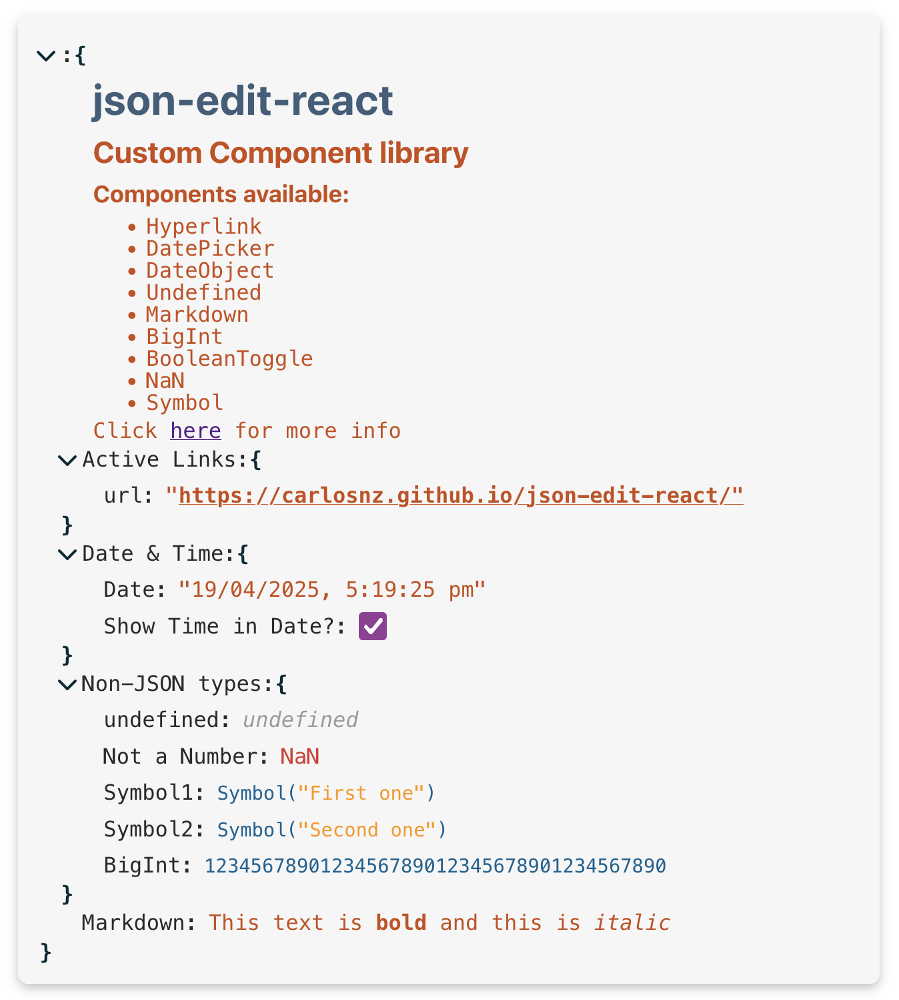

## Custom Component Library

A collection of [Custom Components](https://github.com/CarlosNZ/json-edit-react#custom-nodes) for **json-edit-react**. 

You can use these as-is or modify them for your own particular use case.



Eventually, I'd like to publish these in a separate package so you can easily import them. But for now just copy the code out of this repo.

Contains a [Vite](https://vite.dev/) web-app for previewing and developing components.

The individual components are in the `/components` folder, along with demo data (in `data.ts`).

> [!NOTE]
> If you create a custom component that you think would be useful to others, please [create a PR](https://github.com/CarlosNZ/json-edit-react/pulls) for it.

## Components

These are the ones currently available:

- [x] Hyperlink/URL
- [x] Undefined
- [x] `Date` Object
- [x] Date/Time Picker (with ISO string)
- [x] Boolean Toggle
- [x] `NaN`
- [x] `BigInt`
- [x] Markdown
- [x] "Enhanced" link
- [ ] Image (to-do)

## Development

From within this folder: `/custom-component-library`:

Install dependencies:

```js
yarn install
```

Launch app:

```js
yarn dev
```

## Guidelines for development:

Custom components should consider the following:

- Must respect editing restrictions
- If including CSS classes, please prefix with `jer-`
- Handle keyboard input as much as possible:
  - Double-click to edit (if allowed)
  - `Tab`/`Shift-Tab` to navigate
  - `Enter` to submit
  - `Escape` to cancel
- Provide customisation options, particularly styles
- If the data contains non-JSON types, add a "stringify" and "reviver" function definition (see `BigInt`, `NaN` and `Symbol` components)

If your custom component is "string-like", there are two helper components exported with the package: `StringDisplay` and `StringEdit` -- these are the same components used for the actual "string" elements in the main package. See the [Hyperlink](https://github.com/CarlosNZ/json-edit-react/blob/main/custom-component-library/components/Hyperlink/component.tsx) and [BigInt](https://github.com/CarlosNZ/json-edit-react/blob/main/custom-component-library/components/BigInt/component.tsx) components for examples of how to use them.

